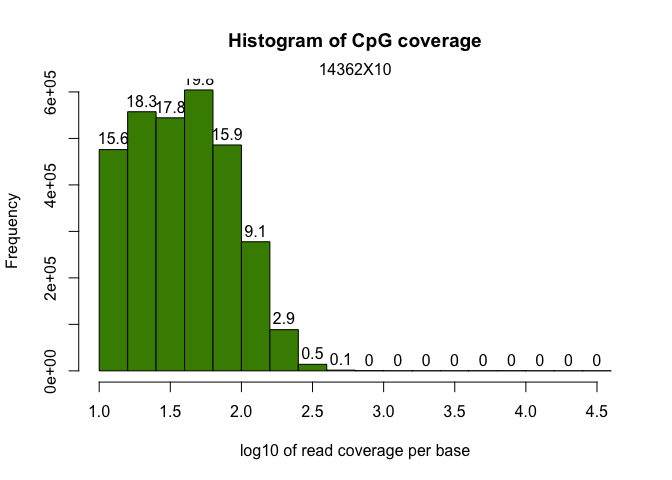
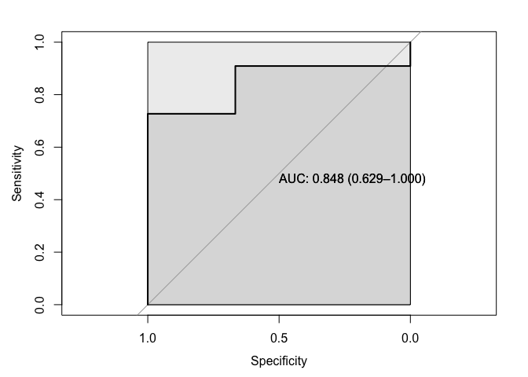
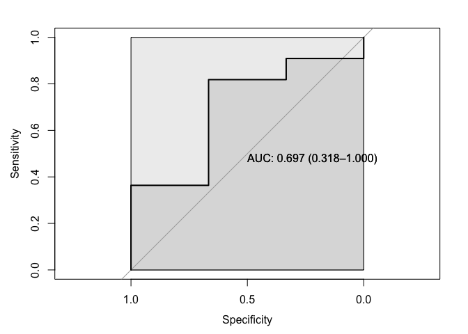
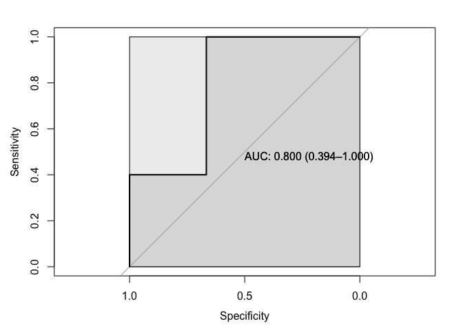
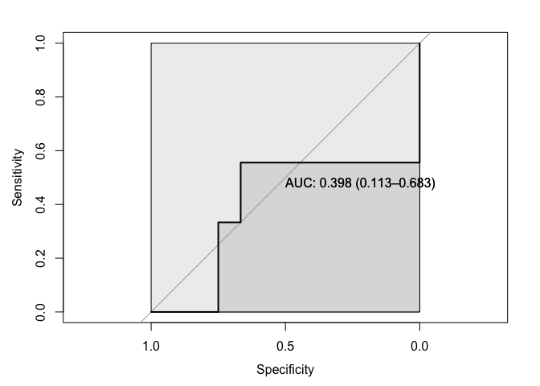

**Code Authors**: Mark E. Pepin, MD, PhD, MS\
**Contact**: [pepinme\@gmail.com](mailto:mepepin@bwh.harvard.edu){.email}\
**Institution**: Brigham and Womens Hospital, Harvard Medical School\
**Location**: Boston, MA

## Parameters

Define the parameters used, along with the conditions required for the
current analysis. This segment must be modified for each analysis
performed.


```r
##Set the experimental conditions [MUST DO THIS MANUALLY]
TIMING=c("Pre","Post")
ISCH=c("NICM", "ICM")
DIAB=c("ND", "T2D")
RESPONSE=c("CON","Nonresponder")
PAIRING = c("Paired", "CON", "Unpaired")
STATISTIC = 0.05 #P statistic threshold used in this combination.
COMPARISON= paste0(TIMING[2], ".vs.", TIMING[1])
# Candidate Gene Selection (RNA-sequencing) EDIT THIS LIST BASED ON INTERESTS.
GENES=c("DNMT3A", "DNMT3B", "TET1", "TET3","GADD45B", "GADD45G") # Presumed Regulators
DMRS=c("DNMT3A", "DNMT3B", "TET1", "TET3","GADD45B", "GADD45G") # Targets
DEG_HEATMAP_GENES=c("DNMT3A", "DNMT3B", "TET1", "TET3","GADD45B", "GADD45G")
HEATMAP_GENES=c("PRDM16", "GADD45B")
VAR1="Timing"
# Create the countData (Input to DESeq2)
colData_all<-openxlsx::read.xlsx("../1_Input/_Patient/colData_complete.xlsx")
colData_all$Timing<-factor(colData_all$Timing, levels = c("CON", "Pre", "Post"))
colData_all<-colData_all %>% subset(Responder %in% RESPONSE)
#Select the patient characteristics needed for the current comparison.
colData<-dplyr::filter(colData_all, Timing %in% TIMING, Pairing %in% PAIRING, Responder %in% RESPONSE)
# colData$Response<-factor(colData$Response, levels = c("CON", "NR", "R"))
colData$Timing<-factor(colData$Timing, levels = c("CON", "Pre", "Post"))
colData$Patient_ID<-as.character(colData$Patient_ID)
colData<-dplyr::filter(colData, RNA.Seq_ID!="")
colData<-colData[!is.na(colData$RNA.Seq_ID),]
GENE.Pathway<-read.csv("../1_Input/Metabolic_gene.sets/Oxphos.KEGG.csv", header = F) #Can alter the gene pathway (just change path)
colnames(GENE.Pathway)<-"GeneSymbol"
Comparisons_table<-t(combn(TIMING, 2))
Comparisons_list<-list()
for(i in 1:(length(combn(TIMING, 2))/2)){
Comparisons_list[[i]]<-c(Comparisons_table[i,1], Comparisons_table[i,2])
}
## Create color based on Genotype
ann_colors = list(Group = c(CON="grey", Pre = "darkcyan", Post ="coral2"))
ann_colorTable<-as.data.frame(ann_colors)
ann_colGroup<-subset(ann_colorTable, rownames(ann_colorTable) %in% TIMING) #Creates colors just for the specific comparison (by GROUP)
ann_colListGroup<-list(ann_colGroup)
ann_colGroupVec<-ann_colGroup$Group
ann_colorInvest<-subset(ann_colorTable, rownames(ann_colorTable) %in% colData_all$Timing) #Creates colors just for the specific comparison (by INVEST)
ann_colListInvest<-list(ann_colorInvest$Group)
ann_colorInvestVec<-ann_colorInvest$Group
names(ann_colorInvestVec)<-as.factor(rownames(ann_colorInvest))
INVEST_colors<-list(ann_colorInvestVec=ann_colorInvestVec)
names(ann_colGroupVec)<-as.factor(rownames(ann_colGroup))
GROUP_colors<-list(ann_colGroupVec=ann_colGroupVec)

# Create Output Folder Structure
ifelse(!dir.exists(file.path(paste0("../2_Output/"))), dir.create(file.path(paste0("../2_Output/"))), FALSE)
```

```
## [1] FALSE
```

```r
ifelse(!dir.exists(file.path(paste0("../2_Output/1_RNA/"))), dir.create(file.path(paste0("../2_Output/1_RNA/"))), FALSE)
```

```
## [1] FALSE
```

```r
ifelse(!dir.exists(file.path(paste0("../2_Output/2_Methyl/"))), dir.create(file.path(paste0("../2_Output/2_Methyl/"))), FALSE)
```

```
## [1] FALSE
```

```r
ifelse(!dir.exists(file.path(paste0("../2_Output/3_Combined/"))), dir.create(file.path(paste0("../2_Output/3_Combined/"))), FALSE)
```

```
## [1] FALSE
```

```r
#Project-specific Folders
ifelse(!dir.exists(file.path(paste0("../2_Output/_Patient/Candidates/"))), dir.create(file.path(paste0("../2_Output/_Patient/Candidates/"))), FALSE)
```

```
## [1] FALSE
```

```r
ifelse(!dir.exists(file.path(paste0("../2_Output/1_RNA/", COMPARISON))), dir.create(file.path(paste0("../2_Output/1_RNA/", COMPARISON))), FALSE)
```

```
## [1] FALSE
```

```r
ifelse(!dir.exists(file.path(paste0("../2_Output/1_RNA/Candidates"))), dir.create(file.path(paste0("../2_Output/1_RNA/"))), FALSE)
```

```
## [1] FALSE
```

```r
ifelse(!dir.exists(file.path(paste0("../2_Output/1_RNA/Candidates/EpigeneticDEGs/"))),dir.create(file.path(paste0("../2_Output/1_RNA/Candidates/EpigeneticDEGs/"))), FALSE)
```

```
## [1] FALSE
```

```r
ifelse(!dir.exists(file.path(paste0("../2_Output/1_RNA/Candidates/Selected_Genes/"))),dir.create(file.path(paste0("../2_Output/1_RNA/Candidates/Selected_Genes/"))), FALSE)
```

```
## [1] FALSE
```

```r
ifelse(!dir.exists(file.path(paste0("../2_Output/1_RNA/Candidates/Selected_Pathway/"))),dir.create(file.path(paste0("../2_Output/1_RNA/Candidates/Selected_Pathway/"))), FALSE)
```

```
## [1] FALSE
```

## Packages


```r
if (!require("pacman")) install.packages("pacman")
pacman::p_load(dplyr, Hmisc, openxlsx, corrplot, RColorBrewer, kableExtra, ggplot2, gridExtra, ggpubr, ggsignif, DESeq2, data.table, GenomicFeatures, biomaRt, Haplin, pheatmap, calibrate, ggrepel, tidyr, gtools)
```
\pagebreak

# RNA-Sequencing Analysis

## Read Alignment using STAR

RNA was isolated from the left ventricle endocardial tissue using the
RNeasy Lipid Mini-Kit according to the manufacturer's instructions
(Qiagen, Valencia, CA). High-throughput RNA sequencing was performed at
the University of Utah GenomX core. Once sample read quality was checked
(multiQC analysis), the paired-end fastq files were then aligned to the
reference genome, which was created using Gencode human sequence
(GRCh38.p12.genome.fa) and annotation (gencode.v28.annotation.gtf). STAR
aligner is the current gold-standard for this, which we used for the
current analysis. Before aligning each fastq file to the genome, an
annotated reference genome must first be assembled. This was performed
as follows (this was performed in Cheaha as \`bash GenomeReference.sh':

STAR=../../Tools/STAR-2.5.3a/bin/Linux_x86_64/STAR

\$STAR\
--runThreadN 12\
--runMode genomeGenerate\
--genomeDir ./\
--genomeFastaFiles
/data/scratch/pepinme/huHrt/Input/Genome/GRCh38.p12.genome.fa\

Alignment of short reads to this annotated genome could then proceed,
using the following SLURM batch script which was submitted to the UAB
*Cheaha* compute cluster (See **Appendix**). This shell script contains
the following STAR alignment run settings:

\$STAR_RUN\
--genomeDir \$GENOME_DIR\
--readFilesCommand zcat\
--readFilesIn $INPUT_DIR/fastq/${VAR}.txt.gz\
--sjdbGTFfile \$GENOME_DIR/gencode.v28.annotation.gtf\
--sjdbOverhang 99\
--quantMode GeneCounts\
--runThreadN 12\
--outSAMtype BAM SortedByCoordinate\
--outFileNamePrefix ${RESULTS_DIR}/Alignment/${VAR}\_

## Read Count Compiling

Before the DESeq2-based differential expression can be computed, the
counts generated by STAR need to be compiled, since the .tab file
contains count information based on forward, reverse, and combined
reads. Therefore, we will take the fourth column in each table and merge
them.


```r
Count.files <- list.files(path = "../1_Input/1_RNA/Counts/", pattern = "*ReadsPerGene.out.tab", full.names = TRUE, all.files = TRUE)
Counts <- lapply(Count.files, read.table, skip = 4) #skip the first 4 rows, since these are summary data.
#Create a data.frame containing the raw counts
countData.raw <- as.data.frame(sapply(Counts, function(x) x[,4])) #selects only the 4th column as the raw counts.
#Generate Column names and Row names for the counts (remove the extra nonsense from the path names)
colnames <- gsub( "ReadsPerGene[.]out[.]tab", "", Count.files)
colnames <- gsub( "[.][.]/1_Input/1_RNA/Counts//", "", colnames)
colnames(countData.raw) <- colnames
row.names(countData.raw) <- Counts[[1]][,1]
```

## Data Pre-Processing

After alignment of the fastq files to the annotated genome assembly
(hg38), the first step in the analysis is to consolidate the raw data
from the provided files into data matrix that can be used to generate a
normalized count matrix and differential expression dataset.


### Count Normalization

DESeq2 (version 1.18.1) was used to perform the raw count normalization
within R (version 3.4.2)


```r
######### RUN DESeq2
dds<-DESeqDataSetFromMatrix(countData=countData, colData = colData, design= ~Timing)
dds
```

```
## class: DESeqDataSet 
## dim: 58381 14 
## metadata(1): version
## assays(1): counts
## rownames(58381): ENSG00000223972.5 ENSG00000227232.5 ...
##   ENSG00000210195.2 ENSG00000210196.2
## rowData names(0):
## colnames(14): 10931X71 11943X54 ... 13584X1 13584X2
## colData names(53): Patient_ID RNA.Seq_ID ... Glucose BNP
```

```r
# dds$ICM<-relevel(dds$ICM, ref = "NICM") # setting the reference to wild-type genotype. only relevant for factors.
# dds$Timing<-relevel(dds$Timing, ref="1")
#Determine the Dispersion Relationship (determines which distribution to use for the differential analysis) - should take about 2 minutes
dds <- estimateSizeFactors(dds)
dds <- estimateDispersions(dds)
plotDispEsts(dds)
```

<!-- -->

```r
# png(file=paste0("../2_Output/1_RNA/", COMPARISON,"/",COMPARISON, "_Dispersion.png"))
# plotDispEsts(dds)
# dev.off()
```

There appears to be a linear negative correlation between the mean and
dispersion estimates, so the parametric test model should be an
appropriate fit for differential expression analysis. Furthermore, we
could get away with the parametric fit-type, but the run-time is not
significantly impaired, allowing us to use the 'local' fit-type. NOTE:
If it were nonlinear throughout, we would require a 'local'
nonparametric fit-type.

### Differential Expression Analysis


```r
##Pre-Filter to reduce the size of this dataset (according to the DESeq2 document reccomendations)
dds <- dds[ rowSums(counts(dds)) > 1, ]
dds
```

```
## class: DESeqDataSet 
## dim: 34689 14 
## metadata(1): version
## assays(2): counts mu
## rownames(34689): ENSG00000227232.5 ENSG00000268903.1 ...
##   ENSG00000210195.2 ENSG00000210196.2
## rowData names(10): baseMean baseVar ... dispOutlier dispMAP
## colnames(14): 10931X71 11943X54 ... 13584X1 13584X2
## colData names(54): Patient_ID RNA.Seq_ID ... BNP sizeFactor
```

```r
################Run DESeq2 differential quantification (Likelihood ratio test (LRT) or Wald-test)
dds<-DESeq(dds, test="Wald", fitType="parametric") #LRT if using multiple variables
#compile the results tables
resultsNames(dds)
```

```
## [1] "Intercept"          "Timing_Post_vs_Pre"
```

```r
resdf<-as.data.frame(DESeq2::results(dds, format = "DataFrame"))
resdf$ensembl_gene_id<-as.character(row.names(resdf))
#
library(apeglm)
resApeT <- lfcShrink(dds, coef=2, type="apeglm", lfcThreshold=1)
plotMA(resApeT, ylim=c(-3,3), cex=.8)
abline(h=c(-1,1), col="dodgerblue", lwd=2)
```

<!-- -->

Once the differential Expression analysis was performed, the following
were compiled into a results data matrix: Log2FoldChange, P-value,
Bonferroni-Adjusted P-Value (Q-value), and normalized counts for each
sample.


```r
####Add Annotation to the results file (this will take some time, about 5 minutes...)
#Use the GTF for annotation
gtf.file="../1_Input/gencode.v28.annotation.gtf"
gtf.gr = rtracklayer::import(gtf.file) # creates a GRanges object
gtf.df = as.data.frame(gtf.gr)
genes = unique(gtf.df[ ,c("gene_id","gene_name")])
Test1<-dplyr::select(gtf.df, ensembl_gene_id=gene_id, gene_name)
genes = unique(Test1[ ,c("ensembl_gene_id","gene_name")])
results<-merge(resdf, genes, by="ensembl_gene_id")
Residual<-dplyr::anti_join(resdf, results, by = "ensembl_gene_id")

####Add normalized count data (for heatmap and sota)
normcount<-as.data.frame(counts(dds, normalized=TRUE))
normcount$ensembl_gene_id<-rownames(normcount)
results<-dplyr::left_join(results, normcount, by="ensembl_gene_id")

counts_complete<-dplyr::select(results, GeneSymbol="gene_name", contains("X"))
colnames(counts_complete)<-as.character(colnames(counts_complete))
write.xlsx(counts_complete, paste0("../2_Output/1_RNA/", COMPARISON, "/", COMPARISON, "_normalized.counts.xlsx"), row.names = F, overwrite = TRUE)


#Create Rlog transformed data
rld<-rlog(dds)
rld<-assay(rld) #transpose the rlog-normalized count data
rld<-as.data.frame(rld) #convert to a data frame (to merge the colData)
write.xlsx(rld, paste0("../2_Output/1_RNA/", COMPARISON, "/", COMPARISON, "_rlog.counts.xlsx"), rowNames = TRUE, overwrite = T)

#Create filters as tabs
results_p05<-dplyr::filter(results, pvalue<0.05)
results_q05<-dplyr::filter(results, padj<0.05)

library(openxlsx)
wb_DESeq<-createWorkbook()
#Unfiltered
  addWorksheet(wb_DESeq, "Unfiltered")
  writeData(wb_DESeq, "Unfiltered", results, startCol = 1)
#P-value Significant (0.05)
  addWorksheet(wb_DESeq, "P_0.05")
  writeData(wb_DESeq, "P_0.05", results_p05, startCol = 1)
#Q-value Significant (0.05)
  addWorksheet(wb_DESeq, "Q_0.05")
  writeData(wb_DESeq, "Q_0.05", results_q05, startCol = 1)
saveWorkbook(wb_DESeq, file = paste0("../2_Output/1_RNA/", COMPARISON,"/",COMPARISON, "_DESeq2.xlsx"), overwrite = TRUE)
```

## QQ Plot

Before we examined the gene networks and pathways differentially
regulated by NRF2 knockout, the first task was to determine whether
transgene induction resulted in global changes. An effective way of
determining this is the QQ plot, which compares the P-value distribution
produced by the pairwise comparison (transgenic vs. WT mouse) to that of
a random normal distribution. Below, it is evident that the two
experimental groups produce robustly divergent expression patterns
consistent with a true population difference worthy of differential
expression analysis.


```r
#Create Q-Q plot
test<-results
test<-test[complete.cases(test),]
pQQ(test$pvalue, lim=c(0,10))
```

<!-- -->

```r
png(file=paste0("../2_Output/1_RNA/", COMPARISON,"/",COMPARISON, "_QQ.Plot.png"))
pQQ(test$pvalue, lim=c(0,10))
dev.off()
```

```
## quartz_off_screen 
##                 2
```

## Volcano Plot


```r
# Load packages
library(dplyr)
library(ggplot2)
library(ggrepel)
library(openxlsx)
# Read data from the web
options(ggrepel.max.overlaps = Inf)
results<-read.xlsx(paste0("../2_Output/1_RNA/", COMPARISON, "/", COMPARISON, "_DESeq2.xlsx"), sheet = "Unfiltered")
results = mutate(results, minuslogpvalue = -log(pvalue), log2FC=log2FoldChange)

results <- results %>% 
  mutate(., sig=ifelse(pvalue<0.05 & log2FoldChange>1, 
                       "P < 0.05 and Fold-Change > 2", 
                       ifelse(pvalue<0.05 & log2FoldChange< -1,
                              "P < 0.05 and Fold-Change < 2", 
                              "Not Sig")
                       )
         )
results$sig<-factor(results$sig, 
levels = c("P < 0.05 and Fold-Change < 2",
  "Not Sig",
  "P < 0.05 and Fold-Change > 2")
  )
max(results$minuslogpvalue, na.rm = TRUE)
```

```
## [1] 42.7088
```

```r
max(results$log2FoldChange, na.rm = TRUE)
```

```
## [1] 5.278193
```

```r
min(results$log2FoldChange, na.rm = TRUE)
```

```
## [1] -4.856386
```

```r
p = ggplot(results, aes(log2FoldChange, minuslogpvalue)) + 
  theme_classic() +
  theme(axis.line = element_blank(),
        axis.ticks = element_blank()
  ) +
  geom_point(aes(fill=sig, size = minuslogpvalue),
             colour="black",
             shape=21,
             stroke = 0,
             alpha = 7/10) +
  geom_vline(xintercept=1, size=.5, linetype="dashed") +
  geom_vline(xintercept=-1, size=0.5, linetype="dashed") +
  geom_hline(yintercept=0-log(0.05), size=.5, linetype="dashed") +
  labs(x=expression(Log[2](Fold-Change)), y=expression(-Log[10](P-value))) + 
  xlim(min(results$log2FoldChange, na.rm = TRUE),max(results$log2FoldChange, na.rm = TRUE)) + 
  ylim(-0, max(results$minuslogpvalue, na.rm = TRUE)) + geom_hline(yintercept = 0, size = 1) + 
  geom_vline(xintercept=0, size=1) +
  scale_fill_manual(values=c("dodgerblue4", "darkgray", "goldenrod2")) +
  scale_size_continuous(range = c(.1, 3))

  p+
  geom_text_repel(data=top_n(filter(results, log2FoldChange< -2), 10, minuslogpvalue), aes(label=gene_name)) +
  geom_text_repel(data=top_n(filter(results, log2FoldChange>2), 10, minuslogpvalue), aes(label=gene_name))
```

<!-- -->

```r
pdf(file = paste0("../2_Output/1_RNA/", COMPARISON, "/", COMPARISON, "_VolcanoPlot.pdf"))
  p+
  geom_text_repel(data=top_n(filter(results, log2FoldChange< -2), 10, minuslogpvalue), aes(label=gene_name)) +
  geom_text_repel(data=top_n(filter(results, log2FoldChange > 2), 10, minuslogpvalue), aes(label=gene_name))
dev.off()
```

```
## quartz_off_screen 
##                 2
```

#Heatmap Visualization (P_0.01)

In order to visualize the distribution of differentially expressed
genes, as well as determine the effect various heart failure etiologies
on transcription, hierarchical clustering and heatmap visualization were
performed at the Q \< 0.05 statistical level. This analysis reveals that
P \< 0.05 is sufficient to separate all samples by genotype.


```r
library(pheatmap)
library(ComplexHeatmap)
HM_Index<-colData_all %>% dplyr::select(RNA.Seq_ID, Timing) %>% na.omit(RNA.Seq_ID)
HM_Index<-as.data.frame(HM_Index)
rownames(HM_Index)<-HM_Index$RNA.Seq_ID
# Vectors to filter data
RNA_samples_all<-rownames(HM_Index)
RNA_preCON<-HM_Index %>% subset(Timing %in% c("CON", "Pre"))
RNA_preCON<-rownames(RNA_preCON)
RNA_post<-HM_Index %>% subset(Timing %in% c("CON","Post"))
RNA_post<-rownames(RNA_post)
# Expression data
hm_data<-openxlsx::read.xlsx("../1_Input/RNA_normalized.counts.xlsx") %>% dplyr::rename("gene_name" = "GeneSymbol")
Combined_together<-results_p05 %>% dplyr::select(gene_name, ensembl_gene_id, log2FoldChange, pvalue, padj) %>% inner_join(., hm_data)
Combined_together<-Combined_together[(rowSums(Combined_together[,RNA_preCON]) >= 1) & (rowSums(Combined_together[,RNA_post]) >= 1),]
rownames(Combined_together)<-make.unique(Combined_together$gene_name, sep = ".")
hm_data<-Combined_together %>% dplyr::select(any_of(RNA_samples_all)) %>% data.matrix()
hm_data_precon<-Combined_together %>% dplyr::select(any_of(RNA_preCON)) %>% data.matrix()
hm_data_post<-Combined_together %>% dplyr::select(any_of(RNA_post)) %>% data.matrix()
# Ensure index has same number of samples
hm_samples<-colnames(hm_data)
HM_Index <- HM_Index %>% subset(RNA.Seq_ID %in% hm_samples)
HM_Index_precon<-HM_Index %>% subset(RNA.Seq_ID %in% RNA_preCON)
HM_Index_precon<-HM_Index_precon[match(rownames(HM_Index_precon), colnames(hm_data_precon)),]
HM_Index_precon<-HM_Index_precon %>% dplyr::select(-RNA.Seq_ID)
HM_Index_post<-HM_Index %>% subset(RNA.Seq_ID %in% RNA_post)
HM_Index_post<-HM_Index_post[match(rownames(HM_Index_post), colnames(hm_data_post)),]
HM_Index_post<-HM_Index_post %>% dplyr::select(-RNA.Seq_ID)
# heatmap
paletteLength <- 100
myColor <- colorRampPalette(c("dodgerblue4", "white", "gold2"))(paletteLength)
ComplexHeatmap::pheatmap(hm_data,
         cluster_cols=T, 
         border_color=NA, 
         cluster_rows=T, 
         scale = 'row',
         show_colnames = T, 
         show_rownames = F, 
         color = myColor,
         annotation_col = HM_Index,
         filename=paste0("../2_Output/1_RNA/", COMPARISON,"/",COMPARISON, "_Heatmap_Normcount.P01.pdf")
         )
```

<!-- -->

```r
# Annotated heatmaps with known epigenetic regulators.
EPIs<-read.xlsx("../1_Input/Miscellaneous_gene.sets/EpiGenes_main.xlsx") %>% dplyr::rename("gene_name"="HGNC_symbol") %>% semi_join(., results_q05)
EPIs_Genes<-EPIs[,"gene_name"]

##############################################################################################
# Heatmap Pre and Post
ann_colors = list(Timing = c(CON="darkgray", Pre = "goldenrod2", Post = "#1b9e77"))
paletteLength <- 100
myColor <- colorRampPalette(c("dodgerblue4", "white", "gold2"))(paletteLength)
heatmap_Pre_con<-ComplexHeatmap::pheatmap(hm_data_precon, scale="row",
                    name = "Pre vs. CON",
                    cluster_cols = T,
                    cluster_rows = T,
                    cutree_rows = 2,
                     fontsize_col = 8,
                     color = myColor,
                    annotation_names_col = FALSE,
                    show_colnames = F,
                     show_rownames = F,
                     border_color = NA,
                    annotation_colors = ann_colors,
                    annotation_col = HM_Index_precon,
                    border = TRUE)
heatmap_Post<-ComplexHeatmap::pheatmap(hm_data_post, scale="row",
                    name = "Post vs. CON",
                    cluster_cols = T,
                    cluster_rows = F,
                    # cutree_rows = 2,
                     fontsize_col = 8,
                     color = myColor,
                    annotation_names_col = FALSE,
                    show_colnames = F,
                     show_rownames = F,
                     border_color = NA,
                    annotation_colors = ann_colors,
                    annotation_col = HM_Index_post,
                    border = TRUE)
ha = rowAnnotation(link = anno_mark(at = grep(paste(EPIs_Genes, collapse="|"), Combined_together$gene_name),
                   labels = Combined_together[grep(paste(EPIs_Genes, collapse="|"), Combined_together$gene_name), "gene_name"],
                   labels_gp = gpar(fontsize = 7), 
                   padding = unit(1, "mm"))
                   )
RNAColor <- colorRampPalette(c("dodgerblue4", "white", "gold2"))(paletteLength)
Expression_HM<-Heatmap(Combined_together$log2FoldChange, 
                  name = "DEG",
                  na_col = "white", 
                  col = RNAColor,
                  show_column_names = T, 
                  right_annotation = ha, 
                  width = unit(5, "mm"))

pdf(file=paste0("../2_Output/1_RNA/", COMPARISON, "/", COMPARISON, "DEG_Heatmap.pdf"), height = 7, width = 8, onefile = F)
heatmap_Pre_con + heatmap_Post + Expression_HM
dev.off()
```

```
## quartz_off_screen 
##                 2
```

```r
heatmap_Pre_con + heatmap_Post + Expression_HM
```

<!-- -->

```r
while (!is.null(dev.list()))  dev.off()
```

## Principal Components Analysis

Once we established that the populations under consideration truly
display divergene expression patterns, we sought to determine whether
unbiased global gene expression patterns recapitulate the described
phenotypes within each heart failure group. To accomplish this, an
unsupervised Principal Components Analysis (PCA) was initially used with
normalized counts.

### PCA Features

Before running the principal components analysis, it was necessary to
first determine the number of PC's required to account for 80% of the
variance, a machine-learning algorithmm benchmark that provides
sufficient confidence in the analysis.


```r
#Plot Features of the PCA
PCA_data<-read.xlsx("../1_Input/RNA_rlog.xlsx", rowNames = TRUE)
PCA_data<-PCA_data[order(-rowSums(PCA_data)),]
##Import the data to be used for annotation
Index<-colData_all %>% filter(RNA.Seq_ID != "NA")
rownames(Index)<-Index$RNA.Seq_ID
Index<-as.data.frame(Index)
#transpose the dataset (required for PCA)
PCA_data<-PCA_data %>% dplyr::select(any_of(Index$RNA.Seq_ID))
Index<-Index %>% subset(RNA.Seq_ID %in% colnames(PCA_data))
data.pca<-t(PCA_data)
data.pca<-as.data.frame(data.pca)
##merge the file
data.pca_Final<-merge(Index, data.pca, by=0)
rownames(data.pca_Final)<-data.pca_Final$Row.names
pca.comp<-prcomp(data.pca_Final[,(ncol(Index)+2):ncol(data.pca_Final)])

pcaCharts=function(x) {
    x.var <- x$sdev ^ 2
    x.pvar <- x.var/sum(x.var)
    par(mfrow=c(2,2))
    plot(x.pvar,xlab="Principal component", 
         ylab="Proportion of variance", ylim=c(0,1), type='b')
    plot(cumsum(x.pvar),xlab="Principal component", 
         ylab="Cumulative Proportion of variance", 
         ylim=c(0,1), 
         type='b')
    # screeplot(x)
    # screeplot(x,type="l")
    par(mfrow=c(1,1))
}
pcaCharts(pca.comp)
```

<!-- -->

```r
png(file=paste0("../2_Output/1_RNA/", COMPARISON,"/",COMPARISON, "_PCA.Charts.png"))
pcaCharts(pca.comp)
dev.off()
```

```
## quartz_off_screen 
##                 2
```

```r
library(PCAtools)
metadata<-colData
rownames(metadata)<-colData$RNA.Seq_ID
vst<-assay(vst(dds))
p <- pca(vst, metadata = metadata, removeVar = 0.1)
screeplot(p, axisLabSize = 18, titleLabSize = 22)
```

<!-- -->

### 3-Dimensional PCA

From the previous calculations, it is seens that only 2 principal
components are necessary (accounting for \>80% cumulative variance).
Nonetheless, below is a 3-D PCA to ensure that all groups are
characterize to higher-degree of stringency.


```r
##Create a 3D-PCA for Inspection
library(plotly)
##Index
Patient_Data <- Index %>% dplyr::select(Patient_ID, Timing, Age_yrs, Sex, Race, BMI)
PCs<-merge(pca.comp$x, Patient_Data, by=0)
rownames(PCs)<-PCs$Row.names
PCs$Timing<-as.numeric(as.factor(PCs$Timing))
ax_text<-list(
  family = "times",
  size = 12,
  color = "black")
t <- list(
  family = "times",
  size = 14,
  color = "black")
p <- plot_ly(PCs, x = ~PC1, y = ~PC2, z = ~PC3,
   marker = list(color = ~Timing, 
                 colorscale = c('#FFE1A1', '#683531'), 
                 showscale = TRUE),
  text=rownames(PCs)) %>%
  add_markers() %>% 
  layout(scene = list(
     xaxis = list(title = 'PC1', zerolinewidth = 4, 
        zerolinecolor="darkgrey", linecolor="darkgrey", 
        linewidth=4, titlefont=t, tickfont=ax_text),
     yaxis = list(title = 'PC2', zerolinewidth = 4, 
        zerolinecolor="darkgrey", linecolor="darkgrey", 
        linewidth=4, titlefont=t, tickfont=ax_text),
    zaxis = list(title = 'PC3', zerolinewidth = 4, 
        zerolinecolor="darkgrey",  linecolor="darkgrey", 
        linewidth=4, titlefont=t, tickfont=ax_text)),
  annotations = list(
           x = 1.13,
           y = 1.03,
           text = 'Timing',
           xref = '1',
           yref = '0',
           showarrow = FALSE))
p #must comment out for PDF generation via knitr (Pandoc)
```

```{=html}
<div class="plotly html-widget html-fill-item-overflow-hidden html-fill-item" id="htmlwidget-61f60f9f8618b106298f" style="width:672px;height:480px;"></div>
<script type="application/json" data-for="htmlwidget-61f60f9f8618b106298f">{"x":{"visdat":{"c3327fe7da0a":["function () ","plotlyVisDat"]},"cur_data":"c3327fe7da0a","attrs":{"c3327fe7da0a":{"x":{},"y":{},"z":{},"marker":{"color":{},"colorscale":["#FFE1A1","#683531"],"showscale":true},"text":["10931X11","10931X16","10931X21","10931X71","10931X72","11943X12","11943X23","11943X27","11943X28","11943X4","11943X41","11943X48","11943X54","11943X8","11943X9","13584X1","13584X2"],"alpha_stroke":1,"sizes":[10,100],"spans":[1,20],"type":"scatter3d","mode":"markers","inherit":true}},"layout":{"margin":{"b":40,"l":60,"t":25,"r":10},"scene":{"xaxis":{"title":"PC1","zerolinewidth":4,"zerolinecolor":"darkgrey","linecolor":"darkgrey","linewidth":4,"titlefont":{"family":"times","size":14,"color":"black"},"tickfont":{"family":"times","size":12,"color":"black"}},"yaxis":{"title":"PC2","zerolinewidth":4,"zerolinecolor":"darkgrey","linecolor":"darkgrey","linewidth":4,"titlefont":{"family":"times","size":14,"color":"black"},"tickfont":{"family":"times","size":12,"color":"black"}},"zaxis":{"title":"PC3","zerolinewidth":4,"zerolinecolor":"darkgrey","linecolor":"darkgrey","linewidth":4,"titlefont":{"family":"times","size":14,"color":"black"},"tickfont":{"family":"times","size":12,"color":"black"}}},"annotations":[{"x":1.13,"y":1.03,"text":"Timing","xref":"1","yref":"0","showarrow":false}],"hovermode":"closest","showlegend":false},"source":"A","config":{"modeBarButtonsToAdd":["hoverclosest","hovercompare"],"showSendToCloud":false},"data":[{"x":[-30.0536071196403,-27.4890192209964,-22.6980617393091,-7.58097872150755,-2.11536886092731,38.1780506970665,-0.426495350742383,-3.97631684495707,7.45652883828133,7.94675541906446,26.3226504291533,5.01561182879098,4.78988934975243,14.6065021822509,-10.4764741996783,5.82388694140038,-5.32355362800336],"y":[15.3047367638478,19.3318690743481,21.0098002846879,-0.538035408750274,-5.13874555793233,26.6693350164781,-19.2235686419862,-12.858946071587,-1.76977504373682,-25.0476787104535,8.35724272630455,-7.38485546232707,3.19901447361315,14.4158574179026,-19.8550114754524,-10.4498671414103,-6.02137224354715],"z":[4.46004668858777,-0.989410956840313,-6.95679105629286,-8.94882162829331,-30.7951314001762,-9.69596203628354,13.591698572471,18.3781817446369,10.8247730082136,-12.2154876360135,-4.98897236646898,-5.12933887598894,11.0332960985089,20.4276295160751,-7.56804879745599,4.80222862624561,3.77011049907429],"marker":{"color":[1,1,1,2,3,3,3,3,3,2,3,2,2,2,2,2,2],"colorscale":["#FFE1A1","#683531"],"showscale":true,"line":{"color":"rgba(31,119,180,1)"}},"text":["10931X11","10931X16","10931X21","10931X71","10931X72","11943X12","11943X23","11943X27","11943X28","11943X4","11943X41","11943X48","11943X54","11943X8","11943X9","13584X1","13584X2"],"type":"scatter3d","mode":"markers","error_y":{"color":"rgba(31,119,180,1)"},"error_x":{"color":"rgba(31,119,180,1)"},"line":{"color":"rgba(31,119,180,1)"},"frame":null}],"highlight":{"on":"plotly_click","persistent":false,"dynamic":false,"selectize":false,"opacityDim":0.2,"selected":{"opacity":1},"debounce":0},"shinyEvents":["plotly_hover","plotly_click","plotly_selected","plotly_relayout","plotly_brushed","plotly_brushing","plotly_clickannotation","plotly_doubleclick","plotly_deselect","plotly_afterplot","plotly_sunburstclick"],"base_url":"https://plot.ly"},"evals":[],"jsHooks":[]}</script>
```

### MDS Plot - Transcriptomics


```r
library(limma)
library(openxlsx)
# Perform MDS on RNA-sequencing data
MDS_data<-read.xlsx(paste0("../1_Input/RNA_rlog.xlsx"), rowNames = TRUE)
# Index_MDS<-read.xlsx("../1_Input/colData.xlsx") %>% dplyr::filter(RNA.Seq_ID!="NA")
Index_MDS<- Index %>% dplyr::select(RNA.Seq_ID,Patient_ID, Timing, Age_yrs, Sex, Race, BMI)
options(ggrepel.max.overlaps = Inf)
#Filter normalized counts to remove outliers
vector<-rownames(Index_MDS)
MDS_data<-dplyr::select(MDS_data, any_of(vector))
# MDS in ggplot2
Ntop = 10000
library(magrittr)
library(dplyr)
library(ggpubr)
library(matrixStats)
library("ggrepel")
library(wesanderson)
MDS.set<-as.data.frame(MDS_data)
RowVar<-rowVars(data.matrix(MDS.set)) #calculate variances for each row (vector)
MDS.set<-as.data.frame(cbind(MDS.set, RowVar)) #Add to the MDS.set dataset
MDS_matrix<-MDS.set %>% arrange(desc(RowVar)) %>% top_n(Ntop,RowVar) #Select top N rows by variance
# Compute MDS
mds <- MDS_matrix %>% dplyr::select(-RowVar) %>% t(.) %>%
  dist() %>%          
  cmdscale() %>%
  as_tibble()
colnames(mds) <- c("Dim.1", "Dim.2")
rownames(mds)<-colnames(MDS.set[,1:(ncol(MDS.set)-1)])
mds$RNA.Seq_ID<-rownames(mds)
mds<-dplyr::inner_join(mds, Index_MDS)

#K-means clustering
clust <- kmeans(mds[,1:2], 2)$cluster %>%
  as.factor()
mds <- mds %>%
  mutate(kmeans.2 = clust)
###
library(ggpubr)
library(cowplot) 
# Main plot
pmain <- ggplot(mds, aes(x = Dim.1, y = Dim.2, color = Timing))+
  scale_color_manual(values = ann_colorInvestVec) +
  theme(panel.background = element_rect("white", colour = "black", size=2), 
      panel.grid.major = element_line(colour = "gray50", size=.75), 
      panel.grid.minor = element_line(colour = "gray50", size=0.4),
      legend.position="bottom",
      legend.key=element_blank(),
      axis.text = element_text(size = 12),
      axis.title = element_text(size = 14, face="bold")) +
  geom_hline(yintercept = 0, size = 1) + 
  geom_vline(xintercept=0, size=1) +
  geom_point()+ #Add points for each sample
  # stat_ellipse()+ # create elliptical shapes
  # geom_text_repel(data=mds, aes(label=Sample_ID), show.legend  = F) + #label the samples
  labs(x="Principal Component 1", 
       y="Principal Component 2")
# Marginal densities along x axis
xdens <- axis_canvas(pmain, axis = "x")+
  geom_density(data = mds, aes(x = Dim.1, fill = Timing),
              alpha = 0.7, size = 0.2) + 
  scale_fill_manual(values = ann_colorInvestVec)
# Marginal densities along y axis
ydens <- axis_canvas(pmain, axis = "y", coord_flip = TRUE)+ #must set coord_flip = true if using coord_flip() below
  geom_density(data = mds, aes(x = Dim.2, fill = Timing),
                alpha = 0.7, size = 0.2)+
  coord_flip() +
  scale_fill_manual(values = ann_colorInvestVec)
p1 <- insert_xaxis_grob(pmain, xdens, grid::unit(.2, "null"), position = "top")
p2<- insert_yaxis_grob(p1, ydens, grid::unit(.2, "null"), position = "right")
pdf(file=paste0("../2_Output/1_RNA/MDS.Scatterhist.pdf"), height = 5, width = 5, onefile = F)
ggdraw(p2)
dev.off()
```

```
## quartz_off_screen 
##                 2
```

```r
ggdraw(p2)
```

<!-- -->

### Reprogramming the cardiac epigenome in heart failure

We used the following script to identify all epigenetic regulators that
are differentially-expressed in heart failure relative to control.


```r
##########Find all Epigeneric Regulators 
EPIs<-read.xlsx("../1_Input/Miscellaneous_gene.sets/EpiGenes_main.xlsx")
EPIs_Genes<-EPIs$HGNC_symbol
DEG_List<-read.xlsx(paste0("../2_Output/1_RNA/", COMPARISON, "/", COMPARISON, "_DESeq2.xlsx"), sheet = "P_0.05")
Epi_DEGs<-merge(DEG_List, EPIs, by.x="gene_name", by.y="HGNC_symbol")
rownames(Epi_DEGs)<-Epi_DEGs$gene_name
openxlsx:::write.xlsx(Epi_DEGs,paste0("../2_Output/1_RNA/", COMPARISON,"/",COMPARISON, "_Epigenetic.DEGs.xlsx"), overwrite = TRUE)

#Heatmap Index
hm_index<-colData %>% select(Timing, Age_yrs)
rownames(hm_index)<-colData$RNA.Seq_ID
#Heatmap of Epigenetic regulators
gene_names<-semi_join(Epi_DEGs, normcount, by = "ensembl_gene_id")
hm_epi<-semi_join(normcount, Epi_DEGs, by = "ensembl_gene_id") %>% select(-ensembl_gene_id) %>% data.matrix()
rownames(hm_epi)<-gene_names$gene_name
hm_index<-hm_index %>% subset(rownames(hm_index) %in% colnames(hm_epi)) # Make sure the index has the same number
RNA_DEG<-rowAnnotation(DEG = anno_barplot(gene_names$log2FoldChange))
heatmap_epi<-ComplexHeatmap::pheatmap(hm_epi, scale="row",
                    name = "Pre vs. CON",
                    cluster_cols = T,
                    cluster_rows = T,
                    cutree_rows = 2,
                    cutree_cols = 2,
                    fontsize_col = 8,
                    color = myColor,
                    annotation_names_col = FALSE,
                    show_colnames = F,
                    show_rownames = T,
                    border_color = NA,
                    annotation_colors = ann_colors,
                    annotation_col = hm_index,
                    border = TRUE,
                    right_annotation = RNA_DEG)
pdf(file = paste0("../2_Output/1_RNA/", COMPARISON,"/",COMPARISON, "_EpigeneticRegulators.pdf"))
heatmap_epi
dev.off()
```

```
## quartz_off_screen 
##                 2
```

```r
#############################
```

### Epigenetic Regulatory Gene Expression


```r
library(ggplot2)
library(gridExtra)
library(ggpubr)
library(dplyr)
library(gtools)
######################################################
VAR1="Timing"
LIST_GENES=Epi_DEGs$gene_name
ifelse(!dir.exists(file.path(paste0("../2_Output/1_RNA/Candidates/"))), dir.create(file.path(paste0("../2_Output/1_RNA/Candidates/"))), FALSE)
```

```
## [1] FALSE
```

```r
######################################################
#Import dataset
Counts<-read.xlsx("../1_Input/RNA_Normalized.Counts.xlsx")
colData<-openxlsx::read.xlsx("../1_Input/_Patient/colData_complete.xlsx", sheet = "Summary", startRow = 1)
colData$Timing<-factor(colData$Timing, levels = c("CON", "Pre", "Post"))
#Filter results by the gene vector
DEGs<-subset(Counts, GeneSymbol %in% LIST_GENES)
rownames(DEGs)<-make.unique(as.character(DEGs$GeneSymbol, sep = "."))
tDEGs<-as.data.frame(t(DEGs))
tDEGs = tDEGs[-1, ]
## convert all genes to numeric (from factors)
asNumeric=function(x){as.numeric(as.character(x))}
factorsNumeric=function(d){modifyList(d, lapply(d[, sapply(d, is.character)], asNumeric))}
##
tDEGs<-factorsNumeric(tDEGs)
tDEGs$RNA.Seq_ID<-rownames(tDEGs)
colData.ex<-dplyr::inner_join(tDEGs, colData, by = "RNA.Seq_ID")
colData.ex<-dplyr::group_by_(colData.ex, VAR1) #define groups for statistics
groupsize<-dplyr::tally(colData.ex) #define sample size (for SEM)
#Define function for mean and standard deviation for each group
data_summary <- function(data, varname, groupnames){
  require(plyr)
  summary_func <- function(x, col){
    c(mean = mean(x[[col]], na.rm=TRUE),
      sd = sd(x[[col]], na.rm=TRUE))
  }
  data_sum<-ddply(data, groupnames, .fun=summary_func,
                  varname)
  data_sum <- rename(data_sum, c("mean" = varname))
 return(data_sum)
}
#Create a p-value for every summarized data (relative to CON)
t.test2 <- function(m1,m2,s1,s2,n1,n2,m0=0,equal.variance=FALSE)
{
    if( equal.variance==FALSE ) 
    {
        se <- sqrt( (s1^2/n1) + (s2^2/n2) )
        # welch-satterthwaite df
        df <- ( (s1^2/n1 + s2^2/n2)^2 )/( (s1^2/n1)^2/(n1-1) + (s2^2/n2)^2/(n2-1) )
    } else
    {
        # pooled standard deviation, scaled by the sample sizes
        se <- sqrt( (1/n1 + 1/n2) * ((n1-1)*s1^2 + (n2-1)*s2^2)/(n1+n2-2) ) 
        df <- n1+n2-2
    }      
    t <- (m1-m2-m0)/se 
    dat <- c(m1-m2, se, t, 2*pt(-abs(t),df))    
    names(dat) <- c("Difference of means", "Std Error", "t", "p-value")
    return(dat) 
}
########################################################
plotlist = list()
p<-1
if(any(grepl("package:plyr", search()))) detach("package:plyr") else message("plyr not loaded")
for (i in LIST_GENES){
  GENE<-as.name(i) #define a "name" for the variable
  ds <- data_summary(colData.ex, varname=i, groupnames=c(VAR1))
  ds<-dplyr::left_join(ds, groupsize)
  ds<-dplyr::mutate(ds, upper=ds[,2]+(sd))
  for(j in seq_along(ds[,4])){
    p[j]=round(t.test2(m1=ds[j,2], m2=ds[1,i], s1=ds[j,"sd"], s2=ds[1,"sd"], n1=ds[j,"n"], n2=ds[1,"n"], equal.variance = FALSE)[4], 2)
  } ### THIS MUST BE CORRECTED BASED ON THE ANALYSIS (change [,THIS] as needed to create: m = mean, s = standard deviation, n = sample size.
  ds$p_con<-stars.pval(p)
g<-ggplot(ds, aes_string(x=VAR1, y=i, fill = VAR1)) +
    geom_bar(stat="identity", color="black",
           position=position_dodge()) +
    # geom_point(shape="O",stat="identity", mapping = aes_string(x=VAR2, y=i),data = colData.ex, position=position_dodge(0.9), stroke = 2) +
    geom_errorbar(aes_string(ymin=i, ymax="upper"), width=.2,
                 position=position_dodge(.9)) +
    geom_text(aes(label=p_con), position=position_dodge(width=0.9), vjust=-1, size=5) +
    scale_fill_manual(values=c("white", "black", "darkcyan")) +
    ylim(NA, 1.1*max(ds$upper))
g_plot<-g+labs(title=paste0("Expression - ", i), x=VAR1, y = "Normalized Counts")+
   theme_classic2(base_size = 10)
# pdf(file=paste0("../2_Output/1_RNA/Candidates/EpigeneticDEGs/", i, "_Expression.pdf"), width = 3, height = 1.5)
# print(g_plot)
# dev.off()
plotlist[[i]] = g_plot
}
t<-marrangeGrob(grobs = plotlist, legend, nrow=3, ncol=2)
ggsave(paste0("../2_Output/1_RNA/Candidates/Epigenetic_DEGs.pdf"), t, width = 6, height = 7)
########################################################
```

### Differential Expression by Timepoint


```r
#Plot as single bar graph
library(ggplot2)
library(gridExtra)
library(ggpubr)
library(dplyr)
library(tidyr)
library(openxlsx)
######################################################
#Import dataset
Counts<-read.xlsx("../1_Input/RNA_Normalized.Counts.xlsx", check.names = F)
Counts[,2:ncol(Counts)]<-sapply(Counts[,2:ncol(Counts)], as.numeric) #convert the count data to numeric (somehow becomes character in excel)
colData<-openxlsx::read.xlsx("../1_Input/_Patient/colData_complete.xlsx", sheet = "Summary", startRow = 1)
colData<-dplyr::filter(colData, Timing %in% TIMING)
colData$Timing<-factor(colData$Timing, levels = c("CON", "Pre", "Post"))
#Filter results by the gene vector
DEGs<-dplyr::filter(Counts, GeneSymbol %in% GENES)
rownames(DEGs)<-DEGs$GeneSymbol
tDEGs<-as.data.frame(t(DEGs))
tDEGs = tDEGs[-1,]
## convert all genes to numeric (from factors)
asNumeric=function(x){as.numeric(as.character(x))}
factorsNumeric=function(d){modifyList(d, lapply(d[, sapply(d, is.character)], asNumeric))}
##
tDEGs<-factorsNumeric(tDEGs)
tDEGs$RNA.Seq_ID<-rownames(tDEGs)
colData.ex<-dplyr::inner_join(tDEGs, colData)
colData.ex$Race<-factor(colData.ex$Race, levels = c("CA", "AA"))
colData.ex$Diabetes<-factor(colData.ex$Diabetes, levels = c("ND", "T2D"))
# colData.ex$Ischemia<-factor(colData.ex$Ischemia, levels = c("NICM", "ICM"))
colData.ex<-colData.ex %>% group_by_(VAR1) #define groups for statistics
groupsize<-colData.ex %>% tally() #define sample size (for SEM)
#Define function for mean and standard deviation for each group
data_summary <- function(data, varname, groupnames){
  require(plyr)
  summary_func <- function(x, col){
    c(mean = mean(x[[col]], na.rm=TRUE),
      sd = sd(x[[col]], na.rm=TRUE))
  }
  data_sum<-ddply(data, groupnames, .fun=summary_func,
                  varname)
  data_sum <- rename(data_sum, c("mean" = varname))
 return(data_sum)
}
colData.exg<-tidyr::gather(colData.ex, "Gene.Symbol", "Gene.Expression", 1:length(DEGs$gene_name))
colData.exg$Gene.Symbol<-factor(colData.exg$Gene.Symbol, levels = GENES)
detach("package:dplyr", unload=TRUE)
ds_timing<-data_summary(colData.exg, varname="Gene.Expression", groupnames=c("Gene.Symbol", VAR1))
groupsize<-colData.ex %>% group_by(!!as.name(VAR1)) %>% dplyr::tally() #Calculate sample sizes
ds_timing<-dplyr::left_join(ds_timing, groupsize) #add sample size to summary table
ds_timing<-dplyr::mutate(ds_timing, #make upper and lower bounds based on SEM
                         lower=Gene.Expression-(sd/sqrt(n-1)), 
                         upper=Gene.Expression+(sd/sqrt(n-1))) 
g<-ggplot(ds_timing, aes_string(x="Gene.Symbol", y="Gene.Expression", fill = VAR1)) + 
    geom_bar(stat="identity", color="black", position=position_dodge()) +
    geom_errorbar(aes(ymin=Gene.Expression, ymax=upper), width=.2, position=position_dodge(.9)) + 
    labs(y = "Normalized Counts", x = "Gene Name")+
    theme_classic() +
    scale_fill_manual(values=c('white', "black", "darkcyan")) +
    stat_compare_means(mapping = aes_string(x="Gene.Symbol", y="Gene.Expression"), 
                       data = colData.exg, label = "p.signif")
pdf(file="../2_Output/1_RNA/Candidates/_DEGs_singlebar.pdf", width = 5, height = 2)
print(g)
dev.off()
```

```
## quartz_off_screen 
##                 2
```

```r
########################################################
```

### Candidate Gene Searching from Enriched Pathways


```r
#GENE SET PLOTTING
####This code is useful in determining DEGs that associate with a given pathway
########################################################
library(ggplot2)
library(gridExtra)
library(ggpubr)
library(dplyr)
library(gtools)
library(openxlsx)
######################################################
#Import dataset
Counts<-read.xlsx("../1_Input/RNA_Normalized.Counts.xlsx", check.names = F)
#Import the Pathway Information
###USE IMPORTED 'GENE.Pathway' Table (see 'parameters' chunk above)
#Filter results by the gene vector
DEGSET<-Counts %>% inner_join(., GENE.Pathway)
rownames(DEGSET)<-DEGSET$GeneSymbol
GENESET_FIL=as.character(DEGSET$GeneSymbol)
colData<-openxlsx::read.xlsx("../1_Input/_Patient/colData_complete.xlsx", sheet = "Summary", startRow = 1)
colData<-dplyr::filter(colData, Timing %in% TIMING)
colData$Timing<-factor(colData$Timing, levels = c("CON", "Pre", "Post"))
#Filter results by the gene vector
tDEGs<-as.data.frame(t(DEGSET))
tDEGs = tDEGs[-1, ]
## convert all genes to numeric (from factors)
asNumeric=function(x){as.numeric(as.character(x))}
factorsNumeric=function(d){modifyList(d, lapply(d[, sapply(d, is.character)], asNumeric))}
##
tDEGs<-factorsNumeric(tDEGs)
tDEGs$RNA.Seq_ID<-rownames(tDEGs)
colData.ex<-dplyr::inner_join(tDEGs, colData)
colData.ex<-dplyr::group_by_(colData.ex, VAR1) #define groups for statistics
groupsize<-dplyr::tally(colData.ex) #define sample size (for SEM)
#Define function for mean and standard deviation for each group
data_summary <- function(data, varname, groupnames){
  require(plyr)
  summary_func <- function(x, col){
    c(mean = mean(x[[col]], na.rm=TRUE),
      sd = sd(x[[col]], na.rm=TRUE))
  }
  data_sum<-ddply(data, groupnames, .fun=summary_func,
                  varname)
  data_sum <- rename(data_sum, c("mean" = varname))
 return(data_sum)
}
#Create a p-value for every summarized data (relative to CON)
t.test2 <- function(m1,m2,s1,s2,n1,n2,m0=0,equal.variance=FALSE)
{
    if( equal.variance==FALSE ) 
    {
        se <- sqrt( (s1^2/n1) + (s2^2/n2) )
        # welch-satterthwaite df
        df <- ( (s1^2/n1 + s2^2/n2)^2 )/( (s1^2/n1)^2/(n1-1) + (s2^2/n2)^2/(n2-1) )
    } else
    {
        # pooled standard deviation, scaled by the sample sizes
        se <- sqrt( (1/n1 + 1/n2) * ((n1-1)*s1^2 + (n2-1)*s2^2)/(n1+n2-2) ) 
        df <- n1+n2-2
    }      
    t <- (m1-m2-m0)/se 
    dat <- c(m1-m2, se, t, 2*pt(-abs(t),df))    
    names(dat) <- c("Difference of means", "Std Error", "t", "p-value")
    return(dat) 
}
########################################################
plotlist = list()
p<-1
if(any(grepl("package:plyr", search()))) detach("package:plyr") else message("plyr not loaded")
for (i in GENESET_FIL){
  GENE<-as.name(i) #define a "name" for the variable
  ds <- data_summary(colData.ex, varname=i, groupnames=c(VAR1))
  ds<-dplyr::left_join(ds, groupsize)
  ds<-dplyr::mutate(ds, upper=ds[,2]+(sd))
  for(j in seq_along(ds[,4])){
    p[j]=round(t.test2(m1=ds[j,2], m2=ds[1,i], s1=ds[j,"sd"], s2=ds[1,"sd"], n1=ds[j,"n"], n2=ds[1,"n"], equal.variance = FALSE)[4], 2)
  } ### THIS MUST BE CORRECTED BASED ON THE ANALYSIS (change [,THIS] as needed to create: m = mean, s = standard deviation, n = sample size.
  ds$p_con<-stars.pval(p)
g<-ggplot(ds, aes_string(x=VAR1, y=i, fill = VAR1)) +
    geom_bar(stat="identity", color="black",
           position=position_dodge()) + 
    # geom_point(shape="O",stat="identity", mapping = aes_string(x=VAR2, y=i),data = colData.ex, position=position_dodge(0.9), stroke = 2) +
    geom_errorbar(aes_string(ymin=i, ymax="upper"), width=.2,
                 position=position_dodge(.9)) +
    geom_text(aes(label=p_con), position=position_dodge(width=0.9), vjust=-1, size=5) +
    scale_fill_manual(values=c("white", "black", "darkcyan")) +
    ylim(NA, 1.1*max(ds$upper))
g_plot<-g+labs(title=paste0("Expression - ", i), x=VAR1, y = "Normalized Counts")+
   theme_classic2(base_size = 10)
plotlist[[i]] = g_plot
}
t<-marrangeGrob(grobs = plotlist, legend, nrow=2, ncol=2)
ggsave(paste0("../2_Output/1_RNA/Candidates/Pathway_DEGs", VAR1, ".pdf"), t, width = 6, height = 7)
########################################################
```

# Whole-Genome Bisulfite Sequencing (WGBS) Analysis

## Genome Assembly and Alignment

The first task is to align the bisulfite reduced and sequenced reads to
a genome assembly. To accomplish this, I prepared the genome assembly
based on Gencode annotation (gencode.v28.annotation.gtf) and sequence
(GRCh38.p12.genome.fa). For whole-genome bisulfite sequencing via the
Bismark (v0.20.0) aligner and genome preparation, a CT- and GA-converted
assemblies are created.

### Genome Assembly

`./bismark_genome_preparation --path_to_bowtie ../bowtie2-2.3.4.2-linux-x86_64 -- verbose ../../Input/Genome/GRCh38.p12.genome.fa`

### Adapter Trimming

Once the genome assembly was created, adapter sequences were trimmed and
sequencing quality assessed via trim_galore and FastQC, respectively.

`module load SAMtools/1.6-intel-2017a`
`module load Bowtie2/2.3.3-intel-2017a`
`module load Trim_Galore/0.4.4-foss-2016b`
`module load FastQC/0.11.7-Java-1.8.0_74`

`trim_galore -o $INPUT_DIR/fastq_trimmed/ --paired --rrbs --non_directional --length 20 --fastqc`
`$INPUT_DIR/fastq/${VAR}_1.txt.gz $INPUT_DIR/fastq/${VAR}_2.txt.gz`

### Read Alignment

We then aligned all 34 paired-end .fastq files to the genome assemblies
using the following command:

`$BISMARK/bismark \` `--bowtie2 --bam $GENOME_DIR \`
`-1 $INPUT_DIR/fastq_trimmed/${VAR}_1.txt.gz_val_1.fq.gz -2 $INPUT_DIR/fastq_trimmed/${VAR}_2.txt.gz_val_2.fq.gz \`
`--output_dir $RESULTS_DIR/WGBS`

### Deduplication

Once aligned, we need to "deduplicate" the aligned .bam files to reduce
PCR bias.

`$BISMARK/deduplicate_bismark \`
`--output_dir $RESULTS_DIR/WGBS/deduplicate_bismark \` `--bam -p \`
`$RESULTS_DIR/WGBS/${VAR}_1.txt.gz_val_1_bismark_bt2_pe.bam`

### Methylation Extraction

Once finished, the CpG methylation was extracted as both bedgraph file
(for UCSC genome browser) and bed file, which was then used to identify
differentially-methylated cytosines (DMCs) and differentially-methylated
regions (DMRs).

`$BISMARK/bismark_methylation_extractor \`
`-p --no_overlap --report --bedGraph --gzip \`
`$RESULTS_DIR/WGBS/deduplicate_bismark/${VAR}_1.txt.gz_val_1_bismark_bt2_pe.deduplicated.bam`

The "bismark.cov" files that resulted from this were then read into R ()
and combined into a single "object" for differential methylation
analysis

# Differential Methylation Analysis

### Combining sample methylation


```r
library(openxlsx)
library(methylKit)
library(dplyr)
# Create the countData (Input to DESeq2)
colData_all<-openxlsx::read.xlsx("../1_Input/_Patient/colData_complete.xlsx")
#Select the patient characteristics needed for the current comparison.
colData_WGBS<-dplyr::filter(colData_all, Timing %in% TIMING, Pairing %in% PAIRING, Responder %in% RESPONSE)
# colData$Response<-factor(colData$Response, levels = c("CON", "NR", "R"))
colData_WGBS$Timing<-factor(colData_WGBS$Timing, levels = c("CON", "Pre", "Post"))
colData_WGBS$Patient_ID<-as.character(colData_WGBS$Patient_ID)
colData_WGBS<-dplyr::filter(colData_WGBS, WGBS_ID!="")
colData_WGBS<-colData_WGBS[!is.na(colData_WGBS$WGBS_ID),]
########
files.vector <- list.files(path = "../1_Input/2_Methyl/Aligned", pattern = "*.cov", full.names = TRUE, all.files = TRUE)
#Generate Column names (remove the extra nonsense from the path names)
colnames <- gsub( "*_1.txt.gz_val_1_bismark_bt2_pe.deduplicated.bismark.cov", "", files.vector)
colnames <- gsub( "[.][.]/1_Input/2_Methyl/Aligned/", "", colnames)
colnames <- gsub("\\_.*", "", colnames)
sample_id<-as.list(colnames)
#Import the Index file
Index.raw<-openxlsx::read.xlsx("../1_Input/_Patient/colData_complete.xlsx", sheet = "Summary", rowNames = F)
Index.raw$Timing<-factor(Index.raw$Timing, levels = c("CON", "Pre", "Post"))
Index.raw$Pairing<-as.character(Index.raw$Pairing)
## Sort the index according to the .bed file ordering (as imported).
Index_sorted<-subset(Index.raw, WGBS_ID %in% colnames)
Index_filtered<-subset(Index_sorted, Timing %in% TIMING & Pairing %in% PAIRING & Responder %in% RESPONSE)
Index_filtered$Timing<-factor(Index_filtered$Timing, levels = c("CON", "Pre", "Post"))
# Index_filtered$Timing<-as.integer(Index_filtered$Timing)
# Index_filtered$DNA.Meth.ID<-factor(Index_filtered$WGBS_ID, levels = colnames)
Index_filtered<-Index_filtered[order(Index_filtered$WGBS_ID),]
meth_names<-as.list(Index_filtered$WGBS_ID)
##Create a methlRawlistDB
file.list<-as.list(unique(grep(paste(paste0(Index_filtered$WGBS_ID, "_"), collapse="|"), 
                        files.vector, value=TRUE)))
myobj_filtered<-methRead(location = file.list, sample.id = meth_names, assembly = "hg38", treatment=Index_filtered$Timing, pipeline = "bismarkCoverage", header = FALSE, context = "CpG")
##Example of smaple statistics (can spot check these)
getMethylationStats(myobj_filtered[[3]], plot = F, both.strands = F)
```

```
## methylation statistics per base
## summary:
##    Min. 1st Qu.  Median    Mean 3rd Qu.    Max. 
##   0.000   1.667  36.364  42.584  84.906 100.000 
## percentiles:
##          0%         10%         20%         30%         40%         50% 
##   0.0000000   0.0000000   0.6622517   2.9411765  10.0000000  36.3636364 
##         60%         70%         80%         90%         95%         99% 
##  62.5000000  79.7101449  89.1566265  94.7019868  97.3684211 100.0000000 
##       99.5%       99.9%        100% 
## 100.0000000 100.0000000 100.0000000
```

```r
#Subset the methylRawList to include only the sample_id's for the desired analysis
# myobj_filtered<-reorganize(myobj, sample.ids = Index_filtered$WGBS_ID, treatment = Index_filtered$Timing)
```

Once the samples have been compiled, it is valuable to perform some
basic visualizations and statistics to determine whether quality
filtering is necessary. The distribution of methylation change is
plotted as a histogram (typically bimodal at the extremes), as well as a
distribution of the read coverage per based, again plotted as a
histogram. For the latter plot, it is important to determine whether PCR
duplication biases the read coverage. If so, a secondary peak would
emerge on the right-most portion of the histogram. In the current
analysis, coverage distribution exhibits a one-tailed distribution,
suggesting that the "deduplication" step in the alignment effectively
eliminated the PCR amplification bias in coverage.


```r
library(graphics)
getMethylationStats(myobj_filtered[[2]], plot = T, both.strands = F)
```

<!-- -->

```r
getCoverageStats(myobj_filtered[[2]], plot = T, both.strands = F)
```

<!-- -->

```r
#Save these files in an output folder
ifelse(!dir.exists(file.path("../2_Output/2_Methyl/", COMPARISON)), dir.create(file.path("../2_Output/2_Methyl/", COMPARISON)), FALSE)
```

```
## [1] FALSE
```

```r
pdf(file=paste0("../2_Output/2_Methyl/", COMPARISON, "/", COMPARISON, "_Methylation.Stats.pdf"))
getMethylationStats(myobj_filtered[[2]], plot = T, both.strands = F)
dev.off()
```

```
## quartz_off_screen 
##                 2
```

```r
pdf(file=paste0("../2_Output/2_Methyl/", COMPARISON, "/", COMPARISON, "_Coverage.Stats.pdf"))
getCoverageStats(myobj_filtered[[2]], plot = T, both.strands = F)
dev.off()
```

```
## quartz_off_screen 
##                 2
```

Although most important in the context of correcting PCR-bias
(duplication), filtering samples based on coverage also reduces false
discovery based on low-coverage genomic regions. If PCR bias exists, an
artificially high coverage would exist. Low coverage is also a concern
due to low statistical power associated with low-coverage regions.
Below, we discard bases with coverage below 10X, but also discard bases
with coverage \> 99.9th percentile.


```r
#remove exceedingly high-coverage (risk of PCR bias) or low-coverage DMPs (low statistical power) 
filtered.myobj <- filterByCoverage(myobj_filtered, lo.count = 10, lo.perc = NULL, hi.count = NULL, hi.perc = 99.9)
```

### Visualizing Methylation


```r
#destrand and unite the sample data
meth<-methylKit::unite(filtered.myobj, destrand = FALSE) #When calculating DMRs, it is not helpful to "destrand"
clusterSamples(meth, dist = "correlation", method = "ward.D2", plot = TRUE)
```

<!-- -->

```
## 
## Call:
## hclust(d = d, method = HCLUST.METHODS[hclust.method])
## 
## Cluster method   : ward.D2 
## Distance         : pearson 
## Number of objects: 13
```

```r
PCASamples(meth)
```

<!-- -->

```r
#Create a folder in which to generate all documents/tables for this analysyis
ifelse(!dir.exists(file.path("../2_Output/2_Methyl/", COMPARISON)), dir.create(file.path("../2_Output/2_Methyl/", COMPARISON)), FALSE)
```

```
## [1] FALSE
```

```r
#Create dendrogram and PCA plots
pdf(file=paste0("../2_Output/2_Methyl/", COMPARISON, "/", COMPARISON, "_Clustering.pdf"))
clusterSamples(meth, dist = "correlation", method = "ward.D2", plot = TRUE)
```

```
## 
## Call:
## hclust(d = d, method = HCLUST.METHODS[hclust.method])
## 
## Cluster method   : ward.D2 
## Distance         : pearson 
## Number of objects: 13
```

```r
PCASamples(meth)
dev.off()
```

```
## quartz_off_screen 
##                 2
```

### Tiling Methylation Windows


```r
##################################
#Differential Methylation of Tiles
##################################
tiles = tileMethylCounts(myobj_filtered, win.size = 500, step.size = 500) #expect this to take awhile...
meth_tile<-methylKit::unite(tiles, destrand = FALSE) #When calculating DMRs, it is not helpful to "destrand"
myDiff_tiles=calculateDiffMeth(meth_tile, overdispersion = "MN", test = "Chisq", mc.cores = 10) # expect this to take awhile...
myDiff_tile.md<-as.data.frame(as(myDiff_tiles,"methylDiff"))
write.csv(myDiff_tile.md, "../1_Input/myDiff_tile.md.csv")
# myDiff_tiles.filtered<-dplyr::select(myDiff_tile.md, chr, start, end, strand, meth.diff, pvalue, qvalue)

#Check clustering of samples by DMR correlation
clusterSamples(meth_tile, dist = "correlation", method = "ward.D2", plot = TRUE)
```

<!-- -->

```
## 
## Call:
## hclust(d = d, method = HCLUST.METHODS[hclust.method])
## 
## Cluster method   : ward.D2 
## Distance         : pearson 
## Number of objects: 13
```

```r
PCASamples(meth_tile)
```

<!-- -->

```r
#Create a folder in which to generate all documents/tables for this analysyis
ifelse(!dir.exists(file.path("../2_Output/2_Methyl/", COMPARISON)), dir.create(file.path("../2_Output/2_Methyl/", COMPARISON)), FALSE)
```

```
## [1] FALSE
```

```r
#Create dendrogram and PCA plots
pdf(file=paste0("../2_Output/2_Methyl/", COMPARISON, "/", COMPARISON, "_Clustering.pdf"))
clusterSamples(meth_tile, dist = "correlation", method = "ward", plot = TRUE)
```

```
## 
## Call:
## hclust(d = d, method = HCLUST.METHODS[hclust.method])
## 
## Cluster method   : ward.D 
## Distance         : pearson 
## Number of objects: 13
```

```r
PCASamples(meth_tile)
dev.off()
```

```
## quartz_off_screen 
##                 2
```

```r
##############################################
#Calculate percent methylation for each sample/site
##############################################
Methylation<-as.data.frame(meth_tile)
class(Methylation) <- 'data.frame'
f = function(Cyt, cov, col_name) {
  require(lazyeval)
  require(dplyr)
    mutate_call = lazyeval::interp(~ (a / b)*100, a = as.name(Cyt), b = as.name(cov))
    Methylation %>% mutate_(.dots = setNames(list(mutate_call), col_name))
}
for(i in seq_along(Index_filtered$WGBS_ID)){
  COVERAGE=paste0("coverage", i)
  mC=paste0("numCs", i)
  perc.mC=paste0("perc.mC_", Index_filtered$WGBS_ID[i])
  print(COVERAGE)
  print(mC)
  print(perc.mC)
  Methylation<-f(Cyt=mC, cov=COVERAGE, col_name=perc.mC)
}
```

```
## [1] "coverage1"
## [1] "numCs1"
## [1] "perc.mC_14362X1"
## [1] "coverage2"
## [1] "numCs2"
## [1] "perc.mC_14362X10"
## [1] "coverage3"
## [1] "numCs3"
## [1] "perc.mC_14362X13"
## [1] "coverage4"
## [1] "numCs4"
## [1] "perc.mC_14362X17"
## [1] "coverage5"
## [1] "numCs5"
## [1] "perc.mC_14362X18"
## [1] "coverage6"
## [1] "numCs6"
## [1] "perc.mC_14362X2"
## [1] "coverage7"
## [1] "numCs7"
## [1] "perc.mC_14362X20"
## [1] "coverage8"
## [1] "numCs8"
## [1] "perc.mC_14362X22"
## [1] "coverage9"
## [1] "numCs9"
## [1] "perc.mC_14362X25"
## [1] "coverage10"
## [1] "numCs10"
## [1] "perc.mC_14362X26"
## [1] "coverage11"
## [1] "numCs11"
## [1] "perc.mC_14362X4"
## [1] "coverage12"
## [1] "numCs12"
## [1] "perc.mC_14362X6"
## [1] "coverage13"
## [1] "numCs13"
## [1] "perc.mC_14362X9"
```

```r
Methylation<-dplyr::select(Methylation, chr, start, end, contains("perc.mC"))

#Merge with the percent methylation (by cytosine)
myDiff_tiles.filtered<-left_join(myDiff_tile.md, Methylation)
class(myDiff_tiles.filtered)<-'data.frame'

#Subset by statistical threshold
# write.csv(myDiff_tiles.filtered, "../1_Input/DMPs_all.csv")
myDiff.tiles_p05<-dplyr::filter(myDiff_tiles.filtered, pvalue<0.05)
myDiff.tiles_q05<-dplyr::filter(myDiff_tiles.filtered, qvalue<0.05)

#Save a copy of the differential Methylation analysis
wb_countData<-createWorkbook()
addWorksheet(wb_countData, "P_0.05")
  writeData(wb_countData, "P_0.05", myDiff.tiles_p05, rowNames = F)
addWorksheet(wb_countData, "Q_0.05")
  writeData(wb_countData, "Q_0.05", myDiff.tiles_q05, rowNames = F)
saveWorkbook(wb_countData, file = paste0("../2_Output/2_Methyl/", COMPARISON, "/", COMPARISON, "_DiffMeth.xlsx"), overwrite = TRUE)

myDiff.tiles_q05_GR<-makeGRangesFromDataFrame(myDiff.tiles_q05, seqnames.field = "chr", strand.field="strand", start.field = "start", end.field = "end", keep.extra.columns = T)

write.table(myDiff.tiles_q05, file = "../2_Output/2_Methyl/Tiles_Q05_DiffMeth.bed", sep = "\t", row.names = F, col.names = F, quote = F)
```
## Annotate DMRs


```r
############################
##ANNOTATION
############################
library(openxlsx)
library(annotatr)
library(AnnotationHub)
library(rtracklayer)
library(TxDb.Hsapiens.UCSC.hg38.knownGene)
#convert to GRanges object (correct format for annotatr)
myDiff.tiles_GR<-makeGRangesFromDataFrame(myDiff_tiles.filtered, seqnames.field = "chr", strand.field="strand", start.field = "start", end.field = "end", keep.extra.columns = T)
#create annotations from the following sources
annots = c('hg38_cpgs', 'hg38_basicgenes')
# Build the annotations (a single GRanges object)
annotations = build_annotations(genome = 'hg38', annotations = annots)
# Intersect the regions read in with the annotations
dm_annotated.tiles = annotate_regions(
    regions = myDiff.tiles_GR,
    annotations = annotations,
    ignore.strand = TRUE,
    quiet = FALSE)
#convert to a data.frame
df_dm_annotated.tiles = data.frame(dm_annotated.tiles)
# A GRanges object is returned
print(dm_annotated.tiles)
```

```
## GRanges object with 4008623 ranges and 17 metadata columns:
##             seqnames        ranges strand |    pvalue    qvalue  meth.diff
##                <Rle>     <IRanges>  <Rle> | <numeric> <numeric>  <numeric>
##         [1]     chr1 629001-629500      * |  0.999522  0.952869 0.00410382
##         [2]     chr1 629001-629500      * |  0.999522  0.952869 0.00410382
##         [3]     chr1 629001-629500      * |  0.999522  0.952869 0.00410382
##         [4]     chr1 629001-629500      * |  0.999522  0.952869 0.00410382
##         [5]     chr1 629001-629500      * |  0.999522  0.952869 0.00410382
##         ...      ...           ...    ... .       ...       ...        ...
##   [4008619]     chrM   16501-17000      * |  0.691942  0.925996   0.125259
##   [4008620]     chrM   16501-17000      * |  0.691942  0.925996   0.125259
##   [4008621]     chrM   16501-17000      * |  0.691942  0.925996   0.125259
##   [4008622]     chrM   16501-17000      * |  0.691942  0.925996   0.125259
##   [4008623]     chrM   16501-17000      * |  0.691942  0.925996   0.125259
##             perc.mC_14362X1 perc.mC_14362X10 perc.mC_14362X13 perc.mC_14362X17
##                   <numeric>        <numeric>        <numeric>        <numeric>
##         [1]         58.3497          15.0442          20.8672          45.5369
##         [2]         58.3497          15.0442          20.8672          45.5369
##         [3]         58.3497          15.0442          20.8672          45.5369
##         [4]         58.3497          15.0442          20.8672          45.5369
##         [5]         58.3497          15.0442          20.8672          45.5369
##         ...             ...              ...              ...              ...
##   [4008619]         1.02041          1.63265         0.684932          1.05105
##   [4008620]         1.02041          1.63265         0.684932          1.05105
##   [4008621]         1.02041          1.63265         0.684932          1.05105
##   [4008622]         1.02041          1.63265         0.684932          1.05105
##   [4008623]         1.02041          1.63265         0.684932          1.05105
##             perc.mC_14362X18 perc.mC_14362X2 perc.mC_14362X20 perc.mC_14362X22
##                    <numeric>       <numeric>        <numeric>        <numeric>
##         [1]          39.2694          52.322          37.8897          53.4805
##         [2]          39.2694          52.322          37.8897          53.4805
##         [3]          39.2694          52.322          37.8897          53.4805
##         [4]          39.2694          52.322          37.8897          53.4805
##         [5]          39.2694          52.322          37.8897          53.4805
##         ...              ...             ...              ...              ...
##   [4008619]          1.34529         2.06186         0.945626          2.30608
##   [4008620]          1.34529         2.06186         0.945626          2.30608
##   [4008621]          1.34529         2.06186         0.945626          2.30608
##   [4008622]          1.34529         2.06186         0.945626          2.30608
##   [4008623]          1.34529         2.06186         0.945626          2.30608
##             perc.mC_14362X25 perc.mC_14362X26 perc.mC_14362X4 perc.mC_14362X6
##                    <numeric>        <numeric>       <numeric>       <numeric>
##         [1]          40.4918          43.9535         51.1299         53.8314
##         [2]          40.4918          43.9535         51.1299         53.8314
##         [3]          40.4918          43.9535         51.1299         53.8314
##         [4]          40.4918          43.9535         51.1299         53.8314
##         [5]          40.4918          43.9535         51.1299         53.8314
##         ...              ...              ...             ...             ...
##   [4008619]         0.990099          1.52905         1.48515          1.6129
##   [4008620]         0.990099          1.52905         1.48515          1.6129
##   [4008621]         0.990099          1.52905         1.48515          1.6129
##   [4008622]         0.990099          1.52905         1.48515          1.6129
##   [4008623]         0.990099          1.52905         1.48515          1.6129
##             perc.mC_14362X9                annot
##                   <numeric>            <GRanges>
##         [1]              25 chr1:628062-629061:+
##         [2]              25 chr1:628640-629639:+
##         [3]              25 chr1:626074-630073:+
##         [4]              25 chr1:627757-631756:+
##         [5]              25 chr1:628535-632534:+
##         ...             ...                  ...
##   [4008619]         0.42735     chrM:-737-3262:+
##   [4008620]         0.42735     chrM:-598-3401:+
##   [4008621]         0.42735     chrM:-530-3469:+
##   [4008622]         0.42735   chrM:15674-19673:-
##   [4008623]         0.42735   chrM:15743-19742:-
##   -------
##   seqinfo: 227 sequences from an unspecified genome; no seqlengths
```

```r
##The issue with this annotation is that each DMP has multiple repeated rows if different annotations. To simplify this, we can condense the annotations into strings. This makes the resulting file more manageable based on the differential-methylation data.
DiffMeth_Annotated.tiles<-df_dm_annotated.tiles %>% 
  tidyr::fill(annot.symbol) %>% dplyr::distinct() %>%
  dplyr::group_by(seqnames, start, end, meth.diff, pvalue, qvalue) %>% 
  dplyr::summarise(GeneSymbol=paste(unique(annot.symbol), collapse = ";"),
                   Gene_Annotation=paste(unique(annot.type), collapse = ";"), 
                   CpG_Annotation=paste(unique(annot.id), collapse = ";"))
#Add %Methylation
DiffMeth_Annotated.tiles<-dplyr::rename(DiffMeth_Annotated.tiles, chr=seqnames)
DiffMeth_Annotated.tiles<-dplyr::left_join(DiffMeth_Annotated.tiles, Methylation)

# Export once (with all methylation)
write.csv(DiffMeth_Annotated.tiles, paste0("../2_Output/2_Methyl/", COMPARISON, "/", COMPARISON, "_ALL_DMRs.csv"))

#subset the Differential Methylation by statistics
DiffMeth_Annotated.tiles_p05<-subset(DiffMeth_Annotated.tiles, pvalue<0.05)
DiffMeth_Annotated.tiles_q05<-subset(DiffMeth_Annotated.tiles, qvalue<0.05)
#Write out the annotated DMP file 
library(openxlsx)
wb_WGBS_Annotate<-createWorkbook()
addWorksheet(wb_WGBS_Annotate, "P_0.05")
  writeData(wb_WGBS_Annotate, "P_0.05", DiffMeth_Annotated.tiles_p05, rowNames = F)
addWorksheet(wb_WGBS_Annotate, "Q_0.05")
  writeData(wb_WGBS_Annotate, "Q_0.05", DiffMeth_Annotated.tiles_q05, rowNames = F)
saveWorkbook(wb_WGBS_Annotate, file = paste0("../2_Output/2_Methyl/", COMPARISON, "/", COMPARISON, "_Annotated_DiffMeth.xlsx"), overwrite = TRUE)
#Provide a summary of the annotation
dm_annsum.tile = summarize_annotations(
    annotated_regions = dm_annotated.tiles,
    quiet = TRUE)
print(dm_annsum.tile)
```

```
## # A tibble: 10  2
##    annot.type                n
##    <chr>                 <int>
##  1 hg38_cpg_inter       187772
##  2 hg38_cpg_islands      53532
##  3 hg38_cpg_shelves      40964
##  4 hg38_cpg_shores      105180
##  5 hg38_genes_1to5kb    136186
##  6 hg38_genes_3UTRs      34298
##  7 hg38_genes_5UTRs      39369
##  8 hg38_genes_exons     141076
##  9 hg38_genes_introns   245634
## 10 hg38_genes_promoters 148251
```

```r
#Plot the annotation distribution
dm_vs_kg_annotations.tile = plot_annotation(
    annotated_regions = dm_annotated.tiles,
    plot_title = '# of Sites Tested for DM annotated on chr9',
    x_label = 'knownGene Annotations',
    y_label = 'Count')
print(dm_vs_kg_annotations.tile)
```

<!-- -->

```r
annots_order = c(
    'hg38_genes_1to5kb',
    'hg38_genes_promoters',
    'hg38_genes_5UTRs',
    'hg38_genes_exons',
    'hg38_genes_introns',
    'hg38_genes_3UTRs')
dm_vs_kg_annotations = plot_annotation(
    annotated_regions = dm_annotated.tiles,
    annotation_order = annots_order,
    plot_title = '# of Sites Tested for DM annotated on chr9',
    x_label = 'knownGene Annotations',
    y_label = 'Count')
print(dm_vs_kg_annotations)
```

<!-- -->


## Unsupervised Analysis
### MDS Plot

In contrast to our epigenomic analysis, unsupervised MDS failed to
denote any separation by race (**Supplemental Figure S5**).


```r
library(limma)
library(openxlsx)
# Perform MDS on RNA-sequencing data
# write.csv(Methylation_DMPs, paste0("../1_Input/Methylation", BATCH[1], "_DMPs.csv"))
Methylation_DMPs<-read.csv(paste0("../1_Input/DMPs_all.csv"))
MDS_data<-Methylation_DMPs
names(MDS_data) <- sub('^perc.mC_', '', names(MDS_data))
Index_MDS<-colData_all %>% dplyr::select(WGBS_ID, Timing, Responder, Sex) %>% subset(Responder %in% c("CON", "Nonresponder"))
rownames(Index_MDS)<-Index_MDS$WGBS_ID
Index_MDS$WGBS_ID<-as.character(Index_MDS$WGBS_ID)
options(ggrepel.max.overlaps = Inf)
#Filter normalized counts to remove outliers
samples_index<-Index_MDS$WGBS_ID
MDS_data<-dplyr::select(MDS_data, any_of(samples_index), -chr, -start, -end)
samples_mat<-colnames(MDS_data)
Index_MDS<-Index_MDS %>% subset(WGBS_ID %in% samples_mat)
# MDS in ggplot2
Ntop = 10000
library(magrittr)
library(dplyr)
library(ggpubr)
library(matrixStats)
library("ggrepel")
library(wesanderson)
MDS.set<-as.data.frame(MDS_data)
RowVar<-rowVars(data.matrix(MDS.set)) #calculate variances for each row (vector)
MDS.set<-as.data.frame(cbind(MDS.set, RowVar)) #Add to the MDS.set dataset
MDS_matrix<-MDS.set %>% arrange(desc(RowVar)) %>% top_n(Ntop,RowVar) #Select top N rows by variance
# Compute MDS
mds <- MDS_matrix %>% dplyr::select(-RowVar) %>% t(.) %>%
  dist() %>%          
  cmdscale() %>%
  as_tibble()
colnames(mds) <- c("Dim.1", "Dim.2")
rownames(mds)<-rownames(Index_MDS)
mds$WGBS_ID<-rownames(mds)
mds<-dplyr::inner_join(mds, Index_MDS)

#K-means clustering
clust <- kmeans(mds[,1:2], 2)$cluster %>%
  as.factor()
mds <- mds %>%
  mutate(kmeans.2 = clust)
###
library(ggpubr)
library(cowplot) 
# Main plot
pmain <- ggplot(mds, aes(x = Dim.1, y = Dim.2, color = Timing))+
  # scale_color_manual(values = ann_colorInvestVec) +
  theme(panel.background = element_rect("white", colour = "black", size=2), 
      panel.grid.major = element_line(colour = "gray50", size=.75), 
      panel.grid.minor = element_line(colour = "gray50", size=0.4),
      legend.position="bottom",
      legend.key=element_blank(),
      axis.text = element_text(size = 12),
      axis.title = element_text(size = 14, face="bold")) +
  geom_hline(yintercept = 0, size = 1) + 
  geom_vline(xintercept=0, size=1) +
  geom_point()+ #Add points for each sample
  # stat_ellipse()+ # create elliptical shapes
  # geom_text_repel(data=mds, aes(label=Sample_ID), show.legend  = F) + #label the samples
  labs(x="Principal Component 1", 
       y="Principal Component 2")
# Marginal densities along x axis
xdens <- axis_canvas(pmain, axis = "x")+
  geom_density(data = mds, aes(x = Dim.1, fill = Timing),
              alpha = 0.7, size = 0.2) #+ 
  # scale_fill_manual(values = ann_colorInvestVec)
# Marginal densities along y axis
ydens <- axis_canvas(pmain, axis = "y", coord_flip = TRUE)+ #must set coord_flip = true if using coord_flip() below
  geom_density(data = mds, aes(x = Dim.2, fill = Timing),
                alpha = 0.7, size = 0.2)+
  coord_flip() #+
  # scale_fill_manual(values = ann_colorInvestVec)
p1 <- insert_xaxis_grob(pmain, xdens, grid::unit(.2, "null"), position = "top")
p2<- insert_yaxis_grob(p1, ydens, grid::unit(.2, "null"), position = "right")
pdf(file=paste0("../2_Output/MDS.Scatterhist.pdf"), height = 5, width = 5, onefile = F)
ggdraw(p2)
dev.off()
```

```
## quartz_off_screen 
##                 2
```

```r
ggdraw(p2)
```

<!-- -->
### Principal Components Analysis

Once we established that the populations under consideration truly
display divergene expression patterns, we sought to determine whether
unbiased global gene expression patterns recapitulate the described
phenotypes within each heart failure group. To accomplish this, an
unsupervised Principal Components Analysis (PCA) was initially used with
normalized counts.

#### PCA

Before running the principal components analysis, it was necessary to
first determine the number of PC's required to account for 80% of the
variance, a machine-learning algorithmm benchmark that provides
sufficient confidence in the analysis.


```r
#Plot Features of the PCA
library(dplyr)
library(plotly)
##Import the data to be used for PCA
Methylation_DMPs<-read.csv(paste0("../1_Input/DMPs_all.csv"))
Methylation_DMPs<-Methylation_DMPs
names(Methylation_DMPs) <- sub('^perc.mC_', '', names(Methylation_DMPs))
Index_MDS<-colData_all %>% dplyr::select(WGBS_ID, Timing, Responder, Sex) %>% subset(Responder %in% c("CON", "Nonresponder"))
rownames(Index_MDS)<-Index_MDS$WGBS_ID
Index_MDS$WGBS_ID<-as.character(Index_MDS$WGBS_ID)
options(ggrepel.max.overlaps = Inf)
#Filter normalized counts to remove outliers
samples_index<-Index_MDS$WGBS_ID
MDS_data<-dplyr::select(MDS_data, any_of(samples_index))
samples_mat<-colnames(MDS_data)
Index_MDS<-Index_MDS %>% subset(WGBS_ID %in% samples_mat)
#transpose the dataset (required for PCA)
data.pca<-t(MDS_data)
data.pca<-as.data.frame(data.pca)
##merge the file
data.pca_Final<-merge(Index_MDS, data.pca, by=0)
rownames(data.pca_Final)<-data.pca_Final$Row.names
pca.comp<-prcomp(data.pca_Final[,(ncol(Index_MDS)+2):ncol(data.pca_Final)])

##Create a 3D-PCA for Inspection
library(plotly)
##Index
PCs<-merge(pca.comp$x, Index_MDS, by=0)
rownames(PCs)<-PCs$Row.names
fig <- plot_ly(PCs, x = ~PC1, y = ~PC2, z = ~PC3, color = ~Timing, text = ~paste('Sample_ID:', WGBS_ID, '<br>Timing:', Timing, '<br>Sex:', Sex))
fig <- fig %>% add_markers()
fig <- fig %>% layout(scene = list(xaxis = list(title = 'PC1'),
                     yaxis = list(title = 'PC2'),
                     zaxis = list(title = 'PC3')))
fig
```

```{=html}
<div class="plotly html-widget html-fill-item-overflow-hidden html-fill-item" id="htmlwidget-676da839c96abe440767" style="width:672px;height:480px;"></div>
<script type="application/json" data-for="htmlwidget-676da839c96abe440767">{"x":{"visdat":{"c3324fd065a":["function () ","plotlyVisDat"]},"cur_data":"c3324fd065a","attrs":{"c3324fd065a":{"x":{},"y":{},"z":{},"text":{},"color":{},"alpha_stroke":1,"sizes":[10,100],"spans":[1,20],"type":"scatter3d","mode":"markers","inherit":true}},"layout":{"margin":{"b":40,"l":60,"t":25,"r":10},"scene":{"xaxis":{"title":"PC1"},"yaxis":{"title":"PC2"},"zaxis":{"title":"PC3"}},"hovermode":"closest","showlegend":true},"source":"A","config":{"modeBarButtonsToAdd":["hoverclosest","hovercompare"],"showSendToCloud":false},"data":[{"x":[1225.50072197462,1171.81770486756,1273.21028971678],"y":[113.991936385399,-204.157391996886,-150.292464589499],"z":[-178.200577065619,-212.291135892582,-505.012848881651],"text":["Sample_ID: 14907X2 <br>Timing: CON <br>Sex: F","Sample_ID: 14907X3 <br>Timing: CON <br>Sex: M","Sample_ID: 14907X4 <br>Timing: CON <br>Sex: M"],"type":"scatter3d","mode":"markers","name":"CON","marker":{"color":"rgba(102,194,165,1)","line":{"color":"rgba(102,194,165,1)"}},"textfont":{"color":"rgba(102,194,165,1)"},"error_y":{"color":"rgba(102,194,165,1)"},"error_x":{"color":"rgba(102,194,165,1)"},"line":{"color":"rgba(102,194,165,1)"},"frame":null},{"x":[-399.268121368261,-712.087307867905,-855.615853188358,-460.540833075863,-867.133881261073,-1062.97819089281],"y":[577.502007725864,-21.3268447470835,643.700390921569,109.867074515445,89.8147338978173,-889.204575064681],"z":[-300.193092431922,74.3798855539408,-311.293552165335,-62.5384240156506,-1.61664151229242,-574.332309349414],"text":["Sample_ID: 14362X17 <br>Timing: Post <br>Sex: M","Sample_ID: 14362X18 <br>Timing: Post <br>Sex: M","Sample_ID: 14362X20 <br>Timing: Post <br>Sex: M","Sample_ID: 14362X22 <br>Timing: Post <br>Sex: M","Sample_ID: 14362X25 <br>Timing: Post <br>Sex: M","Sample_ID: 14362X26 <br>Timing: Post <br>Sex: M"],"type":"scatter3d","mode":"markers","name":"Post","marker":{"color":"rgba(252,141,98,1)","line":{"color":"rgba(252,141,98,1)"}},"textfont":{"color":"rgba(252,141,98,1)"},"error_y":{"color":"rgba(252,141,98,1)"},"error_x":{"color":"rgba(252,141,98,1)"},"line":{"color":"rgba(252,141,98,1)"},"frame":null},{"x":[-400.95206927464,551.061302527016,463.202825995378,147.424159281148,364.988942715432,-438.629690148961],"y":[-144.019533356945,75.6515205860495,-71.5290750956191,335.64021403573,-99.1848884361081,-366.453104781074],"z":[386.042699130487,181.248608734944,529.903485342176,168.385531544323,341.138922325302,464.379448683294],"text":["Sample_ID: 14362X1 <br>Timing: Pre <br>Sex: M","Sample_ID: 14362X10 <br>Timing: Pre <br>Sex: M","Sample_ID: 14362X2 <br>Timing: Pre <br>Sex: M","Sample_ID: 14362X4 <br>Timing: Pre <br>Sex: M","Sample_ID: 14362X6 <br>Timing: Pre <br>Sex: M","Sample_ID: 14362X9 <br>Timing: Pre <br>Sex: M"],"type":"scatter3d","mode":"markers","name":"Pre","marker":{"color":"rgba(141,160,203,1)","line":{"color":"rgba(141,160,203,1)"}},"textfont":{"color":"rgba(141,160,203,1)"},"error_y":{"color":"rgba(141,160,203,1)"},"error_x":{"color":"rgba(141,160,203,1)"},"line":{"color":"rgba(141,160,203,1)"},"frame":null}],"highlight":{"on":"plotly_click","persistent":false,"dynamic":false,"selectize":false,"opacityDim":0.2,"selected":{"opacity":1},"debounce":0},"shinyEvents":["plotly_hover","plotly_click","plotly_selected","plotly_relayout","plotly_brushed","plotly_brushing","plotly_clickannotation","plotly_doubleclick","plotly_deselect","plotly_afterplot","plotly_sunburstclick"],"base_url":"https://plot.ly"},"evals":[],"jsHooks":[]}</script>
```

### Heatmap of DMRs


```r
library(pheatmap)
library(ComplexHeatmap)
###################################
HM_Index<-colData_all %>% dplyr::select(WGBS_ID, Timing) %>% na.omit(WGBS_ID)
HM_Index<-as.data.frame(HM_Index)
rownames(HM_Index)<-HM_Index$WGBS_ID
# Vectors to filter data
Methyl_samples_all<-rownames(HM_Index)
Methyl_preCON<-HM_Index %>% subset(Timing %in% c("CON", "Pre"))
Methyl_preCON<-rownames(Methyl_preCON)
Methyl_post<-HM_Index %>% subset(Timing %in% c("CON","Post"))
Methyl_post<-rownames(Methyl_post)
# Expression data
hm_data<-read.csv("../1_Input/DMPs_all.csv") %>% dplyr::select(chr, start, end, GeneSymbol, contains("perc.mC"))
names(hm_data) <- sub('^perc.mC_', '', names(hm_data))
hm_data$loc<-paste0(hm_data$chr, "_",hm_data$start, "_", hm_data$end, "_", hm_data$GeneSymbol)
Combined_together<-DiffMeth_Annotated.tiles_q05 %>% as.data.frame() %>% dplyr::select(chr, start, end, meth.diff, pvalue, qvalue, GeneSymbol) %>% inner_join(., hm_data)
rownames(Combined_together)<-Combined_together$loc
# Combined_together<-Combined_together[(rowSums(Combined_together[,Methyl_preCON]) >= 1) & (rowSums(Combined_together[,Methyl_post]) >= 1),]
hm_data<-Combined_together %>% dplyr::select(any_of(Methyl_samples_all)) %>% data.matrix()
hm_data_precon<-Combined_together %>% dplyr::select(any_of(Methyl_preCON)) %>% data.matrix()
hm_data_post<-Combined_together %>% dplyr::select(any_of(Methyl_post)) %>% data.matrix()
# Ensure index has same number of samples
hm_samples<-colnames(hm_data)
HM_Index <- HM_Index %>% subset(WGBS_ID %in% hm_samples)
HM_Index_precon<-HM_Index %>% subset(WGBS_ID %in% Methyl_preCON)
HM_Index_precon<-HM_Index_precon[match(rownames(HM_Index_precon), colnames(hm_data_precon)),]
HM_Index_precon<-HM_Index_precon %>% dplyr::select(-WGBS_ID)
HM_Index_post<-HM_Index %>% subset(WGBS_ID %in% Methyl_post)
HM_Index_post<-HM_Index_post[match(rownames(HM_Index_post), colnames(hm_data_post)),]
HM_Index_post<-HM_Index_post %>% dplyr::select(-WGBS_ID)
##############################################################################################
# Heatmap Pre and Post
ann_colors = list(Timing = c(CON="darkgray", Pre = "goldenrod2", Post = "#1b9e77"))
paletteLength <- 100
myColor <- colorRampPalette(c("darkcyan", "white", "coral2"))(paletteLength)
heatmap_Pre_con<-ComplexHeatmap::pheatmap(hm_data_precon, scale="row",
                    name = "Pre vs. CON",
                    cluster_cols = T,
                    cluster_rows = T,
                    cutree_rows = 2,
                    cutree_cols = 2,
                     fontsize_col = 8,
                     color = myColor,
                    annotation_names_col = FALSE,
                    show_colnames = F,
                     show_rownames = F,
                     border_color = NA,
                    annotation_colors = ann_colors,
                    annotation_col = HM_Index_precon,
                    border = TRUE)
heatmap_Post<-ComplexHeatmap::pheatmap(hm_data_post, scale="row",
                    name = "Post vs. CON",
                    cluster_cols = T,
                    cluster_rows = F,
                    cutree_cols = 2,
                    # cutree_rows = 2,
                    fontsize_col = 8,
                    color = myColor,
                    annotation_names_col = FALSE,
                    show_colnames = F,
                     show_rownames = F,
                     border_color = NA,
                    annotation_colors = ann_colors,
                    annotation_col = HM_Index_post,
                    border = TRUE)
ha = rowAnnotation(link = anno_mark(at = grep(paste(HEATMAP_GENES, collapse="|"), Combined_together$GeneSymbol),
                   labels = Combined_together[grep(paste(HEATMAP_GENES, collapse="|"), Combined_together$GeneSymbol), "GeneSymbol"],
                   labels_gp = gpar(fontsize = 10), 
                   padding = unit(1, "mm"))
                   )
Expression_HM<-Heatmap(Combined_together$meth.diff, 
                  name = "DMR",
                  na_col = "white",
                  col = circlize::colorRamp2(c(-40, 0, 40), c("darkcyan", "white", "coral2")),
                  show_column_names = T, 
                  right_annotation = ha, 
                  width = unit(5, "mm"))

pdf(file=paste0("../2_Output/2_Methyl/", COMPARISON, "/", COMPARISON, "_DMR_ALL_Heatmap.pdf"), height = 7, width = 8, onefile = F)
heatmap_Pre_con + heatmap_Post + Expression_HM
dev.off()
```

```
## quartz_off_screen 
##                 2
```

```r
heatmap_Pre_con + heatmap_Post + Expression_HM
```

<!-- -->


## DMR Volcano Plot


```r
# Load packages
library(dplyr)
library(ggplot2)
library(ggrepel)
library(openxlsx)
# Read data from the web
options(ggrepel.max.overlaps = Inf)
results = DiffMeth_Annotated.tiles #%>% filter(grepl("island",CpG_Annotation) & grepl("exon", Gene_Annotation)) 
results = mutate(results, minuslogpvalue = -log(qvalue), meth.diff)

results <- results %>% 
  mutate(., sig=ifelse(qvalue<0.05 & meth.diff>10, 
                       "Q < 0.05 and Methylation > 10", 
                       ifelse(qvalue<0.05 & meth.diff< -10,
                              "Q < 0.05 and Methylation < -10", 
                              "Not Sig")
                       )
         )
results$sig<-factor(results$sig, 
levels = c("Q < 0.05 and Methylation < -10",
  "Not Sig",
  "Q < 0.05 and Methylation > 10")
  )
max(results$minuslogpvalue, na.rm = TRUE)
```

```
## [1] 95.51968
```

```r
max(results$meth.diff, na.rm = TRUE)
```

```
## [1] 63.03346
```

```r
min(results$meth.diff, na.rm = TRUE)
```

```
## [1] -46.23657
```

```r
p = ggplot(results, aes(meth.diff, minuslogpvalue)) + 
  theme_classic() +
  theme(axis.line = element_blank(),
        axis.ticks = element_blank()
  ) +
  geom_point(aes(fill=sig, size = minuslogpvalue),
             colour="black",
             shape=21,
             stroke = 0,
             alpha = 7/10) +
  geom_vline(xintercept=10, size=.5, linetype="dashed") +
  geom_vline(xintercept=-10, size=0.5, linetype="dashed") +
  geom_hline(yintercept=0-log(0.05), size=.5, linetype="dashed") +
  labs(x="CpG Methylation (%)", y=expression(-Log[10](Q-value))) + 
  xlim(min(results$meth.diff, na.rm = TRUE),max(results$meth.diff, na.rm = TRUE)) + 
  ylim(-0, max(results$minuslogpvalue, na.rm = TRUE)) + geom_hline(yintercept = 0, size = 1) + 
  geom_vline(xintercept=0, size=1) +
  scale_fill_manual(values=c("darkcyan", "darkgray", "coral2")) +
  scale_size_continuous(range = c(.1, 3))
annotate_up<-results %>% as.data.frame() %>% dplyr::filter(meth.diff>10 & minuslogpvalue>25) %>% as.data.frame() %>% top_n(5, minuslogpvalue)
annotate_down<-results %>% as.data.frame() %>% dplyr::filter(meth.diff<0-10 & minuslogpvalue>25) %>% as.data.frame() %>% top_n(5, minuslogpvalue)
p + 
  geom_text_repel(data=annotate_up, aes_string(label="GeneSymbol")) +
  geom_text_repel(data=annotate_down, aes_string(label="GeneSymbol"))
```

<!-- -->

```r
  # geom_text_repel(data=top_n(filter(results, meth.diff > 10), 5, -pvalue), aes(label=GeneSymbol))

pdf(file = paste0("../2_Output/2_Methyl/", COMPARISON, "/", COMPARISON, "_VolcanoPlot.pdf"))
  p + 
  geom_text_repel(data=annotate_up, aes_string(label="GeneSymbol")) +
  geom_text_repel(data=annotate_down, aes_string(label="GeneSymbol"))
dev.off()
```

```
## quartz_off_screen 
##                 2
```

#**EnrichedHeatmap**


```r
#Import the genomic annotation file
library(EnrichedHeatmap)
library(RColorBrewer)
# library(annotatr)
# library(TxDb.Hsapiens.UCSC.hg38.knownGene)
library(dplyr)
ht_opt$message = FALSE
#### GTF File
gtf.file="../1_Input/gencode.v28.annotation.gtf"
gtf.gr = rtracklayer::import(gtf.file) # creates a GRanges object
gtf.df<-as.data.frame(gtf.gr) %>% filter(type=="gene") %>% dplyr::select(seqnames:strand, gene_id) %>% distinct() %>% mutate(end=start, width=1)
rownames(gtf.df)<-gtf.df$gene_id
# rownames(gtf.df)<-gtf.df$gene_id
gtf.df<-gtf.df %>% dplyr::select(-gene_id)
gtf.GR<-as(gtf.df, "GRanges")
gtf.GR
```

```
## GRanges object with 58381 ranges and 0 metadata columns:
##                     seqnames    ranges strand
##                        <Rle> <IRanges>  <Rle>
##   ENSG00000223972.5     chr1     11869      +
##   ENSG00000227232.5     chr1     14404      -
##   ENSG00000278267.1     chr1     17369      -
##   ENSG00000243485.5     chr1     29554      +
##   ENSG00000284332.1     chr1     30366      +
##                 ...      ...       ...    ...
##   ENSG00000198695.2     chrM     14149      -
##   ENSG00000210194.1     chrM     14674      -
##   ENSG00000198727.2     chrM     14747      +
##   ENSG00000210195.2     chrM     15888      +
##   ENSG00000210196.2     chrM     15956      -
##   -------
##   seqinfo: 25 sequences from an unspecified genome; no seqlengths
```

```r
#Import the annotated "target" data
myDiff.tiles_q05<-openxlsx::read.xlsx(paste0("../2_Output/2_Methyl/", COMPARISON, "/", COMPARISON, "_DiffMeth.xlsx"), sheet = "Q_0.05")
signal_df<-myDiff.tiles_q05 %>% mutate(width=end-start, absolute.meth=abs(meth.diff)) %>% dplyr::select(chr, start, end, width,strand, absolute.meth) %>% filter(absolute.meth>1)
signal_df<-subset(signal_df, chr %in% c("chr1", "chr2", "chr3","chr4","chr5","chr6","chr7","chr8","chr9","chr10","chr11","chr12","chr13","chr14","chr15","chr16","chr17","chr18","chr19","chr20","chr21","chrX","chrY"))
signal<-as(signal_df, "GRanges")
# Filter the target (template) based on the overlapping signal
target<-gtf.GR
target_filtered<-subsetByOverlaps(gtf.GR, signal)
#create a normalized target matrix
mat<-normalizeToMatrix(signal = signal, target = target, value_column = "absolute.meth", extend = 5000, mean_mode="w0", w=50, smooth = TRUE, keep = c(0, 0.99))
Enrich<-EnrichedHeatmap(mat, col = c("white", "black","black"), name = "Methylation", use_raster=FALSE, column_title = COMPARISON, top_annotation = HeatmapAnnotation(enriched = anno_enriched(ylim = c(0, 2.5))))
mat_filtered<-mat[rowSums(is.na(mat)) != ncol(mat), ]
# normTable<-as.data.frame(mat_filtered)
pdf(file = paste0("../2_Output/2_Methyl/", COMPARISON, "/", COMPARISON, "_TSS.Enrichment.pdf"), height = 5, width = 5)
Enrich
dev.off()
```

```
## quartz_off_screen 
##                 2
```

```r
#Post vs. Pre
myDiff_PostPre<-openxlsx::read.xlsx(paste0("../2_Output/2_Methyl/Post.vs.Pre/Post.vs.Pre_DiffMeth.xlsx"), sheet = "Q_0.05")
signal_PostPre<-myDiff_PostPre %>% mutate(width=end-start, absolute.meth=abs(meth.diff)) %>% dplyr::select(chr, start, end, width,strand, absolute.meth, meth.diff)
signal_PostPre<-subset(signal_PostPre, chr %in% c("chr1", "chr2", "chr3","chr4","chr5","chr6","chr7","chr8","chr9","chr10","chr11","chr12","chr13","chr14","chr15","chr16","chr17","chr18","chr19","chr20","chr21","chrX","chrY"))
signal_PostPre<-as(signal_PostPre, "GRanges")
mat_PostPre<-normalizeToMatrix(signal = signal_PostPre, target = target, value_column = "absolute.meth", extend = 5000, mean_mode="w0", w=50, smooth = TRUE, keep = c(0, 0.99))
Enrich_PostPre<-EnrichedHeatmap(mat_PostPre, col = c("white", "firebrick2","firebrick2"), name = "Post vs. Pre", use_raster=FALSE, column_title = "Post vs. Pre", top_annotation = HeatmapAnnotation(enriched = anno_enriched(ylim = c(0, 2.5))))
Enrich_PostPre
```

<!-- -->

```r
#Pre vs. CON
myDiff_PreCON<-openxlsx::read.xlsx(paste0("../2_Output/2_Methyl/Pre.vs.CON/Pre.vs.CON_DiffMeth.xlsx"), sheet = "Q_0.05")
signal_PreCON<-myDiff_PreCON %>% mutate(width=end-start, absolute.meth=abs(meth.diff)) %>% dplyr::select(chr, start, end, width,strand, absolute.meth, meth.diff)
signal_PreCON<-subset(signal_PreCON, chr %in% c("chr1", "chr2", "chr3","chr4","chr5","chr6","chr7","chr8","chr9","chr10","chr11","chr12","chr13","chr14","chr15","chr16","chr17","chr18","chr19","chr20","chr21","chrX","chrY"))
signal_PreCON<-as(signal_PreCON, "GRanges")
mat_PreCON<-normalizeToMatrix(signal = signal_PreCON, target = target, value_column = "absolute.meth", extend = 5000, mean_mode="w0", w=50, smooth = TRUE, keep = c(0, 0.99))
Enrich_PreCON<-EnrichedHeatmap(mat_PreCON, col = c("white", "firebrick2","firebrick2"), name = "Pre vs. CON", use_raster=FALSE, column_title = "Pre vs. CON",top_annotation = HeatmapAnnotation(enriched = anno_enriched(ylim = c(0, 2.5))))

#Post vs. CON
myDiff_PostCON<-openxlsx::read.xlsx(paste0("../2_Output/2_Methyl/Post.vs.CON/Post.vs.CON_DiffMeth.xlsx"), sheet = "Q_0.05")
signal_PostCON<-myDiff_PostCON %>% mutate(width=end-start, absolute.meth=abs(meth.diff)) %>% dplyr::select(chr, start, end, width,strand, absolute.meth, meth.diff)
signal_PostCON<-subset(signal_PostCON, chr %in% c("chr1", "chr2", "chr3","chr4","chr5","chr6","chr7","chr8","chr9","chr10","chr11","chr12","chr13","chr14","chr15","chr16","chr17","chr18","chr19","chr20","chr21","chrX","chrY"))
signal_PostCON<-as(signal_PostCON, "GRanges")
mat_PostCON<-normalizeToMatrix(signal = signal_PostCON, target = target, value_column = "absolute.meth", extend = 5000, mean_mode="w0", w=50, smooth = TRUE, keep = c(0, 0.99), background = 0)
mat_PostCON
```

```
## Normalize signal_PostCON to target:
##   Upstream 5000 bp (100 windows)
##   Downstream 5000 bp (100 windows)
##   Include target regions (width = 1)
##   58381 target regions
```

```r
Test<-as.data.frame(mat_PostCON)
Enrich_PostCON<-EnrichedHeatmap(mat_PostCON, col = c("white", "firebrick2","firebrick2"), name = "Post vs. CON", use_raster=FALSE, column_title = "Post vs. CON",top_annotation = HeatmapAnnotation(enriched = anno_enriched(ylim = c(0, 2.5))))
Enrich_PreCON + Enrich_PostCON + Enrich_PostPre
```

<!-- -->

```r
png("Methylation_Distribution.png")
Enrich_PreCON + Enrich_PostCON + Enrich_PostPre
dev.off()
```

```
## quartz_off_screen 
##                 2
```

# Combined Analysis


```r
PreCon_DMRs<-read.csv("../2_Output/2_Methyl/Pre.vs.CON/Pre.vs.CON_ALL_DMRs.csv", row.names = 1) %>% dplyr::select(chr, start, end, meth.diff_PreCon=meth.diff, pvalue_PreCon = pvalue, qvalue_PreCon=qvalue)
PostCon_DMRs<-read.csv("../2_Output/2_Methyl/Post.vs.CON/Post.vs.CON_ALL_DMRs.csv", row.names = 1) %>% dplyr::select(chr, start, end, meth.diff_PostCon=meth.diff, pvalue_PostCon = pvalue, qvalue_PostCon=qvalue)
Combined_DMRs<-inner_join(PreCon_DMRs, PostCon_DMRs) %>% filter(pvalue_PreCon<0.05)
```

## Combined DEGs
### Pathway Enrichment Analysis


```r
library(dplyr)
library(pathview)
library(biomaRt)
library(openxlsx)
futile.logger::flog.threshold(futile.logger::ERROR, name = "VennDiagramLogger") # Stop the Venn Diagram from making a log file...
```

```
## NULL
```

```r
Pre_DEGs<-read.xlsx("../2_Output/1_RNA/Pre.vs.CON/Pre.vs.CON_DESeq2.xlsx", sheet = "P_0.05")
Post_DEGs<-read.xlsx("../2_Output/1_RNA/Post.vs.CON/Post.vs.CON_DESeq2.xlsx", sheet = "P_0.05")
Post.v.Pre_DEGs<-read.xlsx("../2_Output/1_RNA/Post.vs.Pre/Post.vs.Pre_DESeq2.xlsx", sheet = "P_0.05")
# Pre Only DEGs
Pre_UP<-filter(Pre_DEGs, log2FoldChange>0)
Pre_DOWN<-filter(Pre_DEGs, log2FoldChange<0)
Pre_ONLY<-anti_join(Pre_DEGs, Post_DEGs, by = "gene_name")
Pre_ONLY.UP<-Pre_ONLY %>% filter(log2FoldChange>0)
Pre_ONLY.DOWN<-Pre_ONLY %>% filter(log2FoldChange<0)
write.xlsx(Pre_ONLY, "../2_Output/1_RNA/Pre_vs_CON.xlsx", overwrite = TRUE)
# Post Only DEGs
Post_UP<-filter(Post_DEGs, log2FoldChange>0)
Post_DOWN<-filter(Post_DEGs, log2FoldChange<0)
Post_ONLY<-anti_join(Post_DEGs, Pre_DEGs, by = "gene_name")
Post_ONLY.UP<-Post_ONLY %>% filter(log2FoldChange>0)
Post_ONLY.DOWN<-Post_ONLY %>% filter(log2FoldChange<0)
write.xlsx(Post_ONLY, "../2_Output/1_RNA/Post_vs_CON.xlsx", overwrite = TRUE)
# Overlapping DEGs
Conserved_DEGs<-inner_join(Pre_DEGs, Post_DEGs, by = "ensembl_gene_id") %>% dplyr::rename(GeneName = gene_name.x) %>% rename_all(~stringr::str_replace_all(.,c(".y"="_Post", ".x"="_Pre")))
rownames(Conserved_DEGs)<-make.unique(Conserved_DEGs$GeneName, sep = ".")
Conserved_Both.UP<-Conserved_DEGs %>% filter(log2FoldChange_Pre > 0, log2FoldChange_Post > 0)
Conserved_Both.DOWN<-Conserved_DEGs %>% filter(log2FoldChange_Pre < 0, log2FoldChange_Post < 0)
Conserved_Inverse<-Conserved_DEGs %>% filter((log2FoldChange_Pre>0 & log2FoldChange_Post<0) | (log2FoldChange_Pre<0 & log2FoldChange_Post>0))
write.xlsx(Conserved_DEGs, "../2_Output/1_RNA/Pre.and.Post_conserved.xlsx", overwrite = TRUE)
# Merged<-full_join(Pre_DEGs, Post_DEGs, by = "ensembl_gene_id") %>% full_join(., Conserved_DEGs, by = "ensembl_gene_id")
# write.xlsx(Merged,"Merged.xlsx")
########### VENN DIAGRAM
x<-list(Pre = Pre_DEGs$gene_name, Post = Post_DEGs$gene_name)
# pdf("Rplots.pdf", width = 5, height = 5)
# ggVennDiagram(x, label_alpha = 0) +
#   ggplot2::scale_fill_gradient(low="white",high = "coral2")
# dev.off()
library(VennDiagram)
venn.diagram(x,fill = c("red", "grey"), alpha = c(0.75, 0.75), lty = 'blank', filename = "../2_Output/Pre_Post_DEGsOverlap.pdf", na = "remove")
```

```
## [1] 1
```

```r
##Enrichr
library(enrichR)
dbs <- c("KEGG_2021_Human")
enriched_Pre<-enrichr(Pre_DEGs$gene_name, dbs)
```

```
## Uploading data to Enrichr... Done.
##   Querying KEGG_2021_Human... Done.
## Parsing results... Done.
```

```r
enrich.Pre<-enriched_Pre[[dbs]]
enriched_Pre_UP <- enrichr(Pre_UP$gene_name, dbs)
```

```
## Uploading data to Enrichr... Done.
##   Querying KEGG_2021_Human... Done.
## Parsing results... Done.
```

```r
enrich.Pre_UP<-enriched_Pre_UP[[dbs]]
enriched_Pre_DOWN <- enrichr(Pre_DOWN$gene_name, dbs)
```

```
## Uploading data to Enrichr... Done.
##   Querying KEGG_2021_Human... Done.
## Parsing results... Done.
```

```r
enrich.Pre_DOWN<-enriched_Pre_DOWN[[dbs]]
# Pre Only
enriched_Pre_ONLY.UP <- enrichr(Pre_ONLY.UP$gene_name, dbs)
```

```
## Uploading data to Enrichr... Done.
##   Querying KEGG_2021_Human... Done.
## Parsing results... Done.
```

```r
enrich.Pre_ONLY.UP<-enriched_Pre_ONLY.UP[[dbs]]
enriched_Pre_ONLY.DOWN <- enrichr(Pre_ONLY.DOWN$gene_name, dbs)
```

```
## Uploading data to Enrichr... Done.
##   Querying KEGG_2021_Human... Done.
## Parsing results... Done.
```

```r
enrich.Pre_ONLY.DOWN<-enriched_Pre_ONLY.DOWN[[dbs]]
#Post
enriched_Post <- enrichr(Post_DEGs$gene_name, dbs)
```

```
## Uploading data to Enrichr... Done.
##   Querying KEGG_2021_Human... Done.
## Parsing results... Done.
```

```r
enrich.Post<-enriched_Post[[dbs]]
enriched_Post_UP <- enrichr(Post_UP$gene_name, dbs)
```

```
## Uploading data to Enrichr... Done.
##   Querying KEGG_2021_Human... Done.
## Parsing results... Done.
```

```r
enrich.Post_UP<-enriched_Post_UP[[dbs]]
enriched_Post_DOWN <- enrichr(Post_DOWN$gene_name, dbs)
```

```
## Uploading data to Enrichr... Done.
##   Querying KEGG_2021_Human... Done.
## Parsing results... Done.
```

```r
enrich.Post_DOWN<-enriched_Post_DOWN[[dbs]]
enriched_Post_ONLY.UP <- enrichr(Post_ONLY.UP$gene_name, dbs)
```

```
## Uploading data to Enrichr... Done.
##   Querying KEGG_2021_Human... Done.
## Parsing results... Done.
```

```r
enrich.Post_ONLY.UP<-enriched_Post_ONLY.UP[[dbs]]
enriched_Post_ONLY.DOWN <- enrichr(Post_ONLY.DOWN$gene_name, dbs)
```

```
## Uploading data to Enrichr... Done.
##   Querying KEGG_2021_Human... Done.
## Parsing results... Done.
```

```r
enrich.Post_ONLY.DOWN<-enriched_Post_ONLY.DOWN[[dbs]]
#Overlap
enriched_Conserved_Both.UP <- enrichr(Conserved_Both.UP$GeneName, dbs)
```

```
## Uploading data to Enrichr... Done.
##   Querying KEGG_2021_Human... Done.
## Parsing results... Done.
```

```r
enrich.Conserved_Both.UP<-enriched_Conserved_Both.UP[[dbs]]
enriched_Conserved_Both.DOWN <- enrichr(Conserved_Both.DOWN$GeneName, dbs)
```

```
## Uploading data to Enrichr... Done.
##   Querying KEGG_2021_Human... Done.
## Parsing results... Done.
```

```r
enrich.Conserved_Both.DOWN<-enriched_Conserved_Both.DOWN[[dbs]]
#Post.v.Pre
Post.v.Pre_UP <- dplyr::filter(Post.v.Pre_DEGs, log2FoldChange>0)
Post.v.Pre_DOWN <- dplyr::filter(Post.v.Pre_DEGs, log2FoldChange<0)
enriched_Post.v.Pre_UP<-enrichr(Post.v.Pre_UP$gene_name, dbs)
```

```
## Uploading data to Enrichr... Done.
##   Querying KEGG_2021_Human... Done.
## Parsing results... Done.
```

```r
enrich_Post.v.Pre_UP<-enriched_Post.v.Pre_UP[[dbs]]
Post.v.Pre_DOWN <- dplyr::filter(Post.v.Pre_DEGs, log2FoldChange>0)
Post.v.Pre_DOWN <- dplyr::filter(Post.v.Pre_DEGs, log2FoldChange<0)
enriched_Post.v.Pre_DOWN<-enrichr(Post.v.Pre_DOWN$gene_name, dbs)
```

```
## Uploading data to Enrichr... Done.
##   Querying KEGG_2021_Human... Done.
## Parsing results... Done.
```

```r
enrich_Post.v.Pre_DOWN<-enriched_Post.v.Pre_DOWN[[dbs]]

library(openxlsx)
wb_DESeq<-createWorkbook()
#Unfiltered
  addWorksheet(wb_DESeq, "Pre.v.CON.UP")
  writeData(wb_DESeq, "Pre.v.CON.UP", enrich.Pre_UP, startCol = 1)
  
  addWorksheet(wb_DESeq, "Pre.v.CON.DOWN")
  writeData(wb_DESeq, "Pre.v.CON.DOWN", enrich.Pre_DOWN, startCol = 1)
  
    addWorksheet(wb_DESeq, "Post.v.CON.UP")
  writeData(wb_DESeq, "Post.v.CON.UP", enrich.Post_UP, startCol = 1)

      addWorksheet(wb_DESeq, "Post.v.CON.DOWN")
  writeData(wb_DESeq, "Post.v.CON.DOWN", enrich.Post_DOWN, startCol = 1)
  
  addWorksheet(wb_DESeq, "Post.v.Pre.UP")
  writeData(wb_DESeq, "Post.v.Pre.UP", enrich_Post.v.Pre_UP, startCol = 1)
  
  addWorksheet(wb_DESeq, "Post.v.Pre.DOWN")
  writeData(wb_DESeq, "Post.v.Pre.DOWN", enrich_Post.v.Pre_DOWN, startCol = 1)
saveWorkbook(wb_DESeq, file = paste0("../2_Output/1_RNA/Pathway.Enrichment_Enrichr_", dbs,".xlsx"), overwrite = TRUE)

PATHWAY_NAME="Glycolysis"
OxPhos_Pre<-enrich.Pre %>% filter(grepl(PATHWAY_NAME, Term))
OxPhos_Pre<-strsplit(OxPhos_Pre$Genes, ";")[[1]]
# OxPhos_Pre.Genes<-stringr::str_to_title(OxPhos_Pre) #only needed for mouse genes
OxPhos_Post<-enrich.Post %>% filter(grepl(PATHWAY_NAME, Term))
OxPhos_Post<-strsplit(OxPhos_Post$Genes, ";")[[1]]
OxPhos_list<-list(Pre=OxPhos_Pre, Post=OxPhos_Post)
venn.diagram(OxPhos_list, fill = c("red", "grey"), alpha = c(0.75, 0.75), lty = 'blank', filename = paste0("../2_Output/1_RNA/", PATHWAY_NAME, "Overlap.png"), na = "remove")
```

```
## [1] 1
```

```r
PATHWAY_GENES=OxPhos_Pre
#Import Index file
colData<-openxlsx::read.xlsx("../1_Input/_Patient/colData_complete.xlsx", sheet = "Summary", startRow = 1) %>% filter(RNA.Seq_ID!="NA") %>% dplyr::select(RNA.Seq_ID, Timing)
colData$Timing<-factor(colData$Timing, levels = c("CON", "Pre", "Post"))
colData<-arrange(colData, Timing)
# colData<-dplyr::filter(colData, Timing %in% TIMING) # If you want to use the current comparison
colData$RNA.Seq_ID<-as.character(colData$RNA.Seq_ID)
rownames(colData)<-colData$RNA.Seq_ID
# colData<-colData %>% filter(Sex=="F") # Select sex (if applicable)
##Import normalized counts
Counts<-read.xlsx(paste0("../1_Input/RNA_Normalized.Counts.xlsx"), rowNames = F)
#Remove outliers
vector<-colData$RNA.Seq_ID
Counts<-dplyr::select(Counts, any_of(vector), GeneSymbol) %>% dplyr::rename(gene_name=GeneSymbol)

#Filter results by the gene vector
DEGs<-subset(Counts, gene_name %in% PATHWAY_GENES)
rownames(DEGs)<-make.unique(as.character(DEGs$gene_name, sep = "."))
tDEGs<-as.data.frame(t(DEGs))
## convert all genes to numeric (from factors)
asNumeric=function(x){as.numeric(as.character(x))}
factorsNumeric=function(d){modifyList(d, lapply(d[, sapply(d, is.character)], asNumeric))}
##
tDEGs<-factorsNumeric(tDEGs)
tDEGs$RNA.Seq_ID<-rownames(tDEGs)
colData.ex<-dplyr::inner_join(tDEGs, colData)
colData.ex$Timing<-factor(colData.ex$Timing, levels = c("CON", "Pre", "Post"))
colData.ex<-dplyr::group_by_(colData.ex, "Timing") #define Timings for statistics
rownames(colData.ex)<-colData.ex$RNA.Seq_ID
write.xlsx(colData.ex, paste0("../2_Output/Candidates/Pathway_Candidate.genes.xlsx"), overwrite = T)
## For loop creating a graph for each gene
plotlist = list()
p<-1
for (i in PATHWAY_GENES){
g_plot<-ggboxplot(colData.ex, x = "Timing", 
          y = i, 
          fill = "Timing",
          add = "jitter"
          ) + 
  scale_fill_manual(values = ann_colorInvestVec) +
  stat_compare_means(aes(Timing = Timing),
                    comparisons = Comparisons_list,
                    label = "p.signif",
                    bracket.nudge.y = 5
                    ) +
  theme(axis.text.x=element_text(size=rel(0.75), angle = 45, hjust = 1), axis.text.y=element_text(size=rel(0.75)), axis.title.x = element_blank(), axis.title.y = element_text(face = "bold"), legend.position="none") # + # resize labels, remove legend
  scale_y_continuous(expand = expansion(mult = c(0, 0.3)))  # expand = expansion(mult = c(0, 0.1)) ### Y scale (to see the statistics)
  # geom_text_repel(aes(label=Sample_ID), color = "grey", size = 2) # Add Sample_ID
pdf(file=paste0("../2_Output/1_RNA/Candidates/Selected_Pathway/Pathway_", i, ".pdf"), width = 6, height = 6)
print(g_plot)
dev.off()
plotlist[[i]] = g_plot
}
```

```
## [1] FALSE
```

```
## [1] FALSE
```

```
## [1] FALSE
```

```
## [1] FALSE
```

```
## [1] FALSE
```

```
## [1] FALSE
```

```
## [1] FALSE
```

```
## [1] FALSE
```

```
## [1] FALSE
```

```
## [1] FALSE
```

```
## [1] FALSE
```

```
## [1] FALSE
```

```
## [1] FALSE
```

```r
t<-marrangeGrob(grobs = plotlist, legend, nrow=2, ncol=2)
ggsave(paste0("../2_Output/1_RNA/Candidates/Selected_Pathway/Pathway_GENES.pdf"), t, width = 6, height = 7)
t
```

<!-- --><!-- --><!-- --><!-- -->

```r
##Heatmap of genes in this pathway
library(RColorBrewer)
paletteLength <- 100
colData_hm<-colData %>% dplyr::select(-RNA.Seq_ID)
myColor <- colorRampPalette(c("dodgerblue4", "white", "gold2"))(paletteLength)
hm_data<-DEGs %>% dplyr::select(-gene_name) %>% data.matrix(.)
pheatmap::pheatmap(hm_data,
         cluster_cols=F, 
         clustering_method = "ward.D2",
         border_color=NA, 
         cluster_rows=T, 
         scale = 'row', 
         show_colnames = T, 
         show_rownames = T, 
         color = myColor,
         annotation_col = colData_hm,
         filename = paste0("../2_Output/1_RNA/", PATHWAY_NAME, "_",COMPARISON,"_Heatmap.pdf"))

##Heatmap of genes in this pathway
library(RColorBrewer)
paletteLength <- 100
colData_hm<-colData %>% dplyr::select(-RNA.Seq_ID)
myColor <- colorRampPalette(c("dodgerblue4", "white", "gold2"))(paletteLength)
hm_data<-DEGs %>% dplyr::select(-gene_name) %>% data.matrix(.)
pheatmap::pheatmap(hm_data,
         cluster_cols=F, 
         clustering_method = "ward.D2",
         border_color=NA, 
         cluster_rows=T, 
         scale = 'row', 
         show_colnames = T, 
         show_rownames = T, 
         color = myColor,
         annotation_col = colData_hm)
```

#### Kegg Pathway


```r
##Parameters
KEGG_NAME = "hsa00071"
#####################################################################
#convert to kegg gene id
mart <- biomaRt::useMart(biomart = "ENSEMBL_MART_ENSEMBL",
                         dataset = "hsapiens_gene_ensembl",
                         host = "http://www.ensembl.org")
bm <- getBM(attributes = c("ensembl_gene_id","entrezgene_id"),
               mart = mart)
## Run pathview to see Pre.v.CON
Pathway<-Pre_DEGs %>% dplyr::select(ensembl_gene_id_version=ensembl_gene_id,log2FoldChange) %>% mutate(ensembl_gene_id=gsub("\\..*","",ensembl_gene_id_version))
annotated_Degs<-dplyr::left_join(Pathway, bm) %>% filter(entrezgene_id!="NA")
Vector_DEGs<-annotated_Degs$log2FoldChange
names(Vector_DEGs)<-annotated_Degs$entrezgene_id
pathview(gene.data = Vector_DEGs, 
         pathway.id = KEGG_NAME, 
         species = "hsa",
         out.suffix = "Pre.v.CON")
## Run pathview to see Post.v.CON
Pathway<-Post_DEGs %>% dplyr::select(ensembl_gene_id_version=ensembl_gene_id,log2FoldChange) %>% mutate(ensembl_gene_id=gsub("\\..*","",ensembl_gene_id_version))
annotated_Degs<-dplyr::left_join(Pathway, bm) %>% filter(entrezgene_id!="NA")
Vector_DEGs<-annotated_Degs$log2FoldChange
names(Vector_DEGs)<-annotated_Degs$entrezgene_id
pathview(gene.data = Vector_DEGs, 
         pathway.id = KEGG_NAME, 
         species = "hsa",
         out.suffix = "Post.v.CON")
## Run pathview to see Post.v.Pre
Pathway<-Post.v.Pre_DEGs %>% dplyr::select(ensembl_gene_id_version=ensembl_gene_id,log2FoldChange) %>% mutate(ensembl_gene_id=gsub("\\..*","",ensembl_gene_id_version))
annotated_Degs<-dplyr::left_join(Pathway, bm) %>% filter(entrezgene_id!="NA")
Vector_DEGs<-annotated_Degs$log2FoldChange
names(Vector_DEGs)<-annotated_Degs$entrezgene_id
pathview(gene.data = Vector_DEGs, 
         pathway.id = KEGG_NAME, 
         species = "hsa",
         out.suffix = "Post.v.Pre")
### Validations
annotated_Degs$Validate <- Vector_DEGs[match(annotated_Degs$entrezgene_id, names(Vector_DEGs))]
```

#### Extract DEGs associated with a pathway

```r
library("KEGGREST")
#Get the list of numbers, gene symbols and gene description
names <- keggGet("hsa00071")[[1]]$GENE
#Delete the gene number by deleting every other line
namesodd <-  names[seq(0,length(names),2)]
#Create a substring deleting everything after the ; on each line (this deletes the gene description).
namestrue <- gsub("\\;.*","",namesodd)
#export the vector as a csv
write.csv(namestrue, file = "hsa00071",quote = F, row.names = F)
```


## Merging WGBS with DEGs


```r
ifelse(!dir.exists(file.path(paste0("../2_Output/3_Combined/", COMPARISON))), dir.create(file.path(paste0("../2_Output/3_Combined/", COMPARISON))), FALSE)
```

```
## [1] TRUE
```

```r
#Import the differential data
DEGs<-read.xlsx(paste0("../2_Output/1_RNA/", COMPARISON, "/", COMPARISON, "_DESeq2.xlsx"), sheet = "P_0.05")
colnames(DEGs)<-paste0("RNA_",colnames(DEGs))
DMPs<-read.xlsx(paste0("../2_Output/2_Methyl/", COMPARISON, "/", COMPARISON, "_Annotated_DiffMeth.xlsx"), sheet = "P_0.05")
colnames(DMPs)<-paste0("Methyl_", colnames(DMPs))

#Merge the datasets
Prom.DMPs_DEGs<-merge(DEGs, DMPs, by.x="RNA_gene_name", by.y="Methyl_GeneSymbol")
Prom.DMPs_DEGs<-dplyr::filter(Prom.DMPs_DEGs, grepl("promoter", Methyl_Gene_Annotation), RNA_pvalue<0.05) #Promoter-associated only
Prom.DMPs_DEGs<-dplyr::filter(Prom.DMPs_DEGs, (Methyl_meth.diff>0 & RNA_log2FoldChange<0) | (Methyl_meth.diff<0 & RNA_log2FoldChange>0))

Coding.DMPs_DEGs<-merge(DEGs, DMPs, by.x="RNA_gene_name", by.y="Methyl_GeneSymbol")
Coding.DMPs_DEGs<-dplyr::filter(Coding.DMPs_DEGs, grepl(c("exon","intron"), Methyl_Gene_Annotation)) #Promoter-associated only
Coding.DMPs_DEGs<-dplyr::filter(Coding.DMPs_DEGs, (Methyl_meth.diff>0 & RNA_log2FoldChange>0) | (Methyl_meth.diff<0 & RNA_log2FoldChange<0))

library(openxlsx)
wb_combine<-createWorkbook()
# promoter DMRs w/ DEGs
  addWorksheet(wb_combine, "Inverse Promoter DMRs P_0.05")
  writeData(wb_combine, "Inverse Promoter DMRs P_0.05", Prom.DMPs_DEGs, startCol = 1)
  #coding DMRs w/ DEGs
  addWorksheet(wb_combine, "coding DMRs_DEGs P_0.05")
  writeData(wb_combine, "coding DMRs_DEGs P_0.05", Coding.DMPs_DEGs, startCol = 1)
  #Save Work-Book
saveWorkbook(wb_combine, file = paste0("../2_Output/3_Combined/", COMPARISON,"/",COMPARISON, "_combined.DMRs.DEGs.Promoter.xlsx"), overwrite = TRUE)
```

# Motif Enrichment


```r
###### Working example (from BED file)
library(monaLisa)
library(GenomicRanges)
library(SummarizedExperiment)
library(openxlsx)
library(dplyr)
library(BSgenome.Hsapiens.UCSC.hg38)
library("TFBSTools")
library(JASPAR2020)
mcparams <- BiocParallel::MulticoreParam(10L) #parallelization (10-core)

DMPs<-openxlsx::read.xlsx(paste0("../2_Output/3_Combined/", COMPARISON,"/",COMPARISON, "_combined.DMRs.DEGs.Promoter.xlsx"), sheet ="Inverse Promoter DMRs P_0.05")

bed<-DMPs %>% dplyr::select(Methyl_chr, Methyl_start, Methyl_end, Methyl_meth.diff) %>% dplyr::transmute(seqnames=Methyl_chr, start=Methyl_start, end=Methyl_end, width = Methyl_end - Methyl_start, strand = "*", deltaMeth=Methyl_meth.diff)
bed_mr<-as(bed, "GRanges")
# define bins by differential methylation
bins <- bin(x = bed_mr$deltaMeth, binmode = "equalWidth", nBins = 3, minAbsX = 5)
table(bins)
```

```
## bins
## [-28.1,-5]     (-5,5]   (5,28.1] 
##         52        155         48
```

```r
pdf(paste0("../2_Output/2_Methyl/", COMPARISON, "/", COMPARISON, "_clusterBins.pdf"), width = 7.5, height = 5)
plotBinDensity(bed_mr$deltaMeth, bins, legend = "topright")
dev.off()
```

```
## quartz_off_screen 
##                 2
```

```r
# get PWMs from JASPAR
pwms <- getMatrixSet(JASPAR2020,
                     opts = list(matrixtype = "PWM",
                                 tax_group = "vertebrates"))
# trim bed file for sequenes that are consistent
lmrsel <- trim(resize(bed_mr, width = median(width(bed_mr)), fix = "center"))
lmrsel<-bed_mr
# get sequences from mouse genome
lmrseqs <- getSeq(BSgenome.Hsapiens.UCSC.hg38, bed_mr)
# GC proportion (bias)
plotBinDiagnostics(seqs = lmrseqs, bins = bins, aspect = "GCfrac")
```

<!-- -->

```r
plotBinDiagnostics(seqs = lmrseqs, bins = bins, aspect = "dinucfreq")
# run motif enrichment
se <- calcBinnedMotifEnrR(seqs = lmrseqs, bins = bins, pwmL = pwms, BPPARAM = BiocParallel::MulticoreParam(10))
# Filter results
Test<-as.data.frame(assays(se))
sel <- apply(assay(se, "negLog10P"), 1, 
             function(x) max(abs(x), 0, na.rm = TRUE)) > 2.0
sum(sel)
```

```
## [1] 12
```

```r
#> [1] 59
seSel <- se[sel, ]

# plot
pdf(paste0("../2_Output/3_Combined/", COMPARISON, "/", COMPARISON, "_clusterMotifs.pdf"), width = 11, height = 10)
plotMotifHeatmaps(x = seSel, which.plots = c("log2enr", "negLog10P"), 
                  width = 2.0, cluster = TRUE, maxEnr = 2, maxSig = 10, 
                  show_motif_GC = TRUE, show_dendrogram = T,show_seqlogo = TRUE)
dev.off()
```

```
## quartz_off_screen 
##                 2
```

## Circular Genome Plot


```r
library(dplyr)
library(openxlsx)
#create gene labels
DMPs_DEGs<-read.xlsx(paste0("../2_Output/3_Combined/", COMPARISON,"/",COMPARISON, "_combined.DMRs.DEGs.Promoter.xlsx"), sheet = "coding DMRs_DEGs P_0.05")

Gene_labels<-as.data.frame(DMPs_DEGs)  %>% dplyr::select(chrom=Methyl_chr, chromStart=Methyl_start, chromEnd=Methyl_end, GeneSymbol=RNA_gene_name, RNA_padj) %>% distinct() %>% top_n(50, -RNA_padj) %>% dplyr::select(-RNA_padj)
Gene_labels<-arrange(Gene_labels, chromStart)
Gene_labels$chrom<-factor(Gene_labels$chrom, levels=c("chr1", "chr2", "chr3", "chr4", 
                                                      "chr5", "chr6", "chr7", "chr8", 
                                                      "chr9", "chr10", "chr11", "chr12", 
                                                      "chr13", "chr14", "chr15", "chr16", 
                                                      "chr17", "chr18", "chr19", "chr20", 
                                                      "chr21", "chr22", "chr23", "chrX", 
                                                      "chrY"))
Gene_labels<-Gene_labels[order(Gene_labels$chrom),]
Gene_labels<-Gene_labels[!duplicated(Gene_labels[,4]),]
#Create gene expression
##Fold Change UP
Gene_FoldChange.UP<-dplyr::select(DMPs_DEGs, chrom=Methyl_chr, 
                                                      chromStart=Methyl_start, FoldChange_DEG=RNA_log2FoldChange)
Gene_FoldChange.UP<-dplyr::filter(Gene_FoldChange.UP, FoldChange_DEG>0)
Gene_FoldChange.UP<-dplyr::mutate(Gene_FoldChange.UP, chromEnd=chromStart+1)
Gene_FoldChange.UP<-dplyr::select(Gene_FoldChange.UP, chrom, chromStart, chromEnd, FoldChange_DEG)
Gene_FoldChange.UP<-arrange(Gene_FoldChange.UP, chromStart)
Gene_FoldChange.UP$chrom<-factor(Gene_FoldChange.UP$chrom, levels=c("chr1", "chr2", "chr3", "chr4", 
                                                      "chr5", "chr6", "chr7", "chr8", 
                                                      "chr9", "chr10", "chr11", "chr12", 
                                                      "chr13", "chr14", "chr15", "chr16", 
                                                      "chr17", "chr18", "chr19", "chr20", 
                                                      "chr21", "chr22", "chr23", "chrX", 
                                                      "chrY"))
Gene_FoldChange.UP<-Gene_FoldChange.UP[order(Gene_FoldChange.UP$chrom),]
##Fold Change DOWN
Gene_FoldChange.DOWN<-dplyr::select(DMPs_DEGs, chrom=Methyl_chr, 
                                                      chromStart=Methyl_start, FoldChange_DEG=RNA_log2FoldChange)
Gene_FoldChange.DOWN<-dplyr::filter(Gene_FoldChange.DOWN, FoldChange_DEG<0)
Gene_FoldChange.DOWN<-dplyr::mutate(Gene_FoldChange.DOWN, chromEnd=chromStart+1)
Gene_FoldChange.DOWN<-dplyr::select(Gene_FoldChange.DOWN, chrom, chromStart, chromEnd, FoldChange_DEG)
Gene_FoldChange.DOWN<-arrange(Gene_FoldChange.DOWN, chromStart)
Gene_FoldChange.DOWN$chrom<-factor(Gene_FoldChange.DOWN$chrom, levels=c("chr1", "chr2", "chr3", "chr4", 
                                                      "chr5", "chr6", "chr7", "chr8", 
                                                      "chr9", "chr10", "chr11", "chr12", 
                                                      "chr13", "chr14", "chr15", "chr16", 
                                                      "chr17", "chr18", "chr19", "chr20", 
                                                      "chr21", "chr22", "chr23", "chrX", 
                                                      "chrY"))
Gene_FoldChange.DOWN<-Gene_FoldChange.DOWN[order(Gene_FoldChange.DOWN$chrom),]
##Fold Change List
Gene_FoldChange_List<-list(Gene_FoldChange.UP, Gene_FoldChange.DOWN)

# Methylation Density
DMR.PerChange<-dplyr::select(DMPs, chrom=Methyl_chr, 
                      chromStart=Methyl_start, perc.change=Methyl_meth.diff)
DMR.PerChange<-dplyr::filter(DMR.PerChange, chrom!="chrM")
DMR.PerChange<-dplyr::mutate(DMR.PerChange, chromEnd=chromStart+1)
DMR.PerChange<-dplyr::select(DMR.PerChange, chrom, chromStart, chromEnd, perc.change)
DMR.PerChange$chrom<-factor(DMR.PerChange$chrom, levels=c("chr1", "chr2", "chr3", "chr4", 
                                                      "chr5", "chr6", "chr7", "chr8", 
                                                      "chr9", "chr10", "chr11", "chr12", 
                                                      "chr13", "chr14", "chr15", "chr16", 
                                                      "chr17", "chr18", "chr19", "chr20", 
                                                      "chr21", "chr22", "chr23", "chrX", 
                                                      "chrY"))
DMR.PerChange<-DMR.PerChange[order(DMR.PerChange$chrom),]
Methyl.UP<-filter(DMR.PerChange, perc.change>0)
Methyl.DOWN<-filter(DMR.PerChange, perc.change<0)
Methyl.List<-list(Methyl.DOWN, Methyl.UP)

#Plot the Circos
library(circlize)
library(gtools)
library(dplyr)

circos.genomicDensity1 = function (data, ylim.force = FALSE, window.size = NULL, overlap = TRUE, col = ifelse(area, "grey", "black"), lwd = par("lwd"), lty = par("lty"), type = "l", area = TRUE, area.baseline = NULL, baseline = 0, border = NA, ...) { if (!is.null(area.baseline)) 
data = normalizeToDataFrame(data)
if (!is.dataFrameList(data)) {
data = list(data)
}
if (length(col) == 1) {
col = rep(col, length(data))
}
if (length(lwd) == 1) {
lwd = rep(lwd, length(data))
}
if (length(lty) == 1) {
lty = rep(lty, length(data))
}
if (length(type) == 1) {
type = rep(type, length(data))
}
if (length(area) == 1) {
area = rep(area, length(data))
}

if (length(baseline) == 1) {
    baseline = rep(baseline, length(data))
}
if (length(border) == 1) {
    border = rep(border, length(data))
}
s = sapply(get.all.sector.index(), function(si) get.cell.meta.data("xrange", 
    sector.index = si))

if (is.null(window.size)) {
    window.size = 10^nchar(sum(s))/1000
}
df = vector("list", length = length(data))
for (i in seq_along(data)) {
    all.chr = unique(data[[i]][[1]])
    for (chr in all.chr) {
        region = data[[i]][data[[i]][[1]] == chr, 2:3, drop = FALSE]
        dn = genomicDensity(region, window.size = window.size, 
            overlap = overlap)
        dn = cbind(rep(chr, nrow(dn)), dn)
        df[[i]] = rbind(df[[i]], dn)
    }
}
if (ylim.force) {
    ymax = 1
}
else {
    ymax = max(sapply(df, function(gr) max(gr[[4]])))
}

circos.genomicTrackPlotRegion(df, ylim = c(-ymax,0), panel.fun = function(region, 
    value, ...) {
    i = getI(...)

    circos.genomicLines(region, -value, col = col[i], lwd = lwd[i], 
        lty = lty[i], type = type[i], border = border[i], 
        area = area[i], baseline = baseline[i])
}, ...)
}

environment(circos.genomicDensity1) <- asNamespace('circlize')

#to get error line number:

f <- function (data, ylim.force = FALSE, window.size = NULL, overlap = TRUE,
col = ifelse(area, "grey", "black"), lwd = par("lwd"), lty = par("lty"),
type = "l", area = TRUE, area.baseline = NULL, baseline = 0,
border = NA, ...)
{
circos.genomicDensity1(data, ylim.force = FALSE, window.size = NULL, overlap = TRUE,
col = ifelse(area, "grey", "black"), lwd = par("lwd"), lty = par("lty"),
type = "l", area = TRUE, area.baseline = NULL, baseline = 0,
border = NA, ...)
}

om = circos.par("track.margin")
oc = circos.par("cell.padding")
circos.par(track.margin = c(0, 0), cell.padding = c(0, 0, 0, 0))
circos.par(start.degree = -250)
pdf(file=paste0("../2_Output/3_Combined/", COMPARISON, "/", COMPARISON, "_Circos.pdf"))
circos.initializeWithIdeogram(track.height = 0.05)
### Labels for inversely changing DMRs with DEG
circos.genomicDensity(Methyl.UP, col = c("coral2"), track.height = 0.1, baseline="bottom", bg.border ="white", track.margin = c(0, 0.0))
circos.genomicTrackPlotRegion(Gene_FoldChange_List,
                              ylim = c(-6, 6), bg.border=NA,
                              panel.fun = function(region, value, ...) {
 col = ifelse(value[[1]] > 0, "darkgoldenrod1", "dodgerblue2")
 circos.genomicPoints(region, value, col = add_transparency(col, 0.2), cex = 0.8, pch = 16)
 cell.xlim = get.cell.meta.data("cell.xlim")
 for(h in c(-4, -2, 0, 2, 4)) {
   circos.lines(cell.xlim, c(h, h), col ="#00000040")
 }
}, track.height = 0.2)

circos.genomicLabels(Gene_labels, labels.column=4, side='inside', cex=0.6)
circos.clear()
dev.off()
```

```
## quartz_off_screen 
##                 2
```

# Pathway Enrichment Analysis


```r
library(dplyr)
library(pathview)
library(biomaRt)
library(openxlsx)
library(VennDiagram)
library(enrichR)
# Coding DMRs w/ DEGs
Coding.DMPs_DEGs<-read.xlsx(paste0("../2_Output/3_Combined/", COMPARISON,"/",COMPARISON, "_combined.DMRs.DEGs.Promoter.xlsx"), sheet = "coding DMRs_DEGs P_0.05")
Coding.DMRs_UP<-filter(Coding.DMPs_DEGs, RNA_log2FoldChange>0)
Coding.DMRs_DOWN<-filter(Coding.DMPs_DEGs, RNA_log2FoldChange<0)
# Promoter DMRs w/ DEGs
Prom.DMPs_DEGs<-read.xlsx(paste0("../2_Output/3_Combined/", COMPARISON,"/",COMPARISON, "_combined.DMRs.DEGs.Promoter.xlsx"), sheet = "Inverse Promoter DMRs P_0.05")
Prom.DMRs_UP<-filter(Prom.DMPs_DEGs, RNA_log2FoldChange>0)
Prom.DMRs_DOWN<-filter(Prom.DMPs_DEGs, RNA_log2FoldChange<0)

########### VENN DIAGRAM
x<-list(Pre = Coding.DMPs_DEGs$RNA_gene_name, Post = Prom.DMPs_DEGs$RNA_gene_name)
venn.diagram(x,fill = c("red", "grey"), alpha = c(0.75, 0.75), lty = 'blank', filename = "../2_Output/Promoter.Coding_DMRs_Overlap.pdf", na = "remove")
```

```
## [1] 1
```

```r
##Enrichr
dbs <- c("KEGG_2021_Human")
enriched_Coding<-enrichr(Coding.DMPs_DEGs$RNA_gene_name, dbs)
```

```
## Uploading data to Enrichr... Done.
##   Querying KEGG_2021_Human... Done.
## Parsing results... Done.
```

```r
enrich.Coding<-enriched_Coding[[dbs]]
enriched_Coding_UP <- enrichr(Coding.DMRs_UP$RNA_gene_name, dbs)
```

```
## Uploading data to Enrichr... Done.
##   Querying KEGG_2021_Human... Done.
## Parsing results... Done.
```

```r
enrich.Coding_UP<-enriched_Coding_UP[[dbs]]
enriched_Coding_DOWN <- enrichr(Coding.DMRs_DOWN$RNA_gene_name, dbs)
```

```
## Uploading data to Enrichr... Done.
##   Querying KEGG_2021_Human... Done.
## Parsing results... Done.
```

```r
enrich.Coding_DOWN<-enriched_Coding_DOWN[[dbs]]
# Promoter DMRs w/ DEGs
enriched_Prom <- enrichr(Prom.DMPs_DEGs$RNA_gene_name, dbs)
```

```
## Uploading data to Enrichr... Done.
##   Querying KEGG_2021_Human... Done.
## Parsing results... Done.
```

```r
enrich.Prom<-enriched_Prom[[dbs]]
enriched_Prom_UP <- enrichr(Prom.DMRs_UP$RNA_gene_name, dbs)
```

```
## Uploading data to Enrichr... Done.
##   Querying KEGG_2021_Human... Done.
## Parsing results... Done.
```

```r
enrich.Prom_UP<-enriched_Prom_UP[[dbs]]
enriched_Prom_DOWN <- enrichr(Prom.DMRs_DOWN$RNA_gene_name, dbs)
```

```
## Uploading data to Enrichr... Done.
##   Querying KEGG_2021_Human... Done.
## Parsing results... Done.
```

```r
enrich.Prom_DOWN<-enriched_Prom_DOWN[[dbs]]

library(openxlsx)
wb_DESeq<-createWorkbook()
#Unfiltered
  addWorksheet(wb_DESeq, "Coding ALL P_0.05")
  writeData(wb_DESeq, "Coding ALL P_0.05", enrich.Coding, startCol = 1)
  addWorksheet(wb_DESeq, "Coding UP P_0.05")
  writeData(wb_DESeq, "Coding UP P_0.05", enrich.Coding_UP, startCol = 1)
  addWorksheet(wb_DESeq, "Coding DOWN P_0.05")
  writeData(wb_DESeq, "Coding DOWN P_0.05", enrich.Coding_DOWN, startCol = 1)
    addWorksheet(wb_DESeq, "Promoter ALL P_0.05")
  writeData(wb_DESeq, "Promoter ALL P_0.05", enrich.Prom, startCol = 1)
    addWorksheet(wb_DESeq, "Promoter UP P_0.05")
  writeData(wb_DESeq, "Promoter UP P_0.05", enrich.Prom_UP, startCol = 1)
      addWorksheet(wb_DESeq, "Promoter DOWN P_0.05")
  writeData(wb_DESeq, "Promoter DOWN P_0.05", enrich.Prom_DOWN, startCol = 1)
saveWorkbook(wb_DESeq, file = paste0("../2_Output/3_Combined/", COMPARISON, "/", COMPARISON, "_Pathway.Enrichment.xlsx"), overwrite = TRUE)


##################################
### Single Pathway Analysis ######
##################################

PATHWAY_NAME="Glycolysis"
OxPhos_Pre<-enrich.Pre %>% filter(grepl(PATHWAY_NAME, Term))
OxPhos_Pre<-strsplit(OxPhos_Pre$Genes, ";")[[1]]
# OxPhos_Pre.Genes<-stringr::str_to_title(OxPhos_Pre) #only needed for mouse genes
OxPhos_Post<-enrich.Post %>% filter(grepl(PATHWAY_NAME, Term))
OxPhos_Post<-strsplit(OxPhos_Post$Genes, ";")[[1]]
OxPhos_list<-list(Pre=OxPhos_Pre, Post=OxPhos_Post)
venn.diagram(OxPhos_list, fill = c("red", "grey"), alpha = c(0.75, 0.75), lty = 'blank', filename = paste0("../2_Output/", PATHWAY_NAME, "Combined_Overlap.png"), na = "remove")
```

```
## [1] 1
```

```r
PATHWAY_GENES=OxPhos_Pre
#Import Index file
colData<-openxlsx::read.xlsx("../1_Input/_Patient/colData_complete.xlsx", sheet = "Summary", startRow = 1) %>% filter(RNA.Seq_ID!="NA") %>% dplyr::select(RNA.Seq_ID, Timing)
colData$Timing<-factor(colData$Timing, levels = c("CON", "Pre", "Post"))
colData<-arrange(colData, Timing)
# colData<-dplyr::filter(colData, Timing %in% TIMING) # If you want to use the current comparison
colData$RNA.Seq_ID<-as.character(colData$RNA.Seq_ID)
rownames(colData)<-colData$RNA.Seq_ID
# colData<-colData %>% filter(Sex=="F") # Select sex (if applicable)
##Import normalized counts
Counts<-read.xlsx(paste0("../1_Input/RNA_Normalized.Counts.xlsx"), rowNames = F)
#Remove outliers
vector<-colData$RNA.Seq_ID
Counts<-dplyr::select(Counts, any_of(vector), GeneSymbol) %>% dplyr::rename(gene_name=GeneSymbol)

#Filter results by the gene vector
DEGs<-subset(Counts, gene_name %in% PATHWAY_GENES)
rownames(DEGs)<-make.unique(as.character(DEGs$gene_name, sep = "."))
tDEGs<-as.data.frame(t(DEGs))
## convert all genes to numeric (from factors)
asNumeric=function(x){as.numeric(as.character(x))}
factorsNumeric=function(d){modifyList(d, lapply(d[, sapply(d, is.character)], asNumeric))}
##
tDEGs<-factorsNumeric(tDEGs)
tDEGs$RNA.Seq_ID<-rownames(tDEGs)
colData.ex<-dplyr::inner_join(tDEGs, colData)
colData.ex$Timing<-factor(colData.ex$Timing, levels = c("CON", "Pre", "Post"))
colData.ex<-dplyr::group_by_(colData.ex, "Timing") #define Timings for statistics
rownames(colData.ex)<-colData.ex$RNA.Seq_ID
write.xlsx(colData.ex, paste0("../2_Output/Candidates/Pathway_Candidate.genes.xlsx"), overwrite = T)
## For loop creating a graph for each gene
plotlist = list()
p<-1
for (i in PATHWAY_GENES){
g_plot<-ggboxplot(colData.ex, x = "Timing", 
          y = i, 
          fill = "Timing",
          add = "jitter"
          ) + 
  scale_fill_manual(values = ann_colorInvestVec) +
  stat_compare_means(aes(Timing = Timing),
                    comparisons = Comparisons_list,
                    label = "p.signif",
                    bracket.nudge.y = 5
                    ) +
  theme(axis.text.x=element_text(size=rel(0.75), angle = 45, hjust = 1), axis.text.y=element_text(size=rel(0.75)), axis.title.x = element_blank(), axis.title.y = element_text(face = "bold"), legend.position="none") # + # resize labels, remove legend
  scale_y_continuous(expand = expansion(mult = c(0, 0.1)))  # expand = expansion(mult = c(0, 0.1)) ### Y scale (to see the statistics)
  # geom_text_repel(aes(label=Sample_ID), color = "grey", size = 2) # Add Sample_ID
pdf(file=paste0("../2_Output/1_RNA/Candidates/Selected_Pathway/Pathway_", i, ".pdf"), width = 6, height = 6)
print(g_plot)
dev.off()
plotlist[[i]] = g_plot
}
```

```
## [1] FALSE
```

```
## [1] FALSE
```

```
## [1] FALSE
```

```
## [1] FALSE
```

```
## [1] FALSE
```

```
## [1] FALSE
```

```
## [1] FALSE
```

```
## [1] FALSE
```

```
## [1] FALSE
```

```
## [1] FALSE
```

```
## [1] FALSE
```

```
## [1] FALSE
```

```
## [1] FALSE
```

```r
t<-marrangeGrob(grobs = plotlist, legend, nrow=2, ncol=2)
ggsave(paste0("../2_Output/1_RNA/Candidates/Selected_Pathway/Pathway_GENES.pdf"), t, width = 6, height = 7)
t
```

<!-- --><!-- --><!-- --><!-- -->

```r
##Heatmap of genes in this pathway
library(RColorBrewer)
paletteLength <- 100
colData_hm<-colData %>% dplyr::select(-RNA.Seq_ID)
myColor <- colorRampPalette(c("dodgerblue4", "white", "gold2"))(paletteLength)
hm_data<-DEGs %>% dplyr::select(-gene_name) %>% data.matrix(.)
pheatmap::pheatmap(hm_data,
         cluster_cols=F, 
         clustering_method = "ward.D2",
         border_color=NA, 
         cluster_rows=T, 
         scale = 'row', 
         show_colnames = T, 
         show_rownames = T, 
         color = myColor,
         annotation_col = colData_hm,
         filename = paste0("../2_Output/1_RNA/", PATHWAY_NAME, "_",COMPARISON,"_Heatmap.pdf"))

##Heatmap of genes in this pathway
library(RColorBrewer)
paletteLength <- 100
colData_hm<-colData %>% dplyr::select(-RNA.Seq_ID)
myColor <- colorRampPalette(c("dodgerblue4", "white", "gold2"))(paletteLength)
hm_data<-DEGs %>% dplyr::select(-gene_name) %>% data.matrix(.)
pheatmap::pheatmap(hm_data,
         cluster_cols=F, 
         clustering_method = "ward.D2",
         border_color=NA, 
         cluster_rows=T, 
         scale = 'row', 
         show_colnames = T, 
         show_rownames = T, 
         color = myColor,
         annotation_col = colData_hm)
```

## Ridgline Plot


```r
# library
library(ggridges)
library(ggplot2)
DMPs<-openxlsx::read.xlsx(paste0("../2_Output/2_Methyl/", COMPARISON, "/", COMPARISON, "_Annotated_DiffMeth.xlsx"), sheet = "P_0.05")
colData<-openxlsx::read.xlsx("../1_Input/_Patient/colData_complete.xlsx")
GENE="NR4A1"
Gene_DMP<-dplyr::filter(DMPs, GeneSymbol %in% GENE)
Gene_DMP<-dplyr::select(Gene_DMP, chr,start, end, GeneSymbol, contains("perc.mC"))
colnames(Gene_DMP)<-gsub("perc.mC_", "", colnames(Gene_DMP))
gathered<-tidyr::gather(Gene_DMP, "Sample", "Methylation", 5:length(colnames(Gene_DMP)))
gathered_annot<-merge(colData, gathered, by.x = "WGBS_ID", by.y = "Sample")
gathered_annot$Methylation<-as.numeric(as.character(gathered_annot$Methylation))
gathered_annot$Timing<-factor(gathered_annot$Timing, levels = c("CON", "Pre", "Post"))
gathered_annot$WGBS_ID<-factor(gathered_annot$WGBS_ID)
# basic example
pdf(file=paste0("../2_Output/3_Combined/", COMPARISON, "/", COMPARISON, "_", GENE, "_Methylation_gene.distribution.pdf"))
ggplot(gathered_annot, aes(x=start, y=Methylation, group = WGBS_ID, color=Timing))+theme_bw()+geom_line(size=1)+geom_point(size = 2, alpha = .6)+ggtitle(paste0("Methylation Distribution - ", GENE))
dev.off()
```

```
## quartz_off_screen 
##                 2
```

# ROC Analysis


```r
######################################
#### ROC ANALYSIS
#####################################
ifelse(!dir.exists(file.path(paste0("../2_Output/Candidates/"))), dir.create(file.path(paste0("../2_Output/Candidates/"))), FALSE)
```

```
## [1] FALSE
```

```r
library(ggplot2)
library(ggrepel)
library(stringr)
library(gridExtra)
library(dplyr)
library(ggpubr)
library(pROC)
library(tidyverse)
library(ggplot2)
library(gridExtra)
library(ggpubr)
library(dplyr)
library(gtools)
# Import Methylation
DMPs<-read.csv("../1_Input/DMPs_All.csv") %>% dplyr::select(chr, start, end, GeneSymbol, contains("perc.mC_"))
DMPs$loc<-paste0(DMPs$chr, "_",DMPs$start, "_", DMPs$end, "_", DMPs$GeneSymbol)
rownames(DMPs)<-DMPs$loc
DMPs<-DMPs %>% relocate(loc)
colnames(DMPs)[6:ncol(DMPs)]<-str_remove(colnames(DMPs)[6:ncol(DMPs)], '^perc.mC_')
# Candidate Filter
DMP_Candidate<-DMPs %>% subset(GeneSymbol %in% DMRS) %>% dplyr::select(-loc, -chr, -start, -end, -GeneSymbol)
CPG_CANDIDATES=rownames(DMP_Candidate)
tDMP_Candidate<-t(scale(DMP_Candidate))
# Index
Index_corr<-colData_all %>% data.frame()
Index_corr$Timing<-factor(Index_corr$Timing, levels = c("CON", "Pre", "Post"))
rownames(Index_corr)<-Index_corr$WGBS_ID
# Merge Index file
DMPs_Combined<-merge(tDMP_Candidate, Index_corr, by.x =0, by.y=0)
rownames(DMPs_Combined)<-DMPs_Combined$Row.names
DMPs_Combined<-DMPs_Combined %>% relocate(loc = Row.names, .after = last_col())
openxlsx::write.xlsx(DMPs_Combined, "../2_Output/Candidates/Candidate.xlsx")
#################################################################
# Pre vs. CON
DMPs_Pre<-DMPs_Combined %>% subset(Timing %in% c("CON", "Pre"))
DMPs_Pre$Timing<-factor(DMPs_Pre$Timing, levels = c("CON", "Pre"))
library(pROC)
library(plotROC)
plotlist = list()
for(i in 1:length(CPG_CANDIDATES)){
pROC_obj <- roc(DMPs_Pre$Timing, DMPs_Pre[,CPG_CANDIDATES[i]],
            smoothed = TRUE,
            # arguments for ci
            ci=TRUE, ci.alpha=0.5, stratified=FALSE,
            # arguments for plot
            plot=TRUE, auc.polygon=TRUE, max.auc.polygon=TRUE, grid=FALSE,
            print.auc=TRUE, show.thres=TRUE)
AUC<-as.numeric(pROC_obj$auc)
ROC_Graph<-ggplot(DMPs_Pre, aes_string(d = "Timing", m = DMPs_Pre[,CPG_CANDIDATES[i]])) + 
  geom_roc() + 
  style_roc() +
  geom_abline(intercept = 0, slope = 1, size = 0.5, linetype="dashed") +
  annotate("text", x = 0.75, y=0, label = paste0("AUC = ", AUC)) +
  ggtitle(paste0("Pre vs. CON - ", CPG_CANDIDATES[i]))
ROC_Graph
plotlist[[i]]=ROC_Graph
}
```

<!-- --><!-- --><!-- --><!-- --><!-- --><!-- --><!-- --><!-- --><!-- --><!-- --><!-- --><!-- --><!-- --><!-- --><!-- --><!-- --><!-- --><!-- --><!-- --><!-- --><!-- --><!-- --><!-- --><!-- --><!-- --><!-- --><!-- -->

```r
t_pre<-marrangeGrob(grobs = plotlist, legend, nrow=2, ncol=2)
ggsave(paste0("../2_Output/Candidates/Barplots_Pre.v.CON.pdf"), t_pre, width = 6, height = 7)
t_pre
```

<!-- --><!-- --><!-- --><!-- --><!-- --><!-- --><!-- -->

```r
### Candidate DMRS - Pre vs. CON
plotlist_bars = list()
p<-1
for(i in 1:length(CPG_CANDIDATES)){
g_plot<-ggboxplot(DMPs_Pre, x = "Timing", y = CPG_CANDIDATES[i], color = "Timing", palette = "npg", add = "jitter") +
  stat_compare_means(ref.group = "CON", comparisons = Comparisons_list, label = "p.signif") +
  scale_y_continuous(expand = expansion(mult = c(0, 0.2)))
g_plot
plotlist_bars[[i]] = g_plot
}
```

```
## [1] FALSE
## [1] FALSE
## [1] FALSE
## [1] FALSE
## [1] FALSE
## [1] FALSE
## [1] FALSE
## [1] FALSE
## [1] FALSE
## [1] FALSE
## [1] FALSE
## [1] FALSE
## [1] FALSE
## [1] FALSE
## [1] FALSE
## [1] FALSE
## [1] FALSE
## [1] FALSE
## [1] FALSE
## [1] FALSE
## [1] FALSE
## [1] FALSE
## [1] FALSE
## [1] FALSE
## [1] FALSE
## [1] FALSE
## [1] FALSE
## [1] FALSE
```

```r
t<-marrangeGrob(grobs = plotlist_bars, legend, nrow=2, ncol=2)
ggsave(paste0("../2_Output/Candidates/Pre.v.CON.pdf"), t, width = 6, height = 7)
t
```

<!-- --><!-- --><!-- --><!-- --><!-- --><!-- --><!-- -->

```r
#################################################################
# Post vs. CON
DMPs_Post<-DMPs_Combined %>% subset(Timing %in% c("CON", "Post"))
DMPs_Post$Timing<-factor(DMPs_Post$Timing, levels = c("CON", "Post"))
library(pROC)
library(plotROC)
plotlist = list()
for(i in 1:length(CPG_CANDIDATES)){
pROC_obj <- roc(DMPs_Post$Timing, DMPs_Post[,CPG_CANDIDATES[i]],
            smoothed = TRUE,
            # arguments for ci
            ci=TRUE, ci.alpha=0.5, stratified=FALSE,
            # arguments for plot
            plot=TRUE, auc.polygon=TRUE, max.auc.polygon=TRUE, grid=FALSE,
            print.auc=TRUE, show.thres=TRUE)
AUC<-as.numeric(pROC_obj$auc)
ROC_Graph<-ggplot(DMPs_Post, aes_string(d = "Timing", m = DMPs_Post[,CPG_CANDIDATES[i]])) + 
  geom_roc() + 
  style_roc() +
  geom_abline(intercept = 0, slope = 1, size = 0.5, linetype="dashed") +
  annotate("text", x = 0.75, y=0, label = paste0("AUC = ", AUC)) +
  ggtitle(paste0("Post vs. CON - ", CPG_CANDIDATES[i]))
ROC_Graph
plotlist[[i]]=ROC_Graph
}
```

<!-- --><!-- --><!-- --><!-- --><!-- --><!-- --><!-- --><!-- --><!-- --><!-- --><!-- --><!-- --><!-- --><!-- --><!-- --><!-- --><!-- --><!-- --><!-- --><!-- --><!-- --><!-- --><!-- --><!-- --><!-- --><!-- --><!-- --><!-- -->

```r
t_post<-marrangeGrob(grobs = plotlist, legend, nrow=2, ncol=2)
ggsave(paste0("../2_Output/Candidates/Barplots_Post.v.CON.pdf"), t_post, width = 6, height = 7)
t_post
```

<!-- --><!-- --><!-- --><!-- --><!-- --><!-- --><!-- -->

```r
### Candidate DMRS - Pre vs. CON
plotlist_bars = list()
p<-1
for(i in 1:length(CPG_CANDIDATES)){
g_plot<-ggboxplot(DMPs_Post, x = "Timing", y = CPG_CANDIDATES[i], color = "Timing", palette = "npg", add = "jitter") +
  stat_compare_means(ref.group = "CON", comparisons = Comparisons_list, label = "p.signif") +
  scale_y_continuous(expand = expansion(mult = c(0, 0.2)))
g_plot
plotlist_bars[[i]] = g_plot
}
```

```
## [1] FALSE
## [1] FALSE
## [1] FALSE
## [1] FALSE
## [1] FALSE
## [1] FALSE
## [1] FALSE
## [1] FALSE
## [1] FALSE
## [1] FALSE
## [1] FALSE
## [1] FALSE
## [1] FALSE
## [1] FALSE
## [1] FALSE
## [1] FALSE
## [1] FALSE
## [1] FALSE
## [1] FALSE
## [1] FALSE
## [1] FALSE
## [1] FALSE
## [1] FALSE
## [1] FALSE
## [1] FALSE
## [1] FALSE
## [1] FALSE
## [1] FALSE
```

```r
t<-marrangeGrob(grobs = plotlist_bars, legend, nrow=2, ncol=2)
ggsave(paste0("../2_Output/Candidates/Post.v.CON.pdf"), t, width = 6, height = 7)
t
```

<!-- --><!-- --><!-- --><!-- --><!-- --><!-- --><!-- -->

```r
#################################################################
# Responder vs. Non-responder
DMPs_Response<-DMPs_Combined %>% subset(Responder %in% c("Nonresponder", "Responder"))
DMPs_Response$Responder<-factor(DMPs_Response$Responder, levels = c("Nonresponder", "Responder"))
library(pROC)
library(plotROC)
plotlist = list()
for(i in 1:length(CPG_CANDIDATES)){
pROC_obj <- roc(DMPs_Response$Responder, DMPs_Response[,CPG_CANDIDATES[i]],
            smoothed = TRUE,
            # arguments for ci
            ci=TRUE, ci.alpha=0.5, stratified=FALSE,
            # arguments for plot
            plot=TRUE, auc.polygon=TRUE, max.auc.polygon=TRUE, grid=FALSE,
            print.auc=TRUE, show.thres=TRUE)
AUC<-as.numeric(pROC_obj$auc)
ROC_Graph<-ggplot(DMPs_Response, aes_string(d = "Responder", m = DMPs_Response[,CPG_CANDIDATES[i]])) + 
  geom_roc() + 
  style_roc() +
  geom_abline(intercept = 0, slope = 1, size = 0.5, linetype="dashed") +
  annotate("text", x = 0.75, y=0, label = paste0("AUC = ", AUC)) +
  ggtitle(paste0("LVAD Response - ", CPG_CANDIDATES[i]))
ROC_Graph
plotlist[[i]]=ROC_Graph
}
```

<!-- --><!-- --><!-- --><!-- --><!-- --><!-- --><!-- --><!-- --><!-- --><!-- --><!-- --><!-- --><!-- --><!-- --><!-- --><!-- --><!-- --><!-- --><!-- --><!-- --><!-- --><!-- --><!-- --><!-- --><!-- --><!-- --><!-- --><!-- -->

```r
t_response<-marrangeGrob(grobs = plotlist, legend, nrow=2, ncol=2)
ggsave(paste0("../2_Output/Candidates/Barplots_Responder.pdf"), t_response, width = 6, height = 7)
t_response
```

<!-- --><!-- --><!-- --><!-- --><!-- --><!-- --><!-- -->

```r
### Candidate DMRS - Pre vs. CON
comparisons_responders <- rev(list(c("Pre_Nonresponder","Pre_Responder"),c("Post_Nonresponder","Post_Responder"),c("CON","Pre_Nonresponder"), c("CON", "Pre_Responder")))
plotlist_bars<-list()
p<-1
for(i in 1:length(CPG_CANDIDATES)){
g_plot<-ggboxplot(DMPs_Combined, x = "Timing", y = CPG_CANDIDATES[i], color = "Timing", palette = "npg", add = "jitter") +
  facet_wrap(~Responder) +
  stat_compare_means(ref.group = "CON", comparisons = list(c("Pre", "Post")), label = "p.signif") +
  scale_y_continuous(expand = expansion(mult = c(0, 0.2))) +
  theme(legend.position="none", strip.background=element_rect(colour="black", fill="grey")) +
  labs(title=CPG_CANDIDATES[i], x ="LVAD Timing", y = "DMR (Z-score)")
g_plot
plotlist_bars[[i]] = g_plot
}
```

```
## [1] FALSE
## [1] FALSE
## [1] FALSE
## [1] FALSE
## [1] FALSE
## [1] FALSE
## [1] FALSE
## [1] FALSE
## [1] FALSE
## [1] FALSE
## [1] FALSE
## [1] FALSE
## [1] FALSE
## [1] FALSE
## [1] FALSE
## [1] FALSE
## [1] FALSE
## [1] FALSE
## [1] FALSE
## [1] FALSE
## [1] FALSE
## [1] FALSE
## [1] FALSE
## [1] FALSE
## [1] FALSE
## [1] FALSE
## [1] FALSE
## [1] FALSE
```

```r
t<-marrangeGrob(grobs = plotlist_bars, legend, nrow=2, ncol=1)
ggsave(paste0("../2_Output/Candidates/Responder.Analysis.pdf"), t, width = 5, height = 7)
t
```

<!-- --><!-- --><!-- --><!-- --><!-- --><!-- --><!-- --><!-- --><!-- --><!-- --><!-- --><!-- --><!-- --><!-- -->

#Supplemental Table: R Session Information

All packages and setting are acquired using the following command:


```r
sinfo<-devtools::session_info()
sinfo$platform
```

```
##  setting  value
##  version  R version 4.2.2 (2022-10-31)
##  os       macOS Big Sur ... 10.16
##  system   x86_64, darwin17.0
##  ui       X11
##  language (EN)
##  collate  en_US.UTF-8
##  ctype    en_US.UTF-8
##  tz       America/New_York
##  date     2023-02-04
##  pandoc   2.19.2 @ /Applications/RStudio.app/Contents/Resources/app/quarto/bin/tools/ (via rmarkdown)
```

```r
sinfo$packages %>% kable( 
                         align="c", 
                         longtable=T, 
                         booktabs=T,
                         caption="Packages and Required Dependencies") %>% 
    kable_styling(latex_options=c("striped", "repeat_header", "condensed"))
```

<table class="table" style="margin-left: auto; margin-right: auto;">
<caption>Packages and Required Dependencies</caption>
 <thead>
  <tr>
   <th style="text-align:left;">   </th>
   <th style="text-align:center;"> package </th>
   <th style="text-align:center;"> ondiskversion </th>
   <th style="text-align:center;"> loadedversion </th>
   <th style="text-align:center;"> path </th>
   <th style="text-align:center;"> loadedpath </th>
   <th style="text-align:center;"> attached </th>
   <th style="text-align:center;"> is_base </th>
   <th style="text-align:center;"> date </th>
   <th style="text-align:center;"> source </th>
   <th style="text-align:center;"> md5ok </th>
   <th style="text-align:center;"> library </th>
  </tr>
 </thead>
<tbody>
  <tr>
   <td style="text-align:left;"> abind </td>
   <td style="text-align:center;"> abind </td>
   <td style="text-align:center;"> 1.4.5 </td>
   <td style="text-align:center;"> 1.4-5 </td>
   <td style="text-align:center;"> /Library/Frameworks/R.framework/Versions/4.2/Resources/library/abind </td>
   <td style="text-align:center;"> /Library/Frameworks/R.framework/Versions/4.2/Resources/library/abind </td>
   <td style="text-align:center;"> FALSE </td>
   <td style="text-align:center;"> FALSE </td>
   <td style="text-align:center;"> 2016-07-21 </td>
   <td style="text-align:center;"> CRAN (R 4.2.0) </td>
   <td style="text-align:center;">  </td>
   <td style="text-align:center;"> /Library/Frameworks/R.framework/Versions/4.2/Resources/library </td>
  </tr>
  <tr>
   <td style="text-align:left;"> annotate </td>
   <td style="text-align:center;"> annotate </td>
   <td style="text-align:center;"> 1.76.0 </td>
   <td style="text-align:center;"> 1.76.0 </td>
   <td style="text-align:center;"> /Library/Frameworks/R.framework/Versions/4.2/Resources/library/annotate </td>
   <td style="text-align:center;"> /Library/Frameworks/R.framework/Versions/4.2/Resources/library/annotate </td>
   <td style="text-align:center;"> FALSE </td>
   <td style="text-align:center;"> FALSE </td>
   <td style="text-align:center;"> 2022-11-01 </td>
   <td style="text-align:center;"> Bioconductor </td>
   <td style="text-align:center;">  </td>
   <td style="text-align:center;"> /Library/Frameworks/R.framework/Versions/4.2/Resources/library </td>
  </tr>
  <tr>
   <td style="text-align:left;"> AnnotationDbi </td>
   <td style="text-align:center;"> AnnotationDbi </td>
   <td style="text-align:center;"> 1.60.0 </td>
   <td style="text-align:center;"> 1.60.0 </td>
   <td style="text-align:center;"> /Library/Frameworks/R.framework/Versions/4.2/Resources/library/AnnotationDbi </td>
   <td style="text-align:center;"> /Library/Frameworks/R.framework/Versions/4.2/Resources/library/AnnotationDbi </td>
   <td style="text-align:center;"> TRUE </td>
   <td style="text-align:center;"> FALSE </td>
   <td style="text-align:center;"> 2022-11-01 </td>
   <td style="text-align:center;"> Bioconductor </td>
   <td style="text-align:center;">  </td>
   <td style="text-align:center;"> /Library/Frameworks/R.framework/Versions/4.2/Resources/library </td>
  </tr>
  <tr>
   <td style="text-align:left;"> AnnotationHub </td>
   <td style="text-align:center;"> AnnotationHub </td>
   <td style="text-align:center;"> 3.6.0 </td>
   <td style="text-align:center;"> 3.6.0 </td>
   <td style="text-align:center;"> /Library/Frameworks/R.framework/Versions/4.2/Resources/library/AnnotationHub </td>
   <td style="text-align:center;"> /Library/Frameworks/R.framework/Versions/4.2/Resources/library/AnnotationHub </td>
   <td style="text-align:center;"> TRUE </td>
   <td style="text-align:center;"> FALSE </td>
   <td style="text-align:center;"> 2022-11-01 </td>
   <td style="text-align:center;"> Bioconductor </td>
   <td style="text-align:center;">  </td>
   <td style="text-align:center;"> /Library/Frameworks/R.framework/Versions/4.2/Resources/library </td>
  </tr>
  <tr>
   <td style="text-align:left;"> annotatr </td>
   <td style="text-align:center;"> annotatr </td>
   <td style="text-align:center;"> 1.24.0 </td>
   <td style="text-align:center;"> 1.24.0 </td>
   <td style="text-align:center;"> /Library/Frameworks/R.framework/Versions/4.2/Resources/library/annotatr </td>
   <td style="text-align:center;"> /Library/Frameworks/R.framework/Versions/4.2/Resources/library/annotatr </td>
   <td style="text-align:center;"> TRUE </td>
   <td style="text-align:center;"> FALSE </td>
   <td style="text-align:center;"> 2022-11-01 </td>
   <td style="text-align:center;"> Bioconductor </td>
   <td style="text-align:center;">  </td>
   <td style="text-align:center;"> /Library/Frameworks/R.framework/Versions/4.2/Resources/library </td>
  </tr>
  <tr>
   <td style="text-align:left;"> apeglm </td>
   <td style="text-align:center;"> apeglm </td>
   <td style="text-align:center;"> 1.20.0 </td>
   <td style="text-align:center;"> 1.20.0 </td>
   <td style="text-align:center;"> /Library/Frameworks/R.framework/Versions/4.2/Resources/library/apeglm </td>
   <td style="text-align:center;"> /Library/Frameworks/R.framework/Versions/4.2/Resources/library/apeglm </td>
   <td style="text-align:center;"> TRUE </td>
   <td style="text-align:center;"> FALSE </td>
   <td style="text-align:center;"> 2022-11-01 </td>
   <td style="text-align:center;"> Bioconductor </td>
   <td style="text-align:center;">  </td>
   <td style="text-align:center;"> /Library/Frameworks/R.framework/Versions/4.2/Resources/library </td>
  </tr>
  <tr>
   <td style="text-align:left;"> assertthat </td>
   <td style="text-align:center;"> assertthat </td>
   <td style="text-align:center;"> 0.2.1 </td>
   <td style="text-align:center;"> 0.2.1 </td>
   <td style="text-align:center;"> /Library/Frameworks/R.framework/Versions/4.2/Resources/library/assertthat </td>
   <td style="text-align:center;"> /Library/Frameworks/R.framework/Versions/4.2/Resources/library/assertthat </td>
   <td style="text-align:center;"> FALSE </td>
   <td style="text-align:center;"> FALSE </td>
   <td style="text-align:center;"> 2019-03-21 </td>
   <td style="text-align:center;"> CRAN (R 4.2.0) </td>
   <td style="text-align:center;">  </td>
   <td style="text-align:center;"> /Library/Frameworks/R.framework/Versions/4.2/Resources/library </td>
  </tr>
  <tr>
   <td style="text-align:left;"> backports </td>
   <td style="text-align:center;"> backports </td>
   <td style="text-align:center;"> 1.4.1 </td>
   <td style="text-align:center;"> 1.4.1 </td>
   <td style="text-align:center;"> /Library/Frameworks/R.framework/Versions/4.2/Resources/library/backports </td>
   <td style="text-align:center;"> /Library/Frameworks/R.framework/Versions/4.2/Resources/library/backports </td>
   <td style="text-align:center;"> FALSE </td>
   <td style="text-align:center;"> FALSE </td>
   <td style="text-align:center;"> 2021-12-13 </td>
   <td style="text-align:center;"> CRAN (R 4.2.0) </td>
   <td style="text-align:center;">  </td>
   <td style="text-align:center;"> /Library/Frameworks/R.framework/Versions/4.2/Resources/library </td>
  </tr>
  <tr>
   <td style="text-align:left;"> base64enc </td>
   <td style="text-align:center;"> base64enc </td>
   <td style="text-align:center;"> 0.1.3 </td>
   <td style="text-align:center;"> 0.1-3 </td>
   <td style="text-align:center;"> /Library/Frameworks/R.framework/Versions/4.2/Resources/library/base64enc </td>
   <td style="text-align:center;"> /Library/Frameworks/R.framework/Versions/4.2/Resources/library/base64enc </td>
   <td style="text-align:center;"> FALSE </td>
   <td style="text-align:center;"> FALSE </td>
   <td style="text-align:center;"> 2015-07-28 </td>
   <td style="text-align:center;"> CRAN (R 4.2.0) </td>
   <td style="text-align:center;">  </td>
   <td style="text-align:center;"> /Library/Frameworks/R.framework/Versions/4.2/Resources/library </td>
  </tr>
  <tr>
   <td style="text-align:left;"> bbmle </td>
   <td style="text-align:center;"> bbmle </td>
   <td style="text-align:center;"> 1.0.25 </td>
   <td style="text-align:center;"> 1.0.25 </td>
   <td style="text-align:center;"> /Library/Frameworks/R.framework/Versions/4.2/Resources/library/bbmle </td>
   <td style="text-align:center;"> /Library/Frameworks/R.framework/Versions/4.2/Resources/library/bbmle </td>
   <td style="text-align:center;"> FALSE </td>
   <td style="text-align:center;"> FALSE </td>
   <td style="text-align:center;"> 2022-05-11 </td>
   <td style="text-align:center;"> CRAN (R 4.2.0) </td>
   <td style="text-align:center;">  </td>
   <td style="text-align:center;"> /Library/Frameworks/R.framework/Versions/4.2/Resources/library </td>
  </tr>
  <tr>
   <td style="text-align:left;"> bdsmatrix </td>
   <td style="text-align:center;"> bdsmatrix </td>
   <td style="text-align:center;"> 1.3.6 </td>
   <td style="text-align:center;"> 1.3-6 </td>
   <td style="text-align:center;"> /Library/Frameworks/R.framework/Versions/4.2/Resources/library/bdsmatrix </td>
   <td style="text-align:center;"> /Library/Frameworks/R.framework/Versions/4.2/Resources/library/bdsmatrix </td>
   <td style="text-align:center;"> FALSE </td>
   <td style="text-align:center;"> FALSE </td>
   <td style="text-align:center;"> 2022-06-03 </td>
   <td style="text-align:center;"> CRAN (R 4.2.0) </td>
   <td style="text-align:center;">  </td>
   <td style="text-align:center;"> /Library/Frameworks/R.framework/Versions/4.2/Resources/library </td>
  </tr>
  <tr>
   <td style="text-align:left;"> beachmat </td>
   <td style="text-align:center;"> beachmat </td>
   <td style="text-align:center;"> 2.14.0 </td>
   <td style="text-align:center;"> 2.14.0 </td>
   <td style="text-align:center;"> /Library/Frameworks/R.framework/Versions/4.2/Resources/library/beachmat </td>
   <td style="text-align:center;"> /Library/Frameworks/R.framework/Versions/4.2/Resources/library/beachmat </td>
   <td style="text-align:center;"> FALSE </td>
   <td style="text-align:center;"> FALSE </td>
   <td style="text-align:center;"> 2022-11-01 </td>
   <td style="text-align:center;"> Bioconductor </td>
   <td style="text-align:center;">  </td>
   <td style="text-align:center;"> /Library/Frameworks/R.framework/Versions/4.2/Resources/library </td>
  </tr>
  <tr>
   <td style="text-align:left;"> Biobase </td>
   <td style="text-align:center;"> Biobase </td>
   <td style="text-align:center;"> 2.58.0 </td>
   <td style="text-align:center;"> 2.58.0 </td>
   <td style="text-align:center;"> /Library/Frameworks/R.framework/Versions/4.2/Resources/library/Biobase </td>
   <td style="text-align:center;"> /Library/Frameworks/R.framework/Versions/4.2/Resources/library/Biobase </td>
   <td style="text-align:center;"> TRUE </td>
   <td style="text-align:center;"> FALSE </td>
   <td style="text-align:center;"> 2022-11-01 </td>
   <td style="text-align:center;"> Bioconductor </td>
   <td style="text-align:center;">  </td>
   <td style="text-align:center;"> /Library/Frameworks/R.framework/Versions/4.2/Resources/library </td>
  </tr>
  <tr>
   <td style="text-align:left;"> BiocFileCache </td>
   <td style="text-align:center;"> BiocFileCache </td>
   <td style="text-align:center;"> 2.6.0 </td>
   <td style="text-align:center;"> 2.6.0 </td>
   <td style="text-align:center;"> /Library/Frameworks/R.framework/Versions/4.2/Resources/library/BiocFileCache </td>
   <td style="text-align:center;"> /Library/Frameworks/R.framework/Versions/4.2/Resources/library/BiocFileCache </td>
   <td style="text-align:center;"> TRUE </td>
   <td style="text-align:center;"> FALSE </td>
   <td style="text-align:center;"> 2022-11-01 </td>
   <td style="text-align:center;"> Bioconductor </td>
   <td style="text-align:center;">  </td>
   <td style="text-align:center;"> /Library/Frameworks/R.framework/Versions/4.2/Resources/library </td>
  </tr>
  <tr>
   <td style="text-align:left;"> BiocGenerics </td>
   <td style="text-align:center;"> BiocGenerics </td>
   <td style="text-align:center;"> 0.44.0 </td>
   <td style="text-align:center;"> 0.44.0 </td>
   <td style="text-align:center;"> /Library/Frameworks/R.framework/Versions/4.2/Resources/library/BiocGenerics </td>
   <td style="text-align:center;"> /Library/Frameworks/R.framework/Versions/4.2/Resources/library/BiocGenerics </td>
   <td style="text-align:center;"> TRUE </td>
   <td style="text-align:center;"> FALSE </td>
   <td style="text-align:center;"> 2022-11-01 </td>
   <td style="text-align:center;"> Bioconductor </td>
   <td style="text-align:center;">  </td>
   <td style="text-align:center;"> /Library/Frameworks/R.framework/Versions/4.2/Resources/library </td>
  </tr>
  <tr>
   <td style="text-align:left;"> BiocIO </td>
   <td style="text-align:center;"> BiocIO </td>
   <td style="text-align:center;"> 1.8.0 </td>
   <td style="text-align:center;"> 1.8.0 </td>
   <td style="text-align:center;"> /Library/Frameworks/R.framework/Versions/4.2/Resources/library/BiocIO </td>
   <td style="text-align:center;"> /Library/Frameworks/R.framework/Versions/4.2/Resources/library/BiocIO </td>
   <td style="text-align:center;"> FALSE </td>
   <td style="text-align:center;"> FALSE </td>
   <td style="text-align:center;"> 2022-11-01 </td>
   <td style="text-align:center;"> Bioconductor </td>
   <td style="text-align:center;">  </td>
   <td style="text-align:center;"> /Library/Frameworks/R.framework/Versions/4.2/Resources/library </td>
  </tr>
  <tr>
   <td style="text-align:left;"> BiocManager </td>
   <td style="text-align:center;"> BiocManager </td>
   <td style="text-align:center;"> 1.30.19 </td>
   <td style="text-align:center;"> 1.30.19 </td>
   <td style="text-align:center;"> /Library/Frameworks/R.framework/Versions/4.2/Resources/library/BiocManager </td>
   <td style="text-align:center;"> /Library/Frameworks/R.framework/Versions/4.2/Resources/library/BiocManager </td>
   <td style="text-align:center;"> FALSE </td>
   <td style="text-align:center;"> FALSE </td>
   <td style="text-align:center;"> 2022-10-25 </td>
   <td style="text-align:center;"> CRAN (R 4.2.0) </td>
   <td style="text-align:center;">  </td>
   <td style="text-align:center;"> /Library/Frameworks/R.framework/Versions/4.2/Resources/library </td>
  </tr>
  <tr>
   <td style="text-align:left;"> BiocParallel </td>
   <td style="text-align:center;"> BiocParallel </td>
   <td style="text-align:center;"> 1.32.5 </td>
   <td style="text-align:center;"> 1.32.5 </td>
   <td style="text-align:center;"> /Library/Frameworks/R.framework/Versions/4.2/Resources/library/BiocParallel </td>
   <td style="text-align:center;"> /Library/Frameworks/R.framework/Versions/4.2/Resources/library/BiocParallel </td>
   <td style="text-align:center;"> FALSE </td>
   <td style="text-align:center;"> FALSE </td>
   <td style="text-align:center;"> 2022-12-23 </td>
   <td style="text-align:center;"> Bioconductor </td>
   <td style="text-align:center;">  </td>
   <td style="text-align:center;"> /Library/Frameworks/R.framework/Versions/4.2/Resources/library </td>
  </tr>
  <tr>
   <td style="text-align:left;"> BiocSingular </td>
   <td style="text-align:center;"> BiocSingular </td>
   <td style="text-align:center;"> 1.14.0 </td>
   <td style="text-align:center;"> 1.14.0 </td>
   <td style="text-align:center;"> /Library/Frameworks/R.framework/Versions/4.2/Resources/library/BiocSingular </td>
   <td style="text-align:center;"> /Library/Frameworks/R.framework/Versions/4.2/Resources/library/BiocSingular </td>
   <td style="text-align:center;"> FALSE </td>
   <td style="text-align:center;"> FALSE </td>
   <td style="text-align:center;"> 2022-11-01 </td>
   <td style="text-align:center;"> Bioconductor </td>
   <td style="text-align:center;">  </td>
   <td style="text-align:center;"> /Library/Frameworks/R.framework/Versions/4.2/Resources/library </td>
  </tr>
  <tr>
   <td style="text-align:left;"> BiocVersion </td>
   <td style="text-align:center;"> BiocVersion </td>
   <td style="text-align:center;"> 3.16.0 </td>
   <td style="text-align:center;"> 3.16.0 </td>
   <td style="text-align:center;"> /Library/Frameworks/R.framework/Versions/4.2/Resources/library/BiocVersion </td>
   <td style="text-align:center;"> /Library/Frameworks/R.framework/Versions/4.2/Resources/library/BiocVersion </td>
   <td style="text-align:center;"> FALSE </td>
   <td style="text-align:center;"> FALSE </td>
   <td style="text-align:center;"> 2022-05-05 </td>
   <td style="text-align:center;"> Bioconductor </td>
   <td style="text-align:center;">  </td>
   <td style="text-align:center;"> /Library/Frameworks/R.framework/Versions/4.2/Resources/library </td>
  </tr>
  <tr>
   <td style="text-align:left;"> biomaRt </td>
   <td style="text-align:center;"> biomaRt </td>
   <td style="text-align:center;"> 2.54.0 </td>
   <td style="text-align:center;"> 2.54.0 </td>
   <td style="text-align:center;"> /Library/Frameworks/R.framework/Versions/4.2/Resources/library/biomaRt </td>
   <td style="text-align:center;"> /Library/Frameworks/R.framework/Versions/4.2/Resources/library/biomaRt </td>
   <td style="text-align:center;"> TRUE </td>
   <td style="text-align:center;"> FALSE </td>
   <td style="text-align:center;"> 2022-11-01 </td>
   <td style="text-align:center;"> Bioconductor </td>
   <td style="text-align:center;">  </td>
   <td style="text-align:center;"> /Library/Frameworks/R.framework/Versions/4.2/Resources/library </td>
  </tr>
  <tr>
   <td style="text-align:left;"> Biostrings </td>
   <td style="text-align:center;"> Biostrings </td>
   <td style="text-align:center;"> 2.66.0 </td>
   <td style="text-align:center;"> 2.66.0 </td>
   <td style="text-align:center;"> /Library/Frameworks/R.framework/Versions/4.2/Resources/library/Biostrings </td>
   <td style="text-align:center;"> /Library/Frameworks/R.framework/Versions/4.2/Resources/library/Biostrings </td>
   <td style="text-align:center;"> TRUE </td>
   <td style="text-align:center;"> FALSE </td>
   <td style="text-align:center;"> 2022-11-01 </td>
   <td style="text-align:center;"> Bioconductor </td>
   <td style="text-align:center;">  </td>
   <td style="text-align:center;"> /Library/Frameworks/R.framework/Versions/4.2/Resources/library </td>
  </tr>
  <tr>
   <td style="text-align:left;"> bit </td>
   <td style="text-align:center;"> bit </td>
   <td style="text-align:center;"> 4.0.5 </td>
   <td style="text-align:center;"> 4.0.5 </td>
   <td style="text-align:center;"> /Library/Frameworks/R.framework/Versions/4.2/Resources/library/bit </td>
   <td style="text-align:center;"> /Library/Frameworks/R.framework/Versions/4.2/Resources/library/bit </td>
   <td style="text-align:center;"> FALSE </td>
   <td style="text-align:center;"> FALSE </td>
   <td style="text-align:center;"> 2022-11-15 </td>
   <td style="text-align:center;"> CRAN (R 4.2.0) </td>
   <td style="text-align:center;">  </td>
   <td style="text-align:center;"> /Library/Frameworks/R.framework/Versions/4.2/Resources/library </td>
  </tr>
  <tr>
   <td style="text-align:left;"> bit64 </td>
   <td style="text-align:center;"> bit64 </td>
   <td style="text-align:center;"> 4.0.5 </td>
   <td style="text-align:center;"> 4.0.5 </td>
   <td style="text-align:center;"> /Library/Frameworks/R.framework/Versions/4.2/Resources/library/bit64 </td>
   <td style="text-align:center;"> /Library/Frameworks/R.framework/Versions/4.2/Resources/library/bit64 </td>
   <td style="text-align:center;"> FALSE </td>
   <td style="text-align:center;"> FALSE </td>
   <td style="text-align:center;"> 2020-08-30 </td>
   <td style="text-align:center;"> CRAN (R 4.2.0) </td>
   <td style="text-align:center;">  </td>
   <td style="text-align:center;"> /Library/Frameworks/R.framework/Versions/4.2/Resources/library </td>
  </tr>
  <tr>
   <td style="text-align:left;"> bitops </td>
   <td style="text-align:center;"> bitops </td>
   <td style="text-align:center;"> 1.0.7 </td>
   <td style="text-align:center;"> 1.0-7 </td>
   <td style="text-align:center;"> /Library/Frameworks/R.framework/Versions/4.2/Resources/library/bitops </td>
   <td style="text-align:center;"> /Library/Frameworks/R.framework/Versions/4.2/Resources/library/bitops </td>
   <td style="text-align:center;"> FALSE </td>
   <td style="text-align:center;"> FALSE </td>
   <td style="text-align:center;"> 2021-04-24 </td>
   <td style="text-align:center;"> CRAN (R 4.2.0) </td>
   <td style="text-align:center;">  </td>
   <td style="text-align:center;"> /Library/Frameworks/R.framework/Versions/4.2/Resources/library </td>
  </tr>
  <tr>
   <td style="text-align:left;"> blob </td>
   <td style="text-align:center;"> blob </td>
   <td style="text-align:center;"> 1.2.3 </td>
   <td style="text-align:center;"> 1.2.3 </td>
   <td style="text-align:center;"> /Library/Frameworks/R.framework/Versions/4.2/Resources/library/blob </td>
   <td style="text-align:center;"> /Library/Frameworks/R.framework/Versions/4.2/Resources/library/blob </td>
   <td style="text-align:center;"> FALSE </td>
   <td style="text-align:center;"> FALSE </td>
   <td style="text-align:center;"> 2022-04-10 </td>
   <td style="text-align:center;"> CRAN (R 4.2.0) </td>
   <td style="text-align:center;">  </td>
   <td style="text-align:center;"> /Library/Frameworks/R.framework/Versions/4.2/Resources/library </td>
  </tr>
  <tr>
   <td style="text-align:left;"> broom </td>
   <td style="text-align:center;"> broom </td>
   <td style="text-align:center;"> 1.0.2 </td>
   <td style="text-align:center;"> 1.0.2 </td>
   <td style="text-align:center;"> /Library/Frameworks/R.framework/Versions/4.2/Resources/library/broom </td>
   <td style="text-align:center;"> /Library/Frameworks/R.framework/Versions/4.2/Resources/library/broom </td>
   <td style="text-align:center;"> FALSE </td>
   <td style="text-align:center;"> FALSE </td>
   <td style="text-align:center;"> 2022-12-15 </td>
   <td style="text-align:center;"> CRAN (R 4.2.2) </td>
   <td style="text-align:center;">  </td>
   <td style="text-align:center;"> /Library/Frameworks/R.framework/Versions/4.2/Resources/library </td>
  </tr>
  <tr>
   <td style="text-align:left;"> BSgenome </td>
   <td style="text-align:center;"> BSgenome </td>
   <td style="text-align:center;"> 1.66.2 </td>
   <td style="text-align:center;"> 1.66.2 </td>
   <td style="text-align:center;"> /Library/Frameworks/R.framework/Versions/4.2/Resources/library/BSgenome </td>
   <td style="text-align:center;"> /Library/Frameworks/R.framework/Versions/4.2/Resources/library/BSgenome </td>
   <td style="text-align:center;"> TRUE </td>
   <td style="text-align:center;"> FALSE </td>
   <td style="text-align:center;"> 2023-01-05 </td>
   <td style="text-align:center;"> Bioconductor </td>
   <td style="text-align:center;">  </td>
   <td style="text-align:center;"> /Library/Frameworks/R.framework/Versions/4.2/Resources/library </td>
  </tr>
  <tr>
   <td style="text-align:left;"> BSgenome.Hsapiens.UCSC.hg38 </td>
   <td style="text-align:center;"> BSgenome.Hsapiens.UCSC.hg38 </td>
   <td style="text-align:center;"> 1.4.4 </td>
   <td style="text-align:center;"> 1.4.4 </td>
   <td style="text-align:center;"> /Library/Frameworks/R.framework/Versions/4.2/Resources/library/BSgenome.Hsapiens.UCSC.hg38 </td>
   <td style="text-align:center;"> /Library/Frameworks/R.framework/Versions/4.2/Resources/library/BSgenome.Hsapiens.UCSC.hg38 </td>
   <td style="text-align:center;"> TRUE </td>
   <td style="text-align:center;"> FALSE </td>
   <td style="text-align:center;"> 2022-11-21 </td>
   <td style="text-align:center;"> Bioconductor </td>
   <td style="text-align:center;">  </td>
   <td style="text-align:center;"> /Library/Frameworks/R.framework/Versions/4.2/Resources/library </td>
  </tr>
  <tr>
   <td style="text-align:left;"> bslib </td>
   <td style="text-align:center;"> bslib </td>
   <td style="text-align:center;"> 0.4.2 </td>
   <td style="text-align:center;"> 0.4.2 </td>
   <td style="text-align:center;"> /Library/Frameworks/R.framework/Versions/4.2/Resources/library/bslib </td>
   <td style="text-align:center;"> /Library/Frameworks/R.framework/Versions/4.2/Resources/library/bslib </td>
   <td style="text-align:center;"> FALSE </td>
   <td style="text-align:center;"> FALSE </td>
   <td style="text-align:center;"> 2022-12-16 </td>
   <td style="text-align:center;"> CRAN (R 4.2.0) </td>
   <td style="text-align:center;">  </td>
   <td style="text-align:center;"> /Library/Frameworks/R.framework/Versions/4.2/Resources/library </td>
  </tr>
  <tr>
   <td style="text-align:left;"> cachem </td>
   <td style="text-align:center;"> cachem </td>
   <td style="text-align:center;"> 1.0.6 </td>
   <td style="text-align:center;"> 1.0.6 </td>
   <td style="text-align:center;"> /Library/Frameworks/R.framework/Versions/4.2/Resources/library/cachem </td>
   <td style="text-align:center;"> /Library/Frameworks/R.framework/Versions/4.2/Resources/library/cachem </td>
   <td style="text-align:center;"> FALSE </td>
   <td style="text-align:center;"> FALSE </td>
   <td style="text-align:center;"> 2021-08-19 </td>
   <td style="text-align:center;"> CRAN (R 4.2.0) </td>
   <td style="text-align:center;">  </td>
   <td style="text-align:center;"> /Library/Frameworks/R.framework/Versions/4.2/Resources/library </td>
  </tr>
  <tr>
   <td style="text-align:left;"> calibrate </td>
   <td style="text-align:center;"> calibrate </td>
   <td style="text-align:center;"> 1.7.7 </td>
   <td style="text-align:center;"> 1.7.7 </td>
   <td style="text-align:center;"> /Library/Frameworks/R.framework/Versions/4.2/Resources/library/calibrate </td>
   <td style="text-align:center;"> /Library/Frameworks/R.framework/Versions/4.2/Resources/library/calibrate </td>
   <td style="text-align:center;"> TRUE </td>
   <td style="text-align:center;"> FALSE </td>
   <td style="text-align:center;"> 2020-06-19 </td>
   <td style="text-align:center;"> CRAN (R 4.2.0) </td>
   <td style="text-align:center;">  </td>
   <td style="text-align:center;"> /Library/Frameworks/R.framework/Versions/4.2/Resources/library </td>
  </tr>
  <tr>
   <td style="text-align:left;"> callr </td>
   <td style="text-align:center;"> callr </td>
   <td style="text-align:center;"> 3.7.3 </td>
   <td style="text-align:center;"> 3.7.3 </td>
   <td style="text-align:center;"> /Library/Frameworks/R.framework/Versions/4.2/Resources/library/callr </td>
   <td style="text-align:center;"> /Library/Frameworks/R.framework/Versions/4.2/Resources/library/callr </td>
   <td style="text-align:center;"> FALSE </td>
   <td style="text-align:center;"> FALSE </td>
   <td style="text-align:center;"> 2022-11-02 </td>
   <td style="text-align:center;"> CRAN (R 4.2.0) </td>
   <td style="text-align:center;">  </td>
   <td style="text-align:center;"> /Library/Frameworks/R.framework/Versions/4.2/Resources/library </td>
  </tr>
  <tr>
   <td style="text-align:left;"> car </td>
   <td style="text-align:center;"> car </td>
   <td style="text-align:center;"> 3.1.1 </td>
   <td style="text-align:center;"> 3.1-1 </td>
   <td style="text-align:center;"> /Library/Frameworks/R.framework/Versions/4.2/Resources/library/car </td>
   <td style="text-align:center;"> /Library/Frameworks/R.framework/Versions/4.2/Resources/library/car </td>
   <td style="text-align:center;"> FALSE </td>
   <td style="text-align:center;"> FALSE </td>
   <td style="text-align:center;"> 2022-10-19 </td>
   <td style="text-align:center;"> CRAN (R 4.2.0) </td>
   <td style="text-align:center;">  </td>
   <td style="text-align:center;"> /Library/Frameworks/R.framework/Versions/4.2/Resources/library </td>
  </tr>
  <tr>
   <td style="text-align:left;"> carData </td>
   <td style="text-align:center;"> carData </td>
   <td style="text-align:center;"> 3.0.5 </td>
   <td style="text-align:center;"> 3.0-5 </td>
   <td style="text-align:center;"> /Library/Frameworks/R.framework/Versions/4.2/Resources/library/carData </td>
   <td style="text-align:center;"> /Library/Frameworks/R.framework/Versions/4.2/Resources/library/carData </td>
   <td style="text-align:center;"> FALSE </td>
   <td style="text-align:center;"> FALSE </td>
   <td style="text-align:center;"> 2022-01-06 </td>
   <td style="text-align:center;"> CRAN (R 4.2.0) </td>
   <td style="text-align:center;">  </td>
   <td style="text-align:center;"> /Library/Frameworks/R.framework/Versions/4.2/Resources/library </td>
  </tr>
  <tr>
   <td style="text-align:left;"> caTools </td>
   <td style="text-align:center;"> caTools </td>
   <td style="text-align:center;"> 1.18.2 </td>
   <td style="text-align:center;"> 1.18.2 </td>
   <td style="text-align:center;"> /Library/Frameworks/R.framework/Versions/4.2/Resources/library/caTools </td>
   <td style="text-align:center;"> /Library/Frameworks/R.framework/Versions/4.2/Resources/library/caTools </td>
   <td style="text-align:center;"> FALSE </td>
   <td style="text-align:center;"> FALSE </td>
   <td style="text-align:center;"> 2021-03-28 </td>
   <td style="text-align:center;"> CRAN (R 4.2.0) </td>
   <td style="text-align:center;">  </td>
   <td style="text-align:center;"> /Library/Frameworks/R.framework/Versions/4.2/Resources/library </td>
  </tr>
  <tr>
   <td style="text-align:left;"> cellranger </td>
   <td style="text-align:center;"> cellranger </td>
   <td style="text-align:center;"> 1.1.0 </td>
   <td style="text-align:center;"> 1.1.0 </td>
   <td style="text-align:center;"> /Library/Frameworks/R.framework/Versions/4.2/Resources/library/cellranger </td>
   <td style="text-align:center;"> /Library/Frameworks/R.framework/Versions/4.2/Resources/library/cellranger </td>
   <td style="text-align:center;"> FALSE </td>
   <td style="text-align:center;"> FALSE </td>
   <td style="text-align:center;"> 2016-07-27 </td>
   <td style="text-align:center;"> CRAN (R 4.2.0) </td>
   <td style="text-align:center;">  </td>
   <td style="text-align:center;"> /Library/Frameworks/R.framework/Versions/4.2/Resources/library </td>
  </tr>
  <tr>
   <td style="text-align:left;"> checkmate </td>
   <td style="text-align:center;"> checkmate </td>
   <td style="text-align:center;"> 2.1.0 </td>
   <td style="text-align:center;"> 2.1.0 </td>
   <td style="text-align:center;"> /Library/Frameworks/R.framework/Versions/4.2/Resources/library/checkmate </td>
   <td style="text-align:center;"> /Library/Frameworks/R.framework/Versions/4.2/Resources/library/checkmate </td>
   <td style="text-align:center;"> FALSE </td>
   <td style="text-align:center;"> FALSE </td>
   <td style="text-align:center;"> 2022-04-21 </td>
   <td style="text-align:center;"> CRAN (R 4.2.0) </td>
   <td style="text-align:center;">  </td>
   <td style="text-align:center;"> /Library/Frameworks/R.framework/Versions/4.2/Resources/library </td>
  </tr>
  <tr>
   <td style="text-align:left;"> circlize </td>
   <td style="text-align:center;"> circlize </td>
   <td style="text-align:center;"> 0.4.15 </td>
   <td style="text-align:center;"> 0.4.15 </td>
   <td style="text-align:center;"> /Library/Frameworks/R.framework/Versions/4.2/Resources/library/circlize </td>
   <td style="text-align:center;"> /Library/Frameworks/R.framework/Versions/4.2/Resources/library/circlize </td>
   <td style="text-align:center;"> TRUE </td>
   <td style="text-align:center;"> FALSE </td>
   <td style="text-align:center;"> 2022-05-10 </td>
   <td style="text-align:center;"> CRAN (R 4.2.0) </td>
   <td style="text-align:center;">  </td>
   <td style="text-align:center;"> /Library/Frameworks/R.framework/Versions/4.2/Resources/library </td>
  </tr>
  <tr>
   <td style="text-align:left;"> cli </td>
   <td style="text-align:center;"> cli </td>
   <td style="text-align:center;"> 3.5.0 </td>
   <td style="text-align:center;"> 3.5.0 </td>
   <td style="text-align:center;"> /Library/Frameworks/R.framework/Versions/4.2/Resources/library/cli </td>
   <td style="text-align:center;"> /Library/Frameworks/R.framework/Versions/4.2/Resources/library/cli </td>
   <td style="text-align:center;"> FALSE </td>
   <td style="text-align:center;"> FALSE </td>
   <td style="text-align:center;"> 2022-12-20 </td>
   <td style="text-align:center;"> CRAN (R 4.2.0) </td>
   <td style="text-align:center;">  </td>
   <td style="text-align:center;"> /Library/Frameworks/R.framework/Versions/4.2/Resources/library </td>
  </tr>
  <tr>
   <td style="text-align:left;"> clue </td>
   <td style="text-align:center;"> clue </td>
   <td style="text-align:center;"> 0.3.63 </td>
   <td style="text-align:center;"> 0.3-63 </td>
   <td style="text-align:center;"> /Library/Frameworks/R.framework/Versions/4.2/Resources/library/clue </td>
   <td style="text-align:center;"> /Library/Frameworks/R.framework/Versions/4.2/Resources/library/clue </td>
   <td style="text-align:center;"> FALSE </td>
   <td style="text-align:center;"> FALSE </td>
   <td style="text-align:center;"> 2022-11-19 </td>
   <td style="text-align:center;"> CRAN (R 4.2.0) </td>
   <td style="text-align:center;">  </td>
   <td style="text-align:center;"> /Library/Frameworks/R.framework/Versions/4.2/Resources/library </td>
  </tr>
  <tr>
   <td style="text-align:left;"> cluster </td>
   <td style="text-align:center;"> cluster </td>
   <td style="text-align:center;"> 2.1.4 </td>
   <td style="text-align:center;"> 2.1.4 </td>
   <td style="text-align:center;"> /Library/Frameworks/R.framework/Versions/4.2/Resources/library/cluster </td>
   <td style="text-align:center;"> /Library/Frameworks/R.framework/Versions/4.2/Resources/library/cluster </td>
   <td style="text-align:center;"> FALSE </td>
   <td style="text-align:center;"> FALSE </td>
   <td style="text-align:center;"> 2022-08-22 </td>
   <td style="text-align:center;"> CRAN (R 4.2.2) </td>
   <td style="text-align:center;">  </td>
   <td style="text-align:center;"> /Library/Frameworks/R.framework/Versions/4.2/Resources/library </td>
  </tr>
  <tr>
   <td style="text-align:left;"> CNEr </td>
   <td style="text-align:center;"> CNEr </td>
   <td style="text-align:center;"> 1.34.0 </td>
   <td style="text-align:center;"> 1.34.0 </td>
   <td style="text-align:center;"> /Library/Frameworks/R.framework/Versions/4.2/Resources/library/CNEr </td>
   <td style="text-align:center;"> /Library/Frameworks/R.framework/Versions/4.2/Resources/library/CNEr </td>
   <td style="text-align:center;"> FALSE </td>
   <td style="text-align:center;"> FALSE </td>
   <td style="text-align:center;"> 2022-11-01 </td>
   <td style="text-align:center;"> Bioconductor </td>
   <td style="text-align:center;">  </td>
   <td style="text-align:center;"> /Library/Frameworks/R.framework/Versions/4.2/Resources/library </td>
  </tr>
  <tr>
   <td style="text-align:left;"> coda </td>
   <td style="text-align:center;"> coda </td>
   <td style="text-align:center;"> 0.19.4 </td>
   <td style="text-align:center;"> 0.19-4 </td>
   <td style="text-align:center;"> /Library/Frameworks/R.framework/Versions/4.2/Resources/library/coda </td>
   <td style="text-align:center;"> /Library/Frameworks/R.framework/Versions/4.2/Resources/library/coda </td>
   <td style="text-align:center;"> FALSE </td>
   <td style="text-align:center;"> FALSE </td>
   <td style="text-align:center;"> 2020-09-30 </td>
   <td style="text-align:center;"> CRAN (R 4.2.0) </td>
   <td style="text-align:center;">  </td>
   <td style="text-align:center;"> /Library/Frameworks/R.framework/Versions/4.2/Resources/library </td>
  </tr>
  <tr>
   <td style="text-align:left;"> codetools </td>
   <td style="text-align:center;"> codetools </td>
   <td style="text-align:center;"> 0.2.18 </td>
   <td style="text-align:center;"> 0.2-18 </td>
   <td style="text-align:center;"> /Library/Frameworks/R.framework/Versions/4.2/Resources/library/codetools </td>
   <td style="text-align:center;"> /Library/Frameworks/R.framework/Versions/4.2/Resources/library/codetools </td>
   <td style="text-align:center;"> FALSE </td>
   <td style="text-align:center;"> FALSE </td>
   <td style="text-align:center;"> 2020-11-04 </td>
   <td style="text-align:center;"> CRAN (R 4.2.2) </td>
   <td style="text-align:center;">  </td>
   <td style="text-align:center;"> /Library/Frameworks/R.framework/Versions/4.2/Resources/library </td>
  </tr>
  <tr>
   <td style="text-align:left;"> colorspace </td>
   <td style="text-align:center;"> colorspace </td>
   <td style="text-align:center;"> 2.0.3 </td>
   <td style="text-align:center;"> 2.0-3 </td>
   <td style="text-align:center;"> /Library/Frameworks/R.framework/Versions/4.2/Resources/library/colorspace </td>
   <td style="text-align:center;"> /Library/Frameworks/R.framework/Versions/4.2/Resources/library/colorspace </td>
   <td style="text-align:center;"> FALSE </td>
   <td style="text-align:center;"> FALSE </td>
   <td style="text-align:center;"> 2022-02-21 </td>
   <td style="text-align:center;"> CRAN (R 4.2.0) </td>
   <td style="text-align:center;">  </td>
   <td style="text-align:center;"> /Library/Frameworks/R.framework/Versions/4.2/Resources/library </td>
  </tr>
  <tr>
   <td style="text-align:left;"> ComplexHeatmap </td>
   <td style="text-align:center;"> ComplexHeatmap </td>
   <td style="text-align:center;"> 2.14.0 </td>
   <td style="text-align:center;"> 2.14.0 </td>
   <td style="text-align:center;"> /Library/Frameworks/R.framework/Versions/4.2/Resources/library/ComplexHeatmap </td>
   <td style="text-align:center;"> /Library/Frameworks/R.framework/Versions/4.2/Resources/library/ComplexHeatmap </td>
   <td style="text-align:center;"> TRUE </td>
   <td style="text-align:center;"> FALSE </td>
   <td style="text-align:center;"> 2022-11-01 </td>
   <td style="text-align:center;"> Bioconductor </td>
   <td style="text-align:center;">  </td>
   <td style="text-align:center;"> /Library/Frameworks/R.framework/Versions/4.2/Resources/library </td>
  </tr>
  <tr>
   <td style="text-align:left;"> corrplot </td>
   <td style="text-align:center;"> corrplot </td>
   <td style="text-align:center;"> 0.92 </td>
   <td style="text-align:center;"> 0.92 </td>
   <td style="text-align:center;"> /Library/Frameworks/R.framework/Versions/4.2/Resources/library/corrplot </td>
   <td style="text-align:center;"> /Library/Frameworks/R.framework/Versions/4.2/Resources/library/corrplot </td>
   <td style="text-align:center;"> TRUE </td>
   <td style="text-align:center;"> FALSE </td>
   <td style="text-align:center;"> 2021-11-18 </td>
   <td style="text-align:center;"> CRAN (R 4.2.0) </td>
   <td style="text-align:center;">  </td>
   <td style="text-align:center;"> /Library/Frameworks/R.framework/Versions/4.2/Resources/library </td>
  </tr>
  <tr>
   <td style="text-align:left;"> cowplot </td>
   <td style="text-align:center;"> cowplot </td>
   <td style="text-align:center;"> 1.1.1 </td>
   <td style="text-align:center;"> 1.1.1 </td>
   <td style="text-align:center;"> /Library/Frameworks/R.framework/Versions/4.2/Resources/library/cowplot </td>
   <td style="text-align:center;"> /Library/Frameworks/R.framework/Versions/4.2/Resources/library/cowplot </td>
   <td style="text-align:center;"> TRUE </td>
   <td style="text-align:center;"> FALSE </td>
   <td style="text-align:center;"> 2020-12-30 </td>
   <td style="text-align:center;"> CRAN (R 4.2.0) </td>
   <td style="text-align:center;">  </td>
   <td style="text-align:center;"> /Library/Frameworks/R.framework/Versions/4.2/Resources/library </td>
  </tr>
  <tr>
   <td style="text-align:left;"> crayon </td>
   <td style="text-align:center;"> crayon </td>
   <td style="text-align:center;"> 1.5.2 </td>
   <td style="text-align:center;"> 1.5.2 </td>
   <td style="text-align:center;"> /Library/Frameworks/R.framework/Versions/4.2/Resources/library/crayon </td>
   <td style="text-align:center;"> /Library/Frameworks/R.framework/Versions/4.2/Resources/library/crayon </td>
   <td style="text-align:center;"> FALSE </td>
   <td style="text-align:center;"> FALSE </td>
   <td style="text-align:center;"> 2022-09-29 </td>
   <td style="text-align:center;"> CRAN (R 4.2.0) </td>
   <td style="text-align:center;">  </td>
   <td style="text-align:center;"> /Library/Frameworks/R.framework/Versions/4.2/Resources/library </td>
  </tr>
  <tr>
   <td style="text-align:left;"> crosstalk </td>
   <td style="text-align:center;"> crosstalk </td>
   <td style="text-align:center;"> 1.2.0 </td>
   <td style="text-align:center;"> 1.2.0 </td>
   <td style="text-align:center;"> /Library/Frameworks/R.framework/Versions/4.2/Resources/library/crosstalk </td>
   <td style="text-align:center;"> /Library/Frameworks/R.framework/Versions/4.2/Resources/library/crosstalk </td>
   <td style="text-align:center;"> FALSE </td>
   <td style="text-align:center;"> FALSE </td>
   <td style="text-align:center;"> 2021-11-04 </td>
   <td style="text-align:center;"> CRAN (R 4.2.0) </td>
   <td style="text-align:center;">  </td>
   <td style="text-align:center;"> /Library/Frameworks/R.framework/Versions/4.2/Resources/library </td>
  </tr>
  <tr>
   <td style="text-align:left;"> curl </td>
   <td style="text-align:center;"> curl </td>
   <td style="text-align:center;"> 4.3.3 </td>
   <td style="text-align:center;"> 4.3.3 </td>
   <td style="text-align:center;"> /Library/Frameworks/R.framework/Versions/4.2/Resources/library/curl </td>
   <td style="text-align:center;"> /Library/Frameworks/R.framework/Versions/4.2/Resources/library/curl </td>
   <td style="text-align:center;"> FALSE </td>
   <td style="text-align:center;"> FALSE </td>
   <td style="text-align:center;"> 2022-10-06 </td>
   <td style="text-align:center;"> CRAN (R 4.2.0) </td>
   <td style="text-align:center;">  </td>
   <td style="text-align:center;"> /Library/Frameworks/R.framework/Versions/4.2/Resources/library </td>
  </tr>
  <tr>
   <td style="text-align:left;"> data.table </td>
   <td style="text-align:center;"> data.table </td>
   <td style="text-align:center;"> 1.14.6 </td>
   <td style="text-align:center;"> 1.14.6 </td>
   <td style="text-align:center;"> /Library/Frameworks/R.framework/Versions/4.2/Resources/library/data.table </td>
   <td style="text-align:center;"> /Library/Frameworks/R.framework/Versions/4.2/Resources/library/data.table </td>
   <td style="text-align:center;"> TRUE </td>
   <td style="text-align:center;"> FALSE </td>
   <td style="text-align:center;"> 2022-11-16 </td>
   <td style="text-align:center;"> CRAN (R 4.2.0) </td>
   <td style="text-align:center;">  </td>
   <td style="text-align:center;"> /Library/Frameworks/R.framework/Versions/4.2/Resources/library </td>
  </tr>
  <tr>
   <td style="text-align:left;"> DBI </td>
   <td style="text-align:center;"> DBI </td>
   <td style="text-align:center;"> 1.1.3 </td>
   <td style="text-align:center;"> 1.1.3 </td>
   <td style="text-align:center;"> /Library/Frameworks/R.framework/Versions/4.2/Resources/library/DBI </td>
   <td style="text-align:center;"> /Library/Frameworks/R.framework/Versions/4.2/Resources/library/DBI </td>
   <td style="text-align:center;"> FALSE </td>
   <td style="text-align:center;"> FALSE </td>
   <td style="text-align:center;"> 2022-06-18 </td>
   <td style="text-align:center;"> CRAN (R 4.2.0) </td>
   <td style="text-align:center;">  </td>
   <td style="text-align:center;"> /Library/Frameworks/R.framework/Versions/4.2/Resources/library </td>
  </tr>
  <tr>
   <td style="text-align:left;"> dbplyr </td>
   <td style="text-align:center;"> dbplyr </td>
   <td style="text-align:center;"> 2.2.1 </td>
   <td style="text-align:center;"> 2.2.1 </td>
   <td style="text-align:center;"> /Library/Frameworks/R.framework/Versions/4.2/Resources/library/dbplyr </td>
   <td style="text-align:center;"> /Library/Frameworks/R.framework/Versions/4.2/Resources/library/dbplyr </td>
   <td style="text-align:center;"> TRUE </td>
   <td style="text-align:center;"> FALSE </td>
   <td style="text-align:center;"> 2022-06-27 </td>
   <td style="text-align:center;"> CRAN (R 4.2.0) </td>
   <td style="text-align:center;">  </td>
   <td style="text-align:center;"> /Library/Frameworks/R.framework/Versions/4.2/Resources/library </td>
  </tr>
  <tr>
   <td style="text-align:left;"> DelayedArray </td>
   <td style="text-align:center;"> DelayedArray </td>
   <td style="text-align:center;"> 0.24.0 </td>
   <td style="text-align:center;"> 0.24.0 </td>
   <td style="text-align:center;"> /Library/Frameworks/R.framework/Versions/4.2/Resources/library/DelayedArray </td>
   <td style="text-align:center;"> /Library/Frameworks/R.framework/Versions/4.2/Resources/library/DelayedArray </td>
   <td style="text-align:center;"> FALSE </td>
   <td style="text-align:center;"> FALSE </td>
   <td style="text-align:center;"> 2022-11-01 </td>
   <td style="text-align:center;"> Bioconductor </td>
   <td style="text-align:center;">  </td>
   <td style="text-align:center;"> /Library/Frameworks/R.framework/Versions/4.2/Resources/library </td>
  </tr>
  <tr>
   <td style="text-align:left;"> DelayedMatrixStats </td>
   <td style="text-align:center;"> DelayedMatrixStats </td>
   <td style="text-align:center;"> 1.20.0 </td>
   <td style="text-align:center;"> 1.20.0 </td>
   <td style="text-align:center;"> /Library/Frameworks/R.framework/Versions/4.2/Resources/library/DelayedMatrixStats </td>
   <td style="text-align:center;"> /Library/Frameworks/R.framework/Versions/4.2/Resources/library/DelayedMatrixStats </td>
   <td style="text-align:center;"> FALSE </td>
   <td style="text-align:center;"> FALSE </td>
   <td style="text-align:center;"> 2022-11-01 </td>
   <td style="text-align:center;"> Bioconductor </td>
   <td style="text-align:center;">  </td>
   <td style="text-align:center;"> /Library/Frameworks/R.framework/Versions/4.2/Resources/library </td>
  </tr>
  <tr>
   <td style="text-align:left;"> deldir </td>
   <td style="text-align:center;"> deldir </td>
   <td style="text-align:center;"> 1.0.6 </td>
   <td style="text-align:center;"> 1.0-6 </td>
   <td style="text-align:center;"> /Library/Frameworks/R.framework/Versions/4.2/Resources/library/deldir </td>
   <td style="text-align:center;"> /Library/Frameworks/R.framework/Versions/4.2/Resources/library/deldir </td>
   <td style="text-align:center;"> FALSE </td>
   <td style="text-align:center;"> FALSE </td>
   <td style="text-align:center;"> 2021-10-23 </td>
   <td style="text-align:center;"> CRAN (R 4.2.0) </td>
   <td style="text-align:center;">  </td>
   <td style="text-align:center;"> /Library/Frameworks/R.framework/Versions/4.2/Resources/library </td>
  </tr>
  <tr>
   <td style="text-align:left;"> DESeq2 </td>
   <td style="text-align:center;"> DESeq2 </td>
   <td style="text-align:center;"> 1.38.2 </td>
   <td style="text-align:center;"> 1.38.2 </td>
   <td style="text-align:center;"> /Library/Frameworks/R.framework/Versions/4.2/Resources/library/DESeq2 </td>
   <td style="text-align:center;"> /Library/Frameworks/R.framework/Versions/4.2/Resources/library/DESeq2 </td>
   <td style="text-align:center;"> TRUE </td>
   <td style="text-align:center;"> FALSE </td>
   <td style="text-align:center;"> 2022-12-14 </td>
   <td style="text-align:center;"> Bioconductor </td>
   <td style="text-align:center;">  </td>
   <td style="text-align:center;"> /Library/Frameworks/R.framework/Versions/4.2/Resources/library </td>
  </tr>
  <tr>
   <td style="text-align:left;"> devtools </td>
   <td style="text-align:center;"> devtools </td>
   <td style="text-align:center;"> 2.4.5 </td>
   <td style="text-align:center;"> 2.4.5 </td>
   <td style="text-align:center;"> /Library/Frameworks/R.framework/Versions/4.2/Resources/library/devtools </td>
   <td style="text-align:center;"> /Library/Frameworks/R.framework/Versions/4.2/Resources/library/devtools </td>
   <td style="text-align:center;"> FALSE </td>
   <td style="text-align:center;"> FALSE </td>
   <td style="text-align:center;"> 2022-10-11 </td>
   <td style="text-align:center;"> CRAN (R 4.2.0) </td>
   <td style="text-align:center;">  </td>
   <td style="text-align:center;"> /Library/Frameworks/R.framework/Versions/4.2/Resources/library </td>
  </tr>
  <tr>
   <td style="text-align:left;"> digest </td>
   <td style="text-align:center;"> digest </td>
   <td style="text-align:center;"> 0.6.31 </td>
   <td style="text-align:center;"> 0.6.31 </td>
   <td style="text-align:center;"> /Library/Frameworks/R.framework/Versions/4.2/Resources/library/digest </td>
   <td style="text-align:center;"> /Library/Frameworks/R.framework/Versions/4.2/Resources/library/digest </td>
   <td style="text-align:center;"> FALSE </td>
   <td style="text-align:center;"> FALSE </td>
   <td style="text-align:center;"> 2022-12-11 </td>
   <td style="text-align:center;"> CRAN (R 4.2.0) </td>
   <td style="text-align:center;">  </td>
   <td style="text-align:center;"> /Library/Frameworks/R.framework/Versions/4.2/Resources/library </td>
  </tr>
  <tr>
   <td style="text-align:left;"> DirichletMultinomial </td>
   <td style="text-align:center;"> DirichletMultinomial </td>
   <td style="text-align:center;"> 1.40.0 </td>
   <td style="text-align:center;"> 1.40.0 </td>
   <td style="text-align:center;"> /Library/Frameworks/R.framework/Versions/4.2/Resources/library/DirichletMultinomial </td>
   <td style="text-align:center;"> /Library/Frameworks/R.framework/Versions/4.2/Resources/library/DirichletMultinomial </td>
   <td style="text-align:center;"> FALSE </td>
   <td style="text-align:center;"> FALSE </td>
   <td style="text-align:center;"> 2022-11-01 </td>
   <td style="text-align:center;"> Bioconductor </td>
   <td style="text-align:center;">  </td>
   <td style="text-align:center;"> /Library/Frameworks/R.framework/Versions/4.2/Resources/library </td>
  </tr>
  <tr>
   <td style="text-align:left;"> doParallel </td>
   <td style="text-align:center;"> doParallel </td>
   <td style="text-align:center;"> 1.0.17 </td>
   <td style="text-align:center;"> 1.0.17 </td>
   <td style="text-align:center;"> /Library/Frameworks/R.framework/Versions/4.2/Resources/library/doParallel </td>
   <td style="text-align:center;"> /Library/Frameworks/R.framework/Versions/4.2/Resources/library/doParallel </td>
   <td style="text-align:center;"> FALSE </td>
   <td style="text-align:center;"> FALSE </td>
   <td style="text-align:center;"> 2022-02-07 </td>
   <td style="text-align:center;"> CRAN (R 4.2.0) </td>
   <td style="text-align:center;">  </td>
   <td style="text-align:center;"> /Library/Frameworks/R.framework/Versions/4.2/Resources/library </td>
  </tr>
  <tr>
   <td style="text-align:left;"> dplyr </td>
   <td style="text-align:center;"> dplyr </td>
   <td style="text-align:center;"> 1.0.10 </td>
   <td style="text-align:center;"> 1.0.10 </td>
   <td style="text-align:center;"> /Library/Frameworks/R.framework/Versions/4.2/Resources/library/dplyr </td>
   <td style="text-align:center;"> /Library/Frameworks/R.framework/Versions/4.2/Resources/library/dplyr </td>
   <td style="text-align:center;"> TRUE </td>
   <td style="text-align:center;"> FALSE </td>
   <td style="text-align:center;"> 2022-09-01 </td>
   <td style="text-align:center;"> CRAN (R 4.2.0) </td>
   <td style="text-align:center;">  </td>
   <td style="text-align:center;"> /Library/Frameworks/R.framework/Versions/4.2/Resources/library </td>
  </tr>
  <tr>
   <td style="text-align:left;"> dqrng </td>
   <td style="text-align:center;"> dqrng </td>
   <td style="text-align:center;"> 0.3.0 </td>
   <td style="text-align:center;"> 0.3.0 </td>
   <td style="text-align:center;"> /Library/Frameworks/R.framework/Versions/4.2/Resources/library/dqrng </td>
   <td style="text-align:center;"> /Library/Frameworks/R.framework/Versions/4.2/Resources/library/dqrng </td>
   <td style="text-align:center;"> FALSE </td>
   <td style="text-align:center;"> FALSE </td>
   <td style="text-align:center;"> 2021-05-01 </td>
   <td style="text-align:center;"> CRAN (R 4.2.0) </td>
   <td style="text-align:center;">  </td>
   <td style="text-align:center;"> /Library/Frameworks/R.framework/Versions/4.2/Resources/library </td>
  </tr>
  <tr>
   <td style="text-align:left;"> ellipsis </td>
   <td style="text-align:center;"> ellipsis </td>
   <td style="text-align:center;"> 0.3.2 </td>
   <td style="text-align:center;"> 0.3.2 </td>
   <td style="text-align:center;"> /Library/Frameworks/R.framework/Versions/4.2/Resources/library/ellipsis </td>
   <td style="text-align:center;"> /Library/Frameworks/R.framework/Versions/4.2/Resources/library/ellipsis </td>
   <td style="text-align:center;"> FALSE </td>
   <td style="text-align:center;"> FALSE </td>
   <td style="text-align:center;"> 2021-04-29 </td>
   <td style="text-align:center;"> CRAN (R 4.2.0) </td>
   <td style="text-align:center;">  </td>
   <td style="text-align:center;"> /Library/Frameworks/R.framework/Versions/4.2/Resources/library </td>
  </tr>
  <tr>
   <td style="text-align:left;"> emdbook </td>
   <td style="text-align:center;"> emdbook </td>
   <td style="text-align:center;"> 1.3.12 </td>
   <td style="text-align:center;"> 1.3.12 </td>
   <td style="text-align:center;"> /Library/Frameworks/R.framework/Versions/4.2/Resources/library/emdbook </td>
   <td style="text-align:center;"> /Library/Frameworks/R.framework/Versions/4.2/Resources/library/emdbook </td>
   <td style="text-align:center;"> FALSE </td>
   <td style="text-align:center;"> FALSE </td>
   <td style="text-align:center;"> 2020-02-19 </td>
   <td style="text-align:center;"> CRAN (R 4.2.0) </td>
   <td style="text-align:center;">  </td>
   <td style="text-align:center;"> /Library/Frameworks/R.framework/Versions/4.2/Resources/library </td>
  </tr>
  <tr>
   <td style="text-align:left;"> EnrichedHeatmap </td>
   <td style="text-align:center;"> EnrichedHeatmap </td>
   <td style="text-align:center;"> 1.27.2 </td>
   <td style="text-align:center;"> 1.27.2 </td>
   <td style="text-align:center;"> /Library/Frameworks/R.framework/Versions/4.2/Resources/library/EnrichedHeatmap </td>
   <td style="text-align:center;"> /Library/Frameworks/R.framework/Versions/4.2/Resources/library/EnrichedHeatmap </td>
   <td style="text-align:center;"> TRUE </td>
   <td style="text-align:center;"> FALSE </td>
   <td style="text-align:center;"> 2022-10-02 </td>
   <td style="text-align:center;"> Bioconductor </td>
   <td style="text-align:center;">  </td>
   <td style="text-align:center;"> /Library/Frameworks/R.framework/Versions/4.2/Resources/library </td>
  </tr>
  <tr>
   <td style="text-align:left;"> enrichR </td>
   <td style="text-align:center;"> enrichR </td>
   <td style="text-align:center;"> 3.1 </td>
   <td style="text-align:center;"> 3.1 </td>
   <td style="text-align:center;"> /Library/Frameworks/R.framework/Versions/4.2/Resources/library/enrichR </td>
   <td style="text-align:center;"> /Library/Frameworks/R.framework/Versions/4.2/Resources/library/enrichR </td>
   <td style="text-align:center;"> TRUE </td>
   <td style="text-align:center;"> FALSE </td>
   <td style="text-align:center;"> 2022-08-10 </td>
   <td style="text-align:center;"> CRAN (R 4.2.0) </td>
   <td style="text-align:center;">  </td>
   <td style="text-align:center;"> /Library/Frameworks/R.framework/Versions/4.2/Resources/library </td>
  </tr>
  <tr>
   <td style="text-align:left;"> evaluate </td>
   <td style="text-align:center;"> evaluate </td>
   <td style="text-align:center;"> 0.19 </td>
   <td style="text-align:center;"> 0.19 </td>
   <td style="text-align:center;"> /Library/Frameworks/R.framework/Versions/4.2/Resources/library/evaluate </td>
   <td style="text-align:center;"> /Library/Frameworks/R.framework/Versions/4.2/Resources/library/evaluate </td>
   <td style="text-align:center;"> FALSE </td>
   <td style="text-align:center;"> FALSE </td>
   <td style="text-align:center;"> 2022-12-13 </td>
   <td style="text-align:center;"> CRAN (R 4.2.0) </td>
   <td style="text-align:center;">  </td>
   <td style="text-align:center;"> /Library/Frameworks/R.framework/Versions/4.2/Resources/library </td>
  </tr>
  <tr>
   <td style="text-align:left;"> fansi </td>
   <td style="text-align:center;"> fansi </td>
   <td style="text-align:center;"> 1.0.3 </td>
   <td style="text-align:center;"> 1.0.3 </td>
   <td style="text-align:center;"> /Library/Frameworks/R.framework/Versions/4.2/Resources/library/fansi </td>
   <td style="text-align:center;"> /Library/Frameworks/R.framework/Versions/4.2/Resources/library/fansi </td>
   <td style="text-align:center;"> FALSE </td>
   <td style="text-align:center;"> FALSE </td>
   <td style="text-align:center;"> 2022-03-24 </td>
   <td style="text-align:center;"> CRAN (R 4.2.0) </td>
   <td style="text-align:center;">  </td>
   <td style="text-align:center;"> /Library/Frameworks/R.framework/Versions/4.2/Resources/library </td>
  </tr>
  <tr>
   <td style="text-align:left;"> farver </td>
   <td style="text-align:center;"> farver </td>
   <td style="text-align:center;"> 2.1.1 </td>
   <td style="text-align:center;"> 2.1.1 </td>
   <td style="text-align:center;"> /Library/Frameworks/R.framework/Versions/4.2/Resources/library/farver </td>
   <td style="text-align:center;"> /Library/Frameworks/R.framework/Versions/4.2/Resources/library/farver </td>
   <td style="text-align:center;"> FALSE </td>
   <td style="text-align:center;"> FALSE </td>
   <td style="text-align:center;"> 2022-07-06 </td>
   <td style="text-align:center;"> CRAN (R 4.2.0) </td>
   <td style="text-align:center;">  </td>
   <td style="text-align:center;"> /Library/Frameworks/R.framework/Versions/4.2/Resources/library </td>
  </tr>
  <tr>
   <td style="text-align:left;"> fastmap </td>
   <td style="text-align:center;"> fastmap </td>
   <td style="text-align:center;"> 1.1.0 </td>
   <td style="text-align:center;"> 1.1.0 </td>
   <td style="text-align:center;"> /Library/Frameworks/R.framework/Versions/4.2/Resources/library/fastmap </td>
   <td style="text-align:center;"> /Library/Frameworks/R.framework/Versions/4.2/Resources/library/fastmap </td>
   <td style="text-align:center;"> FALSE </td>
   <td style="text-align:center;"> FALSE </td>
   <td style="text-align:center;"> 2021-01-25 </td>
   <td style="text-align:center;"> CRAN (R 4.2.0) </td>
   <td style="text-align:center;">  </td>
   <td style="text-align:center;"> /Library/Frameworks/R.framework/Versions/4.2/Resources/library </td>
  </tr>
  <tr>
   <td style="text-align:left;"> fastseg </td>
   <td style="text-align:center;"> fastseg </td>
   <td style="text-align:center;"> 1.44.0 </td>
   <td style="text-align:center;"> 1.44.0 </td>
   <td style="text-align:center;"> /Library/Frameworks/R.framework/Versions/4.2/Resources/library/fastseg </td>
   <td style="text-align:center;"> /Library/Frameworks/R.framework/Versions/4.2/Resources/library/fastseg </td>
   <td style="text-align:center;"> FALSE </td>
   <td style="text-align:center;"> FALSE </td>
   <td style="text-align:center;"> 2022-11-01 </td>
   <td style="text-align:center;"> Bioconductor </td>
   <td style="text-align:center;">  </td>
   <td style="text-align:center;"> /Library/Frameworks/R.framework/Versions/4.2/Resources/library </td>
  </tr>
  <tr>
   <td style="text-align:left;"> ff </td>
   <td style="text-align:center;"> ff </td>
   <td style="text-align:center;"> 4.0.7 </td>
   <td style="text-align:center;"> 4.0.7 </td>
   <td style="text-align:center;"> /Library/Frameworks/R.framework/Versions/4.2/Resources/library/ff </td>
   <td style="text-align:center;"> /Library/Frameworks/R.framework/Versions/4.2/Resources/library/ff </td>
   <td style="text-align:center;"> FALSE </td>
   <td style="text-align:center;"> FALSE </td>
   <td style="text-align:center;"> 2022-05-06 </td>
   <td style="text-align:center;"> CRAN (R 4.2.0) </td>
   <td style="text-align:center;">  </td>
   <td style="text-align:center;"> /Library/Frameworks/R.framework/Versions/4.2/Resources/library </td>
  </tr>
  <tr>
   <td style="text-align:left;"> filelock </td>
   <td style="text-align:center;"> filelock </td>
   <td style="text-align:center;"> 1.0.2 </td>
   <td style="text-align:center;"> 1.0.2 </td>
   <td style="text-align:center;"> /Library/Frameworks/R.framework/Versions/4.2/Resources/library/filelock </td>
   <td style="text-align:center;"> /Library/Frameworks/R.framework/Versions/4.2/Resources/library/filelock </td>
   <td style="text-align:center;"> FALSE </td>
   <td style="text-align:center;"> FALSE </td>
   <td style="text-align:center;"> 2018-10-05 </td>
   <td style="text-align:center;"> CRAN (R 4.2.0) </td>
   <td style="text-align:center;">  </td>
   <td style="text-align:center;"> /Library/Frameworks/R.framework/Versions/4.2/Resources/library </td>
  </tr>
  <tr>
   <td style="text-align:left;"> forcats </td>
   <td style="text-align:center;"> forcats </td>
   <td style="text-align:center;"> 0.5.2 </td>
   <td style="text-align:center;"> 0.5.2 </td>
   <td style="text-align:center;"> /Library/Frameworks/R.framework/Versions/4.2/Resources/library/forcats </td>
   <td style="text-align:center;"> /Library/Frameworks/R.framework/Versions/4.2/Resources/library/forcats </td>
   <td style="text-align:center;"> TRUE </td>
   <td style="text-align:center;"> FALSE </td>
   <td style="text-align:center;"> 2022-08-19 </td>
   <td style="text-align:center;"> CRAN (R 4.2.0) </td>
   <td style="text-align:center;">  </td>
   <td style="text-align:center;"> /Library/Frameworks/R.framework/Versions/4.2/Resources/library </td>
  </tr>
  <tr>
   <td style="text-align:left;"> foreach </td>
   <td style="text-align:center;"> foreach </td>
   <td style="text-align:center;"> 1.5.2 </td>
   <td style="text-align:center;"> 1.5.2 </td>
   <td style="text-align:center;"> /Library/Frameworks/R.framework/Versions/4.2/Resources/library/foreach </td>
   <td style="text-align:center;"> /Library/Frameworks/R.framework/Versions/4.2/Resources/library/foreach </td>
   <td style="text-align:center;"> FALSE </td>
   <td style="text-align:center;"> FALSE </td>
   <td style="text-align:center;"> 2022-02-02 </td>
   <td style="text-align:center;"> CRAN (R 4.2.0) </td>
   <td style="text-align:center;">  </td>
   <td style="text-align:center;"> /Library/Frameworks/R.framework/Versions/4.2/Resources/library </td>
  </tr>
  <tr>
   <td style="text-align:left;"> foreign </td>
   <td style="text-align:center;"> foreign </td>
   <td style="text-align:center;"> 0.8.84 </td>
   <td style="text-align:center;"> 0.8-84 </td>
   <td style="text-align:center;"> /Library/Frameworks/R.framework/Versions/4.2/Resources/library/foreign </td>
   <td style="text-align:center;"> /Library/Frameworks/R.framework/Versions/4.2/Resources/library/foreign </td>
   <td style="text-align:center;"> FALSE </td>
   <td style="text-align:center;"> FALSE </td>
   <td style="text-align:center;"> 2022-12-06 </td>
   <td style="text-align:center;"> CRAN (R 4.2.0) </td>
   <td style="text-align:center;">  </td>
   <td style="text-align:center;"> /Library/Frameworks/R.framework/Versions/4.2/Resources/library </td>
  </tr>
  <tr>
   <td style="text-align:left;"> formatR </td>
   <td style="text-align:center;"> formatR </td>
   <td style="text-align:center;"> 1.13 </td>
   <td style="text-align:center;"> 1.13 </td>
   <td style="text-align:center;"> /Library/Frameworks/R.framework/Versions/4.2/Resources/library/formatR </td>
   <td style="text-align:center;"> /Library/Frameworks/R.framework/Versions/4.2/Resources/library/formatR </td>
   <td style="text-align:center;"> FALSE </td>
   <td style="text-align:center;"> FALSE </td>
   <td style="text-align:center;"> 2022-12-22 </td>
   <td style="text-align:center;"> CRAN (R 4.2.0) </td>
   <td style="text-align:center;">  </td>
   <td style="text-align:center;"> /Library/Frameworks/R.framework/Versions/4.2/Resources/library </td>
  </tr>
  <tr>
   <td style="text-align:left;"> Formula </td>
   <td style="text-align:center;"> Formula </td>
   <td style="text-align:center;"> 1.2.4 </td>
   <td style="text-align:center;"> 1.2-4 </td>
   <td style="text-align:center;"> /Library/Frameworks/R.framework/Versions/4.2/Resources/library/Formula </td>
   <td style="text-align:center;"> /Library/Frameworks/R.framework/Versions/4.2/Resources/library/Formula </td>
   <td style="text-align:center;"> TRUE </td>
   <td style="text-align:center;"> FALSE </td>
   <td style="text-align:center;"> 2020-10-16 </td>
   <td style="text-align:center;"> CRAN (R 4.2.0) </td>
   <td style="text-align:center;">  </td>
   <td style="text-align:center;"> /Library/Frameworks/R.framework/Versions/4.2/Resources/library </td>
  </tr>
  <tr>
   <td style="text-align:left;"> fs </td>
   <td style="text-align:center;"> fs </td>
   <td style="text-align:center;"> 1.5.2 </td>
   <td style="text-align:center;"> 1.5.2 </td>
   <td style="text-align:center;"> /Library/Frameworks/R.framework/Versions/4.2/Resources/library/fs </td>
   <td style="text-align:center;"> /Library/Frameworks/R.framework/Versions/4.2/Resources/library/fs </td>
   <td style="text-align:center;"> FALSE </td>
   <td style="text-align:center;"> FALSE </td>
   <td style="text-align:center;"> 2021-12-08 </td>
   <td style="text-align:center;"> CRAN (R 4.2.0) </td>
   <td style="text-align:center;">  </td>
   <td style="text-align:center;"> /Library/Frameworks/R.framework/Versions/4.2/Resources/library </td>
  </tr>
  <tr>
   <td style="text-align:left;"> futile.logger </td>
   <td style="text-align:center;"> futile.logger </td>
   <td style="text-align:center;"> 1.4.3 </td>
   <td style="text-align:center;"> 1.4.3 </td>
   <td style="text-align:center;"> /Library/Frameworks/R.framework/Versions/4.2/Resources/library/futile.logger </td>
   <td style="text-align:center;"> /Library/Frameworks/R.framework/Versions/4.2/Resources/library/futile.logger </td>
   <td style="text-align:center;"> TRUE </td>
   <td style="text-align:center;"> FALSE </td>
   <td style="text-align:center;"> 2016-07-10 </td>
   <td style="text-align:center;"> CRAN (R 4.2.0) </td>
   <td style="text-align:center;">  </td>
   <td style="text-align:center;"> /Library/Frameworks/R.framework/Versions/4.2/Resources/library </td>
  </tr>
  <tr>
   <td style="text-align:left;"> futile.options </td>
   <td style="text-align:center;"> futile.options </td>
   <td style="text-align:center;"> 1.0.1 </td>
   <td style="text-align:center;"> 1.0.1 </td>
   <td style="text-align:center;"> /Library/Frameworks/R.framework/Versions/4.2/Resources/library/futile.options </td>
   <td style="text-align:center;"> /Library/Frameworks/R.framework/Versions/4.2/Resources/library/futile.options </td>
   <td style="text-align:center;"> FALSE </td>
   <td style="text-align:center;"> FALSE </td>
   <td style="text-align:center;"> 2018-04-20 </td>
   <td style="text-align:center;"> CRAN (R 4.2.0) </td>
   <td style="text-align:center;">  </td>
   <td style="text-align:center;"> /Library/Frameworks/R.framework/Versions/4.2/Resources/library </td>
  </tr>
  <tr>
   <td style="text-align:left;"> gargle </td>
   <td style="text-align:center;"> gargle </td>
   <td style="text-align:center;"> 1.2.1 </td>
   <td style="text-align:center;"> 1.2.1 </td>
   <td style="text-align:center;"> /Library/Frameworks/R.framework/Versions/4.2/Resources/library/gargle </td>
   <td style="text-align:center;"> /Library/Frameworks/R.framework/Versions/4.2/Resources/library/gargle </td>
   <td style="text-align:center;"> FALSE </td>
   <td style="text-align:center;"> FALSE </td>
   <td style="text-align:center;"> 2022-09-08 </td>
   <td style="text-align:center;"> CRAN (R 4.2.0) </td>
   <td style="text-align:center;">  </td>
   <td style="text-align:center;"> /Library/Frameworks/R.framework/Versions/4.2/Resources/library </td>
  </tr>
  <tr>
   <td style="text-align:left;"> geneplotter </td>
   <td style="text-align:center;"> geneplotter </td>
   <td style="text-align:center;"> 1.76.0 </td>
   <td style="text-align:center;"> 1.76.0 </td>
   <td style="text-align:center;"> /Library/Frameworks/R.framework/Versions/4.2/Resources/library/geneplotter </td>
   <td style="text-align:center;"> /Library/Frameworks/R.framework/Versions/4.2/Resources/library/geneplotter </td>
   <td style="text-align:center;"> FALSE </td>
   <td style="text-align:center;"> FALSE </td>
   <td style="text-align:center;"> 2022-11-01 </td>
   <td style="text-align:center;"> Bioconductor </td>
   <td style="text-align:center;">  </td>
   <td style="text-align:center;"> /Library/Frameworks/R.framework/Versions/4.2/Resources/library </td>
  </tr>
  <tr>
   <td style="text-align:left;"> generics </td>
   <td style="text-align:center;"> generics </td>
   <td style="text-align:center;"> 0.1.3 </td>
   <td style="text-align:center;"> 0.1.3 </td>
   <td style="text-align:center;"> /Library/Frameworks/R.framework/Versions/4.2/Resources/library/generics </td>
   <td style="text-align:center;"> /Library/Frameworks/R.framework/Versions/4.2/Resources/library/generics </td>
   <td style="text-align:center;"> FALSE </td>
   <td style="text-align:center;"> FALSE </td>
   <td style="text-align:center;"> 2022-07-05 </td>
   <td style="text-align:center;"> CRAN (R 4.2.0) </td>
   <td style="text-align:center;">  </td>
   <td style="text-align:center;"> /Library/Frameworks/R.framework/Versions/4.2/Resources/library </td>
  </tr>
  <tr>
   <td style="text-align:left;"> GenomeInfoDb </td>
   <td style="text-align:center;"> GenomeInfoDb </td>
   <td style="text-align:center;"> 1.34.6 </td>
   <td style="text-align:center;"> 1.34.6 </td>
   <td style="text-align:center;"> /Library/Frameworks/R.framework/Versions/4.2/Resources/library/GenomeInfoDb </td>
   <td style="text-align:center;"> /Library/Frameworks/R.framework/Versions/4.2/Resources/library/GenomeInfoDb </td>
   <td style="text-align:center;"> TRUE </td>
   <td style="text-align:center;"> FALSE </td>
   <td style="text-align:center;"> 2023-01-03 </td>
   <td style="text-align:center;"> Bioconductor </td>
   <td style="text-align:center;">  </td>
   <td style="text-align:center;"> /Library/Frameworks/R.framework/Versions/4.2/Resources/library </td>
  </tr>
  <tr>
   <td style="text-align:left;"> GenomeInfoDbData </td>
   <td style="text-align:center;"> GenomeInfoDbData </td>
   <td style="text-align:center;"> 1.2.9 </td>
   <td style="text-align:center;"> 1.2.9 </td>
   <td style="text-align:center;"> /Library/Frameworks/R.framework/Versions/4.2/Resources/library/GenomeInfoDbData </td>
   <td style="text-align:center;"> /Library/Frameworks/R.framework/Versions/4.2/Resources/library/GenomeInfoDbData </td>
   <td style="text-align:center;"> FALSE </td>
   <td style="text-align:center;"> FALSE </td>
   <td style="text-align:center;"> 2022-11-21 </td>
   <td style="text-align:center;"> Bioconductor </td>
   <td style="text-align:center;">  </td>
   <td style="text-align:center;"> /Library/Frameworks/R.framework/Versions/4.2/Resources/library </td>
  </tr>
  <tr>
   <td style="text-align:left;"> GenomicAlignments </td>
   <td style="text-align:center;"> GenomicAlignments </td>
   <td style="text-align:center;"> 1.34.0 </td>
   <td style="text-align:center;"> 1.34.0 </td>
   <td style="text-align:center;"> /Library/Frameworks/R.framework/Versions/4.2/Resources/library/GenomicAlignments </td>
   <td style="text-align:center;"> /Library/Frameworks/R.framework/Versions/4.2/Resources/library/GenomicAlignments </td>
   <td style="text-align:center;"> FALSE </td>
   <td style="text-align:center;"> FALSE </td>
   <td style="text-align:center;"> 2022-11-01 </td>
   <td style="text-align:center;"> Bioconductor </td>
   <td style="text-align:center;">  </td>
   <td style="text-align:center;"> /Library/Frameworks/R.framework/Versions/4.2/Resources/library </td>
  </tr>
  <tr>
   <td style="text-align:left;"> GenomicFeatures </td>
   <td style="text-align:center;"> GenomicFeatures </td>
   <td style="text-align:center;"> 1.50.3 </td>
   <td style="text-align:center;"> 1.50.3 </td>
   <td style="text-align:center;"> /Library/Frameworks/R.framework/Versions/4.2/Resources/library/GenomicFeatures </td>
   <td style="text-align:center;"> /Library/Frameworks/R.framework/Versions/4.2/Resources/library/GenomicFeatures </td>
   <td style="text-align:center;"> TRUE </td>
   <td style="text-align:center;"> FALSE </td>
   <td style="text-align:center;"> 2022-12-12 </td>
   <td style="text-align:center;"> Bioconductor </td>
   <td style="text-align:center;">  </td>
   <td style="text-align:center;"> /Library/Frameworks/R.framework/Versions/4.2/Resources/library </td>
  </tr>
  <tr>
   <td style="text-align:left;"> GenomicRanges </td>
   <td style="text-align:center;"> GenomicRanges </td>
   <td style="text-align:center;"> 1.50.2 </td>
   <td style="text-align:center;"> 1.50.2 </td>
   <td style="text-align:center;"> /Library/Frameworks/R.framework/Versions/4.2/Resources/library/GenomicRanges </td>
   <td style="text-align:center;"> /Library/Frameworks/R.framework/Versions/4.2/Resources/library/GenomicRanges </td>
   <td style="text-align:center;"> TRUE </td>
   <td style="text-align:center;"> FALSE </td>
   <td style="text-align:center;"> 2022-12-16 </td>
   <td style="text-align:center;"> Bioconductor </td>
   <td style="text-align:center;">  </td>
   <td style="text-align:center;"> /Library/Frameworks/R.framework/Versions/4.2/Resources/library </td>
  </tr>
  <tr>
   <td style="text-align:left;"> GetoptLong </td>
   <td style="text-align:center;"> GetoptLong </td>
   <td style="text-align:center;"> 1.0.5 </td>
   <td style="text-align:center;"> 1.0.5 </td>
   <td style="text-align:center;"> /Library/Frameworks/R.framework/Versions/4.2/Resources/library/GetoptLong </td>
   <td style="text-align:center;"> /Library/Frameworks/R.framework/Versions/4.2/Resources/library/GetoptLong </td>
   <td style="text-align:center;"> FALSE </td>
   <td style="text-align:center;"> FALSE </td>
   <td style="text-align:center;"> 2020-12-15 </td>
   <td style="text-align:center;"> CRAN (R 4.2.0) </td>
   <td style="text-align:center;">  </td>
   <td style="text-align:center;"> /Library/Frameworks/R.framework/Versions/4.2/Resources/library </td>
  </tr>
  <tr>
   <td style="text-align:left;"> ggplot2 </td>
   <td style="text-align:center;"> ggplot2 </td>
   <td style="text-align:center;"> 3.4.0 </td>
   <td style="text-align:center;"> 3.4.0 </td>
   <td style="text-align:center;"> /Library/Frameworks/R.framework/Versions/4.2/Resources/library/ggplot2 </td>
   <td style="text-align:center;"> /Library/Frameworks/R.framework/Versions/4.2/Resources/library/ggplot2 </td>
   <td style="text-align:center;"> TRUE </td>
   <td style="text-align:center;"> FALSE </td>
   <td style="text-align:center;"> 2022-11-04 </td>
   <td style="text-align:center;"> CRAN (R 4.2.0) </td>
   <td style="text-align:center;">  </td>
   <td style="text-align:center;"> /Library/Frameworks/R.framework/Versions/4.2/Resources/library </td>
  </tr>
  <tr>
   <td style="text-align:left;"> ggpubr </td>
   <td style="text-align:center;"> ggpubr </td>
   <td style="text-align:center;"> 0.5.0 </td>
   <td style="text-align:center;"> 0.5.0 </td>
   <td style="text-align:center;"> /Library/Frameworks/R.framework/Versions/4.2/Resources/library/ggpubr </td>
   <td style="text-align:center;"> /Library/Frameworks/R.framework/Versions/4.2/Resources/library/ggpubr </td>
   <td style="text-align:center;"> TRUE </td>
   <td style="text-align:center;"> FALSE </td>
   <td style="text-align:center;"> 2022-11-16 </td>
   <td style="text-align:center;"> CRAN (R 4.2.0) </td>
   <td style="text-align:center;">  </td>
   <td style="text-align:center;"> /Library/Frameworks/R.framework/Versions/4.2/Resources/library </td>
  </tr>
  <tr>
   <td style="text-align:left;"> ggrepel </td>
   <td style="text-align:center;"> ggrepel </td>
   <td style="text-align:center;"> 0.9.2 </td>
   <td style="text-align:center;"> 0.9.2 </td>
   <td style="text-align:center;"> /Library/Frameworks/R.framework/Versions/4.2/Resources/library/ggrepel </td>
   <td style="text-align:center;"> /Library/Frameworks/R.framework/Versions/4.2/Resources/library/ggrepel </td>
   <td style="text-align:center;"> TRUE </td>
   <td style="text-align:center;"> FALSE </td>
   <td style="text-align:center;"> 2022-11-06 </td>
   <td style="text-align:center;"> CRAN (R 4.2.0) </td>
   <td style="text-align:center;">  </td>
   <td style="text-align:center;"> /Library/Frameworks/R.framework/Versions/4.2/Resources/library </td>
  </tr>
  <tr>
   <td style="text-align:left;"> ggridges </td>
   <td style="text-align:center;"> ggridges </td>
   <td style="text-align:center;"> 0.5.4 </td>
   <td style="text-align:center;"> 0.5.4 </td>
   <td style="text-align:center;"> /Library/Frameworks/R.framework/Versions/4.2/Resources/library/ggridges </td>
   <td style="text-align:center;"> /Library/Frameworks/R.framework/Versions/4.2/Resources/library/ggridges </td>
   <td style="text-align:center;"> TRUE </td>
   <td style="text-align:center;"> FALSE </td>
   <td style="text-align:center;"> 2022-09-26 </td>
   <td style="text-align:center;"> CRAN (R 4.2.0) </td>
   <td style="text-align:center;">  </td>
   <td style="text-align:center;"> /Library/Frameworks/R.framework/Versions/4.2/Resources/library </td>
  </tr>
  <tr>
   <td style="text-align:left;"> ggsci </td>
   <td style="text-align:center;"> ggsci </td>
   <td style="text-align:center;"> 2.9 </td>
   <td style="text-align:center;"> 2.9 </td>
   <td style="text-align:center;"> /Library/Frameworks/R.framework/Versions/4.2/Resources/library/ggsci </td>
   <td style="text-align:center;"> /Library/Frameworks/R.framework/Versions/4.2/Resources/library/ggsci </td>
   <td style="text-align:center;"> FALSE </td>
   <td style="text-align:center;"> FALSE </td>
   <td style="text-align:center;"> 2018-05-14 </td>
   <td style="text-align:center;"> CRAN (R 4.2.0) </td>
   <td style="text-align:center;">  </td>
   <td style="text-align:center;"> /Library/Frameworks/R.framework/Versions/4.2/Resources/library </td>
  </tr>
  <tr>
   <td style="text-align:left;"> ggsignif </td>
   <td style="text-align:center;"> ggsignif </td>
   <td style="text-align:center;"> 0.6.4 </td>
   <td style="text-align:center;"> 0.6.4 </td>
   <td style="text-align:center;"> /Library/Frameworks/R.framework/Versions/4.2/Resources/library/ggsignif </td>
   <td style="text-align:center;"> /Library/Frameworks/R.framework/Versions/4.2/Resources/library/ggsignif </td>
   <td style="text-align:center;"> TRUE </td>
   <td style="text-align:center;"> FALSE </td>
   <td style="text-align:center;"> 2022-10-13 </td>
   <td style="text-align:center;"> CRAN (R 4.2.0) </td>
   <td style="text-align:center;">  </td>
   <td style="text-align:center;"> /Library/Frameworks/R.framework/Versions/4.2/Resources/library </td>
  </tr>
  <tr>
   <td style="text-align:left;"> glmnet </td>
   <td style="text-align:center;"> glmnet </td>
   <td style="text-align:center;"> 4.1.6 </td>
   <td style="text-align:center;"> 4.1-6 </td>
   <td style="text-align:center;"> /Library/Frameworks/R.framework/Versions/4.2/Resources/library/glmnet </td>
   <td style="text-align:center;"> /Library/Frameworks/R.framework/Versions/4.2/Resources/library/glmnet </td>
   <td style="text-align:center;"> FALSE </td>
   <td style="text-align:center;"> FALSE </td>
   <td style="text-align:center;"> 2022-11-27 </td>
   <td style="text-align:center;"> CRAN (R 4.2.0) </td>
   <td style="text-align:center;">  </td>
   <td style="text-align:center;"> /Library/Frameworks/R.framework/Versions/4.2/Resources/library </td>
  </tr>
  <tr>
   <td style="text-align:left;"> GlobalOptions </td>
   <td style="text-align:center;"> GlobalOptions </td>
   <td style="text-align:center;"> 0.1.2 </td>
   <td style="text-align:center;"> 0.1.2 </td>
   <td style="text-align:center;"> /Library/Frameworks/R.framework/Versions/4.2/Resources/library/GlobalOptions </td>
   <td style="text-align:center;"> /Library/Frameworks/R.framework/Versions/4.2/Resources/library/GlobalOptions </td>
   <td style="text-align:center;"> FALSE </td>
   <td style="text-align:center;"> FALSE </td>
   <td style="text-align:center;"> 2020-06-10 </td>
   <td style="text-align:center;"> CRAN (R 4.2.0) </td>
   <td style="text-align:center;">  </td>
   <td style="text-align:center;"> /Library/Frameworks/R.framework/Versions/4.2/Resources/library </td>
  </tr>
  <tr>
   <td style="text-align:left;"> glue </td>
   <td style="text-align:center;"> glue </td>
   <td style="text-align:center;"> 1.6.2 </td>
   <td style="text-align:center;"> 1.6.2 </td>
   <td style="text-align:center;"> /Library/Frameworks/R.framework/Versions/4.2/Resources/library/glue </td>
   <td style="text-align:center;"> /Library/Frameworks/R.framework/Versions/4.2/Resources/library/glue </td>
   <td style="text-align:center;"> FALSE </td>
   <td style="text-align:center;"> FALSE </td>
   <td style="text-align:center;"> 2022-02-24 </td>
   <td style="text-align:center;"> CRAN (R 4.2.0) </td>
   <td style="text-align:center;">  </td>
   <td style="text-align:center;"> /Library/Frameworks/R.framework/Versions/4.2/Resources/library </td>
  </tr>
  <tr>
   <td style="text-align:left;"> GO.db </td>
   <td style="text-align:center;"> GO.db </td>
   <td style="text-align:center;"> 3.16.0 </td>
   <td style="text-align:center;"> 3.16.0 </td>
   <td style="text-align:center;"> /Library/Frameworks/R.framework/Versions/4.2/Resources/library/GO.db </td>
   <td style="text-align:center;"> /Library/Frameworks/R.framework/Versions/4.2/Resources/library/GO.db </td>
   <td style="text-align:center;"> FALSE </td>
   <td style="text-align:center;"> FALSE </td>
   <td style="text-align:center;"> 2022-11-21 </td>
   <td style="text-align:center;"> Bioconductor </td>
   <td style="text-align:center;">  </td>
   <td style="text-align:center;"> /Library/Frameworks/R.framework/Versions/4.2/Resources/library </td>
  </tr>
  <tr>
   <td style="text-align:left;"> googledrive </td>
   <td style="text-align:center;"> googledrive </td>
   <td style="text-align:center;"> 2.0.0 </td>
   <td style="text-align:center;"> 2.0.0 </td>
   <td style="text-align:center;"> /Library/Frameworks/R.framework/Versions/4.2/Resources/library/googledrive </td>
   <td style="text-align:center;"> /Library/Frameworks/R.framework/Versions/4.2/Resources/library/googledrive </td>
   <td style="text-align:center;"> FALSE </td>
   <td style="text-align:center;"> FALSE </td>
   <td style="text-align:center;"> 2021-07-08 </td>
   <td style="text-align:center;"> CRAN (R 4.2.0) </td>
   <td style="text-align:center;">  </td>
   <td style="text-align:center;"> /Library/Frameworks/R.framework/Versions/4.2/Resources/library </td>
  </tr>
  <tr>
   <td style="text-align:left;"> googlesheets4 </td>
   <td style="text-align:center;"> googlesheets4 </td>
   <td style="text-align:center;"> 1.0.1 </td>
   <td style="text-align:center;"> 1.0.1 </td>
   <td style="text-align:center;"> /Library/Frameworks/R.framework/Versions/4.2/Resources/library/googlesheets4 </td>
   <td style="text-align:center;"> /Library/Frameworks/R.framework/Versions/4.2/Resources/library/googlesheets4 </td>
   <td style="text-align:center;"> FALSE </td>
   <td style="text-align:center;"> FALSE </td>
   <td style="text-align:center;"> 2022-08-13 </td>
   <td style="text-align:center;"> CRAN (R 4.2.0) </td>
   <td style="text-align:center;">  </td>
   <td style="text-align:center;"> /Library/Frameworks/R.framework/Versions/4.2/Resources/library </td>
  </tr>
  <tr>
   <td style="text-align:left;"> graph </td>
   <td style="text-align:center;"> graph </td>
   <td style="text-align:center;"> 1.76.0 </td>
   <td style="text-align:center;"> 1.76.0 </td>
   <td style="text-align:center;"> /Library/Frameworks/R.framework/Versions/4.2/Resources/library/graph </td>
   <td style="text-align:center;"> /Library/Frameworks/R.framework/Versions/4.2/Resources/library/graph </td>
   <td style="text-align:center;"> FALSE </td>
   <td style="text-align:center;"> FALSE </td>
   <td style="text-align:center;"> 2022-11-01 </td>
   <td style="text-align:center;"> Bioconductor </td>
   <td style="text-align:center;">  </td>
   <td style="text-align:center;"> /Library/Frameworks/R.framework/Versions/4.2/Resources/library </td>
  </tr>
  <tr>
   <td style="text-align:left;"> gridExtra </td>
   <td style="text-align:center;"> gridExtra </td>
   <td style="text-align:center;"> 2.3 </td>
   <td style="text-align:center;"> 2.3 </td>
   <td style="text-align:center;"> /Library/Frameworks/R.framework/Versions/4.2/Resources/library/gridExtra </td>
   <td style="text-align:center;"> /Library/Frameworks/R.framework/Versions/4.2/Resources/library/gridExtra </td>
   <td style="text-align:center;"> TRUE </td>
   <td style="text-align:center;"> FALSE </td>
   <td style="text-align:center;"> 2017-09-09 </td>
   <td style="text-align:center;"> CRAN (R 4.2.0) </td>
   <td style="text-align:center;">  </td>
   <td style="text-align:center;"> /Library/Frameworks/R.framework/Versions/4.2/Resources/library </td>
  </tr>
  <tr>
   <td style="text-align:left;"> gtable </td>
   <td style="text-align:center;"> gtable </td>
   <td style="text-align:center;"> 0.3.1 </td>
   <td style="text-align:center;"> 0.3.1 </td>
   <td style="text-align:center;"> /Library/Frameworks/R.framework/Versions/4.2/Resources/library/gtable </td>
   <td style="text-align:center;"> /Library/Frameworks/R.framework/Versions/4.2/Resources/library/gtable </td>
   <td style="text-align:center;"> FALSE </td>
   <td style="text-align:center;"> FALSE </td>
   <td style="text-align:center;"> 2022-09-01 </td>
   <td style="text-align:center;"> CRAN (R 4.2.0) </td>
   <td style="text-align:center;">  </td>
   <td style="text-align:center;"> /Library/Frameworks/R.framework/Versions/4.2/Resources/library </td>
  </tr>
  <tr>
   <td style="text-align:left;"> gtools </td>
   <td style="text-align:center;"> gtools </td>
   <td style="text-align:center;"> 3.9.4 </td>
   <td style="text-align:center;"> 3.9.4 </td>
   <td style="text-align:center;"> /Library/Frameworks/R.framework/Versions/4.2/Resources/library/gtools </td>
   <td style="text-align:center;"> /Library/Frameworks/R.framework/Versions/4.2/Resources/library/gtools </td>
   <td style="text-align:center;"> TRUE </td>
   <td style="text-align:center;"> FALSE </td>
   <td style="text-align:center;"> 2022-11-27 </td>
   <td style="text-align:center;"> CRAN (R 4.2.0) </td>
   <td style="text-align:center;">  </td>
   <td style="text-align:center;"> /Library/Frameworks/R.framework/Versions/4.2/Resources/library </td>
  </tr>
  <tr>
   <td style="text-align:left;"> Haplin </td>
   <td style="text-align:center;"> Haplin </td>
   <td style="text-align:center;"> 7.3.0 </td>
   <td style="text-align:center;"> 7.3.0 </td>
   <td style="text-align:center;"> /Library/Frameworks/R.framework/Versions/4.2/Resources/library/Haplin </td>
   <td style="text-align:center;"> /Library/Frameworks/R.framework/Versions/4.2/Resources/library/Haplin </td>
   <td style="text-align:center;"> TRUE </td>
   <td style="text-align:center;"> FALSE </td>
   <td style="text-align:center;"> 2022-05-20 </td>
   <td style="text-align:center;"> CRAN (R 4.2.0) </td>
   <td style="text-align:center;">  </td>
   <td style="text-align:center;"> /Library/Frameworks/R.framework/Versions/4.2/Resources/library </td>
  </tr>
  <tr>
   <td style="text-align:left;"> haven </td>
   <td style="text-align:center;"> haven </td>
   <td style="text-align:center;"> 2.5.1 </td>
   <td style="text-align:center;"> 2.5.1 </td>
   <td style="text-align:center;"> /Library/Frameworks/R.framework/Versions/4.2/Resources/library/haven </td>
   <td style="text-align:center;"> /Library/Frameworks/R.framework/Versions/4.2/Resources/library/haven </td>
   <td style="text-align:center;"> FALSE </td>
   <td style="text-align:center;"> FALSE </td>
   <td style="text-align:center;"> 2022-08-22 </td>
   <td style="text-align:center;"> CRAN (R 4.2.0) </td>
   <td style="text-align:center;">  </td>
   <td style="text-align:center;"> /Library/Frameworks/R.framework/Versions/4.2/Resources/library </td>
  </tr>
  <tr>
   <td style="text-align:left;"> highr </td>
   <td style="text-align:center;"> highr </td>
   <td style="text-align:center;"> 0.10 </td>
   <td style="text-align:center;"> 0.10 </td>
   <td style="text-align:center;"> /Library/Frameworks/R.framework/Versions/4.2/Resources/library/highr </td>
   <td style="text-align:center;"> /Library/Frameworks/R.framework/Versions/4.2/Resources/library/highr </td>
   <td style="text-align:center;"> FALSE </td>
   <td style="text-align:center;"> FALSE </td>
   <td style="text-align:center;"> 2022-12-22 </td>
   <td style="text-align:center;"> CRAN (R 4.2.0) </td>
   <td style="text-align:center;">  </td>
   <td style="text-align:center;"> /Library/Frameworks/R.framework/Versions/4.2/Resources/library </td>
  </tr>
  <tr>
   <td style="text-align:left;"> Hmisc </td>
   <td style="text-align:center;"> Hmisc </td>
   <td style="text-align:center;"> 4.7.2 </td>
   <td style="text-align:center;"> 4.7-2 </td>
   <td style="text-align:center;"> /Library/Frameworks/R.framework/Versions/4.2/Resources/library/Hmisc </td>
   <td style="text-align:center;"> /Library/Frameworks/R.framework/Versions/4.2/Resources/library/Hmisc </td>
   <td style="text-align:center;"> TRUE </td>
   <td style="text-align:center;"> FALSE </td>
   <td style="text-align:center;"> 2022-11-18 </td>
   <td style="text-align:center;"> CRAN (R 4.2.0) </td>
   <td style="text-align:center;">  </td>
   <td style="text-align:center;"> /Library/Frameworks/R.framework/Versions/4.2/Resources/library </td>
  </tr>
  <tr>
   <td style="text-align:left;"> hms </td>
   <td style="text-align:center;"> hms </td>
   <td style="text-align:center;"> 1.1.2 </td>
   <td style="text-align:center;"> 1.1.2 </td>
   <td style="text-align:center;"> /Library/Frameworks/R.framework/Versions/4.2/Resources/library/hms </td>
   <td style="text-align:center;"> /Library/Frameworks/R.framework/Versions/4.2/Resources/library/hms </td>
   <td style="text-align:center;"> FALSE </td>
   <td style="text-align:center;"> FALSE </td>
   <td style="text-align:center;"> 2022-08-19 </td>
   <td style="text-align:center;"> CRAN (R 4.2.0) </td>
   <td style="text-align:center;">  </td>
   <td style="text-align:center;"> /Library/Frameworks/R.framework/Versions/4.2/Resources/library </td>
  </tr>
  <tr>
   <td style="text-align:left;"> htmlTable </td>
   <td style="text-align:center;"> htmlTable </td>
   <td style="text-align:center;"> 2.4.1 </td>
   <td style="text-align:center;"> 2.4.1 </td>
   <td style="text-align:center;"> /Library/Frameworks/R.framework/Versions/4.2/Resources/library/htmlTable </td>
   <td style="text-align:center;"> /Library/Frameworks/R.framework/Versions/4.2/Resources/library/htmlTable </td>
   <td style="text-align:center;"> FALSE </td>
   <td style="text-align:center;"> FALSE </td>
   <td style="text-align:center;"> 2022-07-07 </td>
   <td style="text-align:center;"> CRAN (R 4.2.0) </td>
   <td style="text-align:center;">  </td>
   <td style="text-align:center;"> /Library/Frameworks/R.framework/Versions/4.2/Resources/library </td>
  </tr>
  <tr>
   <td style="text-align:left;"> htmltools </td>
   <td style="text-align:center;"> htmltools </td>
   <td style="text-align:center;"> 0.5.4 </td>
   <td style="text-align:center;"> 0.5.4 </td>
   <td style="text-align:center;"> /Library/Frameworks/R.framework/Versions/4.2/Resources/library/htmltools </td>
   <td style="text-align:center;"> /Library/Frameworks/R.framework/Versions/4.2/Resources/library/htmltools </td>
   <td style="text-align:center;"> FALSE </td>
   <td style="text-align:center;"> FALSE </td>
   <td style="text-align:center;"> 2022-12-07 </td>
   <td style="text-align:center;"> CRAN (R 4.2.0) </td>
   <td style="text-align:center;">  </td>
   <td style="text-align:center;"> /Library/Frameworks/R.framework/Versions/4.2/Resources/library </td>
  </tr>
  <tr>
   <td style="text-align:left;"> htmlwidgets </td>
   <td style="text-align:center;"> htmlwidgets </td>
   <td style="text-align:center;"> 1.6.1 </td>
   <td style="text-align:center;"> 1.6.1 </td>
   <td style="text-align:center;"> /Library/Frameworks/R.framework/Versions/4.2/Resources/library/htmlwidgets </td>
   <td style="text-align:center;"> /Library/Frameworks/R.framework/Versions/4.2/Resources/library/htmlwidgets </td>
   <td style="text-align:center;"> FALSE </td>
   <td style="text-align:center;"> FALSE </td>
   <td style="text-align:center;"> 2023-01-07 </td>
   <td style="text-align:center;"> CRAN (R 4.2.0) </td>
   <td style="text-align:center;">  </td>
   <td style="text-align:center;"> /Library/Frameworks/R.framework/Versions/4.2/Resources/library </td>
  </tr>
  <tr>
   <td style="text-align:left;"> httpuv </td>
   <td style="text-align:center;"> httpuv </td>
   <td style="text-align:center;"> 1.6.7 </td>
   <td style="text-align:center;"> 1.6.7 </td>
   <td style="text-align:center;"> /Library/Frameworks/R.framework/Versions/4.2/Resources/library/httpuv </td>
   <td style="text-align:center;"> /Library/Frameworks/R.framework/Versions/4.2/Resources/library/httpuv </td>
   <td style="text-align:center;"> FALSE </td>
   <td style="text-align:center;"> FALSE </td>
   <td style="text-align:center;"> 2022-12-14 </td>
   <td style="text-align:center;"> CRAN (R 4.2.0) </td>
   <td style="text-align:center;">  </td>
   <td style="text-align:center;"> /Library/Frameworks/R.framework/Versions/4.2/Resources/library </td>
  </tr>
  <tr>
   <td style="text-align:left;"> httr </td>
   <td style="text-align:center;"> httr </td>
   <td style="text-align:center;"> 1.4.4 </td>
   <td style="text-align:center;"> 1.4.4 </td>
   <td style="text-align:center;"> /Library/Frameworks/R.framework/Versions/4.2/Resources/library/httr </td>
   <td style="text-align:center;"> /Library/Frameworks/R.framework/Versions/4.2/Resources/library/httr </td>
   <td style="text-align:center;"> FALSE </td>
   <td style="text-align:center;"> FALSE </td>
   <td style="text-align:center;"> 2022-08-17 </td>
   <td style="text-align:center;"> CRAN (R 4.2.0) </td>
   <td style="text-align:center;">  </td>
   <td style="text-align:center;"> /Library/Frameworks/R.framework/Versions/4.2/Resources/library </td>
  </tr>
  <tr>
   <td style="text-align:left;"> interactiveDisplayBase </td>
   <td style="text-align:center;"> interactiveDisplayBase </td>
   <td style="text-align:center;"> 1.36.0 </td>
   <td style="text-align:center;"> 1.36.0 </td>
   <td style="text-align:center;"> /Library/Frameworks/R.framework/Versions/4.2/Resources/library/interactiveDisplayBase </td>
   <td style="text-align:center;"> /Library/Frameworks/R.framework/Versions/4.2/Resources/library/interactiveDisplayBase </td>
   <td style="text-align:center;"> FALSE </td>
   <td style="text-align:center;"> FALSE </td>
   <td style="text-align:center;"> 2022-11-01 </td>
   <td style="text-align:center;"> Bioconductor </td>
   <td style="text-align:center;">  </td>
   <td style="text-align:center;"> /Library/Frameworks/R.framework/Versions/4.2/Resources/library </td>
  </tr>
  <tr>
   <td style="text-align:left;"> interp </td>
   <td style="text-align:center;"> interp </td>
   <td style="text-align:center;"> 1.1.3 </td>
   <td style="text-align:center;"> 1.1-3 </td>
   <td style="text-align:center;"> /Library/Frameworks/R.framework/Versions/4.2/Resources/library/interp </td>
   <td style="text-align:center;"> /Library/Frameworks/R.framework/Versions/4.2/Resources/library/interp </td>
   <td style="text-align:center;"> FALSE </td>
   <td style="text-align:center;"> FALSE </td>
   <td style="text-align:center;"> 2022-07-13 </td>
   <td style="text-align:center;"> CRAN (R 4.2.0) </td>
   <td style="text-align:center;">  </td>
   <td style="text-align:center;"> /Library/Frameworks/R.framework/Versions/4.2/Resources/library </td>
  </tr>
  <tr>
   <td style="text-align:left;"> IRanges </td>
   <td style="text-align:center;"> IRanges </td>
   <td style="text-align:center;"> 2.32.0 </td>
   <td style="text-align:center;"> 2.32.0 </td>
   <td style="text-align:center;"> /Library/Frameworks/R.framework/Versions/4.2/Resources/library/IRanges </td>
   <td style="text-align:center;"> /Library/Frameworks/R.framework/Versions/4.2/Resources/library/IRanges </td>
   <td style="text-align:center;"> TRUE </td>
   <td style="text-align:center;"> FALSE </td>
   <td style="text-align:center;"> 2022-11-01 </td>
   <td style="text-align:center;"> Bioconductor </td>
   <td style="text-align:center;">  </td>
   <td style="text-align:center;"> /Library/Frameworks/R.framework/Versions/4.2/Resources/library </td>
  </tr>
  <tr>
   <td style="text-align:left;"> irlba </td>
   <td style="text-align:center;"> irlba </td>
   <td style="text-align:center;"> 2.3.5.1 </td>
   <td style="text-align:center;"> 2.3.5.1 </td>
   <td style="text-align:center;"> /Library/Frameworks/R.framework/Versions/4.2/Resources/library/irlba </td>
   <td style="text-align:center;"> /Library/Frameworks/R.framework/Versions/4.2/Resources/library/irlba </td>
   <td style="text-align:center;"> FALSE </td>
   <td style="text-align:center;"> FALSE </td>
   <td style="text-align:center;"> 2022-10-03 </td>
   <td style="text-align:center;"> CRAN (R 4.2.0) </td>
   <td style="text-align:center;">  </td>
   <td style="text-align:center;"> /Library/Frameworks/R.framework/Versions/4.2/Resources/library </td>
  </tr>
  <tr>
   <td style="text-align:left;"> iterators </td>
   <td style="text-align:center;"> iterators </td>
   <td style="text-align:center;"> 1.0.14 </td>
   <td style="text-align:center;"> 1.0.14 </td>
   <td style="text-align:center;"> /Library/Frameworks/R.framework/Versions/4.2/Resources/library/iterators </td>
   <td style="text-align:center;"> /Library/Frameworks/R.framework/Versions/4.2/Resources/library/iterators </td>
   <td style="text-align:center;"> FALSE </td>
   <td style="text-align:center;"> FALSE </td>
   <td style="text-align:center;"> 2022-02-05 </td>
   <td style="text-align:center;"> CRAN (R 4.2.0) </td>
   <td style="text-align:center;">  </td>
   <td style="text-align:center;"> /Library/Frameworks/R.framework/Versions/4.2/Resources/library </td>
  </tr>
  <tr>
   <td style="text-align:left;"> JASPAR2020 </td>
   <td style="text-align:center;"> JASPAR2020 </td>
   <td style="text-align:center;"> 0.99.10 </td>
   <td style="text-align:center;"> 0.99.10 </td>
   <td style="text-align:center;"> /Library/Frameworks/R.framework/Versions/4.2/Resources/library/JASPAR2020 </td>
   <td style="text-align:center;"> /Library/Frameworks/R.framework/Versions/4.2/Resources/library/JASPAR2020 </td>
   <td style="text-align:center;"> TRUE </td>
   <td style="text-align:center;"> FALSE </td>
   <td style="text-align:center;"> 2022-11-21 </td>
   <td style="text-align:center;"> Bioconductor </td>
   <td style="text-align:center;">  </td>
   <td style="text-align:center;"> /Library/Frameworks/R.framework/Versions/4.2/Resources/library </td>
  </tr>
  <tr>
   <td style="text-align:left;"> jpeg </td>
   <td style="text-align:center;"> jpeg </td>
   <td style="text-align:center;"> 0.1.10 </td>
   <td style="text-align:center;"> 0.1-10 </td>
   <td style="text-align:center;"> /Library/Frameworks/R.framework/Versions/4.2/Resources/library/jpeg </td>
   <td style="text-align:center;"> /Library/Frameworks/R.framework/Versions/4.2/Resources/library/jpeg </td>
   <td style="text-align:center;"> FALSE </td>
   <td style="text-align:center;"> FALSE </td>
   <td style="text-align:center;"> 2022-11-29 </td>
   <td style="text-align:center;"> CRAN (R 4.2.0) </td>
   <td style="text-align:center;">  </td>
   <td style="text-align:center;"> /Library/Frameworks/R.framework/Versions/4.2/Resources/library </td>
  </tr>
  <tr>
   <td style="text-align:left;"> jquerylib </td>
   <td style="text-align:center;"> jquerylib </td>
   <td style="text-align:center;"> 0.1.4 </td>
   <td style="text-align:center;"> 0.1.4 </td>
   <td style="text-align:center;"> /Library/Frameworks/R.framework/Versions/4.2/Resources/library/jquerylib </td>
   <td style="text-align:center;"> /Library/Frameworks/R.framework/Versions/4.2/Resources/library/jquerylib </td>
   <td style="text-align:center;"> FALSE </td>
   <td style="text-align:center;"> FALSE </td>
   <td style="text-align:center;"> 2021-04-26 </td>
   <td style="text-align:center;"> CRAN (R 4.2.0) </td>
   <td style="text-align:center;">  </td>
   <td style="text-align:center;"> /Library/Frameworks/R.framework/Versions/4.2/Resources/library </td>
  </tr>
  <tr>
   <td style="text-align:left;"> jsonlite </td>
   <td style="text-align:center;"> jsonlite </td>
   <td style="text-align:center;"> 1.8.4 </td>
   <td style="text-align:center;"> 1.8.4 </td>
   <td style="text-align:center;"> /Library/Frameworks/R.framework/Versions/4.2/Resources/library/jsonlite </td>
   <td style="text-align:center;"> /Library/Frameworks/R.framework/Versions/4.2/Resources/library/jsonlite </td>
   <td style="text-align:center;"> FALSE </td>
   <td style="text-align:center;"> FALSE </td>
   <td style="text-align:center;"> 2022-12-06 </td>
   <td style="text-align:center;"> CRAN (R 4.2.0) </td>
   <td style="text-align:center;">  </td>
   <td style="text-align:center;"> /Library/Frameworks/R.framework/Versions/4.2/Resources/library </td>
  </tr>
  <tr>
   <td style="text-align:left;"> kableExtra </td>
   <td style="text-align:center;"> kableExtra </td>
   <td style="text-align:center;"> 1.3.4 </td>
   <td style="text-align:center;"> 1.3.4 </td>
   <td style="text-align:center;"> /Library/Frameworks/R.framework/Versions/4.2/Resources/library/kableExtra </td>
   <td style="text-align:center;"> /Library/Frameworks/R.framework/Versions/4.2/Resources/library/kableExtra </td>
   <td style="text-align:center;"> TRUE </td>
   <td style="text-align:center;"> FALSE </td>
   <td style="text-align:center;"> 2021-02-20 </td>
   <td style="text-align:center;"> CRAN (R 4.2.0) </td>
   <td style="text-align:center;">  </td>
   <td style="text-align:center;"> /Library/Frameworks/R.framework/Versions/4.2/Resources/library </td>
  </tr>
  <tr>
   <td style="text-align:left;"> KEGGgraph </td>
   <td style="text-align:center;"> KEGGgraph </td>
   <td style="text-align:center;"> 1.58.3 </td>
   <td style="text-align:center;"> 1.58.3 </td>
   <td style="text-align:center;"> /Library/Frameworks/R.framework/Versions/4.2/Resources/library/KEGGgraph </td>
   <td style="text-align:center;"> /Library/Frameworks/R.framework/Versions/4.2/Resources/library/KEGGgraph </td>
   <td style="text-align:center;"> FALSE </td>
   <td style="text-align:center;"> FALSE </td>
   <td style="text-align:center;"> 2022-12-18 </td>
   <td style="text-align:center;"> Bioconductor </td>
   <td style="text-align:center;">  </td>
   <td style="text-align:center;"> /Library/Frameworks/R.framework/Versions/4.2/Resources/library </td>
  </tr>
  <tr>
   <td style="text-align:left;"> KEGGREST </td>
   <td style="text-align:center;"> KEGGREST </td>
   <td style="text-align:center;"> 1.38.0 </td>
   <td style="text-align:center;"> 1.38.0 </td>
   <td style="text-align:center;"> /Library/Frameworks/R.framework/Versions/4.2/Resources/library/KEGGREST </td>
   <td style="text-align:center;"> /Library/Frameworks/R.framework/Versions/4.2/Resources/library/KEGGREST </td>
   <td style="text-align:center;"> TRUE </td>
   <td style="text-align:center;"> FALSE </td>
   <td style="text-align:center;"> 2022-11-01 </td>
   <td style="text-align:center;"> Bioconductor </td>
   <td style="text-align:center;">  </td>
   <td style="text-align:center;"> /Library/Frameworks/R.framework/Versions/4.2/Resources/library </td>
  </tr>
  <tr>
   <td style="text-align:left;"> knitr </td>
   <td style="text-align:center;"> knitr </td>
   <td style="text-align:center;"> 1.41 </td>
   <td style="text-align:center;"> 1.41 </td>
   <td style="text-align:center;"> /Library/Frameworks/R.framework/Versions/4.2/Resources/library/knitr </td>
   <td style="text-align:center;"> /Library/Frameworks/R.framework/Versions/4.2/Resources/library/knitr </td>
   <td style="text-align:center;"> TRUE </td>
   <td style="text-align:center;"> FALSE </td>
   <td style="text-align:center;"> 2022-11-18 </td>
   <td style="text-align:center;"> CRAN (R 4.2.0) </td>
   <td style="text-align:center;">  </td>
   <td style="text-align:center;"> /Library/Frameworks/R.framework/Versions/4.2/Resources/library </td>
  </tr>
  <tr>
   <td style="text-align:left;"> labeling </td>
   <td style="text-align:center;"> labeling </td>
   <td style="text-align:center;"> 0.4.2 </td>
   <td style="text-align:center;"> 0.4.2 </td>
   <td style="text-align:center;"> /Library/Frameworks/R.framework/Versions/4.2/Resources/library/labeling </td>
   <td style="text-align:center;"> /Library/Frameworks/R.framework/Versions/4.2/Resources/library/labeling </td>
   <td style="text-align:center;"> FALSE </td>
   <td style="text-align:center;"> FALSE </td>
   <td style="text-align:center;"> 2020-10-20 </td>
   <td style="text-align:center;"> CRAN (R 4.2.0) </td>
   <td style="text-align:center;">  </td>
   <td style="text-align:center;"> /Library/Frameworks/R.framework/Versions/4.2/Resources/library </td>
  </tr>
  <tr>
   <td style="text-align:left;"> lambda.r </td>
   <td style="text-align:center;"> lambda.r </td>
   <td style="text-align:center;"> 1.2.4 </td>
   <td style="text-align:center;"> 1.2.4 </td>
   <td style="text-align:center;"> /Library/Frameworks/R.framework/Versions/4.2/Resources/library/lambda.r </td>
   <td style="text-align:center;"> /Library/Frameworks/R.framework/Versions/4.2/Resources/library/lambda.r </td>
   <td style="text-align:center;"> FALSE </td>
   <td style="text-align:center;"> FALSE </td>
   <td style="text-align:center;"> 2019-09-18 </td>
   <td style="text-align:center;"> CRAN (R 4.2.0) </td>
   <td style="text-align:center;">  </td>
   <td style="text-align:center;"> /Library/Frameworks/R.framework/Versions/4.2/Resources/library </td>
  </tr>
  <tr>
   <td style="text-align:left;"> later </td>
   <td style="text-align:center;"> later </td>
   <td style="text-align:center;"> 1.3.0 </td>
   <td style="text-align:center;"> 1.3.0 </td>
   <td style="text-align:center;"> /Library/Frameworks/R.framework/Versions/4.2/Resources/library/later </td>
   <td style="text-align:center;"> /Library/Frameworks/R.framework/Versions/4.2/Resources/library/later </td>
   <td style="text-align:center;"> FALSE </td>
   <td style="text-align:center;"> FALSE </td>
   <td style="text-align:center;"> 2021-08-18 </td>
   <td style="text-align:center;"> CRAN (R 4.2.0) </td>
   <td style="text-align:center;">  </td>
   <td style="text-align:center;"> /Library/Frameworks/R.framework/Versions/4.2/Resources/library </td>
  </tr>
  <tr>
   <td style="text-align:left;"> lattice </td>
   <td style="text-align:center;"> lattice </td>
   <td style="text-align:center;"> 0.20.45 </td>
   <td style="text-align:center;"> 0.20-45 </td>
   <td style="text-align:center;"> /Library/Frameworks/R.framework/Versions/4.2/Resources/library/lattice </td>
   <td style="text-align:center;"> /Library/Frameworks/R.framework/Versions/4.2/Resources/library/lattice </td>
   <td style="text-align:center;"> TRUE </td>
   <td style="text-align:center;"> FALSE </td>
   <td style="text-align:center;"> 2021-09-22 </td>
   <td style="text-align:center;"> CRAN (R 4.2.2) </td>
   <td style="text-align:center;">  </td>
   <td style="text-align:center;"> /Library/Frameworks/R.framework/Versions/4.2/Resources/library </td>
  </tr>
  <tr>
   <td style="text-align:left;"> latticeExtra </td>
   <td style="text-align:center;"> latticeExtra </td>
   <td style="text-align:center;"> 0.6.30 </td>
   <td style="text-align:center;"> 0.6-30 </td>
   <td style="text-align:center;"> /Library/Frameworks/R.framework/Versions/4.2/Resources/library/latticeExtra </td>
   <td style="text-align:center;"> /Library/Frameworks/R.framework/Versions/4.2/Resources/library/latticeExtra </td>
   <td style="text-align:center;"> FALSE </td>
   <td style="text-align:center;"> FALSE </td>
   <td style="text-align:center;"> 2022-07-04 </td>
   <td style="text-align:center;"> CRAN (R 4.2.0) </td>
   <td style="text-align:center;">  </td>
   <td style="text-align:center;"> /Library/Frameworks/R.framework/Versions/4.2/Resources/library </td>
  </tr>
  <tr>
   <td style="text-align:left;"> lazyeval </td>
   <td style="text-align:center;"> lazyeval </td>
   <td style="text-align:center;"> 0.2.2 </td>
   <td style="text-align:center;"> 0.2.2 </td>
   <td style="text-align:center;"> /Library/Frameworks/R.framework/Versions/4.2/Resources/library/lazyeval </td>
   <td style="text-align:center;"> /Library/Frameworks/R.framework/Versions/4.2/Resources/library/lazyeval </td>
   <td style="text-align:center;"> TRUE </td>
   <td style="text-align:center;"> FALSE </td>
   <td style="text-align:center;"> 2019-03-15 </td>
   <td style="text-align:center;"> CRAN (R 4.2.0) </td>
   <td style="text-align:center;">  </td>
   <td style="text-align:center;"> /Library/Frameworks/R.framework/Versions/4.2/Resources/library </td>
  </tr>
  <tr>
   <td style="text-align:left;"> lifecycle </td>
   <td style="text-align:center;"> lifecycle </td>
   <td style="text-align:center;"> 1.0.3 </td>
   <td style="text-align:center;"> 1.0.3 </td>
   <td style="text-align:center;"> /Library/Frameworks/R.framework/Versions/4.2/Resources/library/lifecycle </td>
   <td style="text-align:center;"> /Library/Frameworks/R.framework/Versions/4.2/Resources/library/lifecycle </td>
   <td style="text-align:center;"> FALSE </td>
   <td style="text-align:center;"> FALSE </td>
   <td style="text-align:center;"> 2022-10-07 </td>
   <td style="text-align:center;"> CRAN (R 4.2.0) </td>
   <td style="text-align:center;">  </td>
   <td style="text-align:center;"> /Library/Frameworks/R.framework/Versions/4.2/Resources/library </td>
  </tr>
  <tr>
   <td style="text-align:left;"> limma </td>
   <td style="text-align:center;"> limma </td>
   <td style="text-align:center;"> 3.54.0 </td>
   <td style="text-align:center;"> 3.54.0 </td>
   <td style="text-align:center;"> /Library/Frameworks/R.framework/Versions/4.2/Resources/library/limma </td>
   <td style="text-align:center;"> /Library/Frameworks/R.framework/Versions/4.2/Resources/library/limma </td>
   <td style="text-align:center;"> TRUE </td>
   <td style="text-align:center;"> FALSE </td>
   <td style="text-align:center;"> 2022-11-01 </td>
   <td style="text-align:center;"> Bioconductor </td>
   <td style="text-align:center;">  </td>
   <td style="text-align:center;"> /Library/Frameworks/R.framework/Versions/4.2/Resources/library </td>
  </tr>
  <tr>
   <td style="text-align:left;"> locfit </td>
   <td style="text-align:center;"> locfit </td>
   <td style="text-align:center;"> 1.5.9.7 </td>
   <td style="text-align:center;"> 1.5-9.7 </td>
   <td style="text-align:center;"> /Library/Frameworks/R.framework/Versions/4.2/Resources/library/locfit </td>
   <td style="text-align:center;"> /Library/Frameworks/R.framework/Versions/4.2/Resources/library/locfit </td>
   <td style="text-align:center;"> FALSE </td>
   <td style="text-align:center;"> FALSE </td>
   <td style="text-align:center;"> 2023-01-02 </td>
   <td style="text-align:center;"> CRAN (R 4.2.0) </td>
   <td style="text-align:center;">  </td>
   <td style="text-align:center;"> /Library/Frameworks/R.framework/Versions/4.2/Resources/library </td>
  </tr>
  <tr>
   <td style="text-align:left;"> lubridate </td>
   <td style="text-align:center;"> lubridate </td>
   <td style="text-align:center;"> 1.9.0 </td>
   <td style="text-align:center;"> 1.9.0 </td>
   <td style="text-align:center;"> /Library/Frameworks/R.framework/Versions/4.2/Resources/library/lubridate </td>
   <td style="text-align:center;"> /Library/Frameworks/R.framework/Versions/4.2/Resources/library/lubridate </td>
   <td style="text-align:center;"> FALSE </td>
   <td style="text-align:center;"> FALSE </td>
   <td style="text-align:center;"> 2022-11-06 </td>
   <td style="text-align:center;"> CRAN (R 4.2.0) </td>
   <td style="text-align:center;">  </td>
   <td style="text-align:center;"> /Library/Frameworks/R.framework/Versions/4.2/Resources/library </td>
  </tr>
  <tr>
   <td style="text-align:left;"> magrittr </td>
   <td style="text-align:center;"> magrittr </td>
   <td style="text-align:center;"> 2.0.3 </td>
   <td style="text-align:center;"> 2.0.3 </td>
   <td style="text-align:center;"> /Library/Frameworks/R.framework/Versions/4.2/Resources/library/magrittr </td>
   <td style="text-align:center;"> /Library/Frameworks/R.framework/Versions/4.2/Resources/library/magrittr </td>
   <td style="text-align:center;"> TRUE </td>
   <td style="text-align:center;"> FALSE </td>
   <td style="text-align:center;"> 2022-03-30 </td>
   <td style="text-align:center;"> CRAN (R 4.2.0) </td>
   <td style="text-align:center;">  </td>
   <td style="text-align:center;"> /Library/Frameworks/R.framework/Versions/4.2/Resources/library </td>
  </tr>
  <tr>
   <td style="text-align:left;"> MASS </td>
   <td style="text-align:center;"> MASS </td>
   <td style="text-align:center;"> 7.3.58.1 </td>
   <td style="text-align:center;"> 7.3-58.1 </td>
   <td style="text-align:center;"> /Library/Frameworks/R.framework/Versions/4.2/Resources/library/MASS </td>
   <td style="text-align:center;"> /Library/Frameworks/R.framework/Versions/4.2/Resources/library/MASS </td>
   <td style="text-align:center;"> TRUE </td>
   <td style="text-align:center;"> FALSE </td>
   <td style="text-align:center;"> 2022-08-03 </td>
   <td style="text-align:center;"> CRAN (R 4.2.2) </td>
   <td style="text-align:center;">  </td>
   <td style="text-align:center;"> /Library/Frameworks/R.framework/Versions/4.2/Resources/library </td>
  </tr>
  <tr>
   <td style="text-align:left;"> Matrix </td>
   <td style="text-align:center;"> Matrix </td>
   <td style="text-align:center;"> 1.5.3 </td>
   <td style="text-align:center;"> 1.5-3 </td>
   <td style="text-align:center;"> /Library/Frameworks/R.framework/Versions/4.2/Resources/library/Matrix </td>
   <td style="text-align:center;"> /Library/Frameworks/R.framework/Versions/4.2/Resources/library/Matrix </td>
   <td style="text-align:center;"> FALSE </td>
   <td style="text-align:center;"> FALSE </td>
   <td style="text-align:center;"> 2022-11-11 </td>
   <td style="text-align:center;"> CRAN (R 4.2.0) </td>
   <td style="text-align:center;">  </td>
   <td style="text-align:center;"> /Library/Frameworks/R.framework/Versions/4.2/Resources/library </td>
  </tr>
  <tr>
   <td style="text-align:left;"> MatrixGenerics </td>
   <td style="text-align:center;"> MatrixGenerics </td>
   <td style="text-align:center;"> 1.10.0 </td>
   <td style="text-align:center;"> 1.10.0 </td>
   <td style="text-align:center;"> /Library/Frameworks/R.framework/Versions/4.2/Resources/library/MatrixGenerics </td>
   <td style="text-align:center;"> /Library/Frameworks/R.framework/Versions/4.2/Resources/library/MatrixGenerics </td>
   <td style="text-align:center;"> TRUE </td>
   <td style="text-align:center;"> FALSE </td>
   <td style="text-align:center;"> 2022-11-01 </td>
   <td style="text-align:center;"> Bioconductor </td>
   <td style="text-align:center;">  </td>
   <td style="text-align:center;"> /Library/Frameworks/R.framework/Versions/4.2/Resources/library </td>
  </tr>
  <tr>
   <td style="text-align:left;"> matrixStats </td>
   <td style="text-align:center;"> matrixStats </td>
   <td style="text-align:center;"> 0.63.0 </td>
   <td style="text-align:center;"> 0.63.0 </td>
   <td style="text-align:center;"> /Library/Frameworks/R.framework/Versions/4.2/Resources/library/matrixStats </td>
   <td style="text-align:center;"> /Library/Frameworks/R.framework/Versions/4.2/Resources/library/matrixStats </td>
   <td style="text-align:center;"> TRUE </td>
   <td style="text-align:center;"> FALSE </td>
   <td style="text-align:center;"> 2022-11-18 </td>
   <td style="text-align:center;"> CRAN (R 4.2.0) </td>
   <td style="text-align:center;">  </td>
   <td style="text-align:center;"> /Library/Frameworks/R.framework/Versions/4.2/Resources/library </td>
  </tr>
  <tr>
   <td style="text-align:left;"> mclust </td>
   <td style="text-align:center;"> mclust </td>
   <td style="text-align:center;"> 6.0.0 </td>
   <td style="text-align:center;"> 6.0.0 </td>
   <td style="text-align:center;"> /Library/Frameworks/R.framework/Versions/4.2/Resources/library/mclust </td>
   <td style="text-align:center;"> /Library/Frameworks/R.framework/Versions/4.2/Resources/library/mclust </td>
   <td style="text-align:center;"> FALSE </td>
   <td style="text-align:center;"> FALSE </td>
   <td style="text-align:center;"> 2022-10-31 </td>
   <td style="text-align:center;"> CRAN (R 4.2.0) </td>
   <td style="text-align:center;">  </td>
   <td style="text-align:center;"> /Library/Frameworks/R.framework/Versions/4.2/Resources/library </td>
  </tr>
  <tr>
   <td style="text-align:left;"> memoise </td>
   <td style="text-align:center;"> memoise </td>
   <td style="text-align:center;"> 2.0.1 </td>
   <td style="text-align:center;"> 2.0.1 </td>
   <td style="text-align:center;"> /Library/Frameworks/R.framework/Versions/4.2/Resources/library/memoise </td>
   <td style="text-align:center;"> /Library/Frameworks/R.framework/Versions/4.2/Resources/library/memoise </td>
   <td style="text-align:center;"> FALSE </td>
   <td style="text-align:center;"> FALSE </td>
   <td style="text-align:center;"> 2021-11-26 </td>
   <td style="text-align:center;"> CRAN (R 4.2.0) </td>
   <td style="text-align:center;">  </td>
   <td style="text-align:center;"> /Library/Frameworks/R.framework/Versions/4.2/Resources/library </td>
  </tr>
  <tr>
   <td style="text-align:left;"> methylKit </td>
   <td style="text-align:center;"> methylKit </td>
   <td style="text-align:center;"> 1.24.0 </td>
   <td style="text-align:center;"> 1.24.0 </td>
   <td style="text-align:center;"> /Library/Frameworks/R.framework/Versions/4.2/Resources/library/methylKit </td>
   <td style="text-align:center;"> /Library/Frameworks/R.framework/Versions/4.2/Resources/library/methylKit </td>
   <td style="text-align:center;"> TRUE </td>
   <td style="text-align:center;"> FALSE </td>
   <td style="text-align:center;"> 2022-11-01 </td>
   <td style="text-align:center;"> Bioconductor </td>
   <td style="text-align:center;">  </td>
   <td style="text-align:center;"> /Library/Frameworks/R.framework/Versions/4.2/Resources/library </td>
  </tr>
  <tr>
   <td style="text-align:left;"> mgcv </td>
   <td style="text-align:center;"> mgcv </td>
   <td style="text-align:center;"> 1.8.41 </td>
   <td style="text-align:center;"> 1.8-41 </td>
   <td style="text-align:center;"> /Library/Frameworks/R.framework/Versions/4.2/Resources/library/mgcv </td>
   <td style="text-align:center;"> /Library/Frameworks/R.framework/Versions/4.2/Resources/library/mgcv </td>
   <td style="text-align:center;"> FALSE </td>
   <td style="text-align:center;"> FALSE </td>
   <td style="text-align:center;"> 2022-10-21 </td>
   <td style="text-align:center;"> CRAN (R 4.2.2) </td>
   <td style="text-align:center;">  </td>
   <td style="text-align:center;"> /Library/Frameworks/R.framework/Versions/4.2/Resources/library </td>
  </tr>
  <tr>
   <td style="text-align:left;"> mime </td>
   <td style="text-align:center;"> mime </td>
   <td style="text-align:center;"> 0.12 </td>
   <td style="text-align:center;"> 0.12 </td>
   <td style="text-align:center;"> /Library/Frameworks/R.framework/Versions/4.2/Resources/library/mime </td>
   <td style="text-align:center;"> /Library/Frameworks/R.framework/Versions/4.2/Resources/library/mime </td>
   <td style="text-align:center;"> FALSE </td>
   <td style="text-align:center;"> FALSE </td>
   <td style="text-align:center;"> 2021-09-28 </td>
   <td style="text-align:center;"> CRAN (R 4.2.0) </td>
   <td style="text-align:center;">  </td>
   <td style="text-align:center;"> /Library/Frameworks/R.framework/Versions/4.2/Resources/library </td>
  </tr>
  <tr>
   <td style="text-align:left;"> miniUI </td>
   <td style="text-align:center;"> miniUI </td>
   <td style="text-align:center;"> 0.1.1.1 </td>
   <td style="text-align:center;"> 0.1.1.1 </td>
   <td style="text-align:center;"> /Library/Frameworks/R.framework/Versions/4.2/Resources/library/miniUI </td>
   <td style="text-align:center;"> /Library/Frameworks/R.framework/Versions/4.2/Resources/library/miniUI </td>
   <td style="text-align:center;"> FALSE </td>
   <td style="text-align:center;"> FALSE </td>
   <td style="text-align:center;"> 2018-05-18 </td>
   <td style="text-align:center;"> CRAN (R 4.2.0) </td>
   <td style="text-align:center;">  </td>
   <td style="text-align:center;"> /Library/Frameworks/R.framework/Versions/4.2/Resources/library </td>
  </tr>
  <tr>
   <td style="text-align:left;"> modelr </td>
   <td style="text-align:center;"> modelr </td>
   <td style="text-align:center;"> 0.1.10 </td>
   <td style="text-align:center;"> 0.1.10 </td>
   <td style="text-align:center;"> /Library/Frameworks/R.framework/Versions/4.2/Resources/library/modelr </td>
   <td style="text-align:center;"> /Library/Frameworks/R.framework/Versions/4.2/Resources/library/modelr </td>
   <td style="text-align:center;"> FALSE </td>
   <td style="text-align:center;"> FALSE </td>
   <td style="text-align:center;"> 2022-11-11 </td>
   <td style="text-align:center;"> CRAN (R 4.2.0) </td>
   <td style="text-align:center;">  </td>
   <td style="text-align:center;"> /Library/Frameworks/R.framework/Versions/4.2/Resources/library </td>
  </tr>
  <tr>
   <td style="text-align:left;"> monaLisa </td>
   <td style="text-align:center;"> monaLisa </td>
   <td style="text-align:center;"> 1.4.0 </td>
   <td style="text-align:center;"> 1.4.0 </td>
   <td style="text-align:center;"> /Library/Frameworks/R.framework/Versions/4.2/Resources/library/monaLisa </td>
   <td style="text-align:center;"> /Library/Frameworks/R.framework/Versions/4.2/Resources/library/monaLisa </td>
   <td style="text-align:center;"> TRUE </td>
   <td style="text-align:center;"> FALSE </td>
   <td style="text-align:center;"> 2022-11-01 </td>
   <td style="text-align:center;"> Bioconductor </td>
   <td style="text-align:center;">  </td>
   <td style="text-align:center;"> /Library/Frameworks/R.framework/Versions/4.2/Resources/library </td>
  </tr>
  <tr>
   <td style="text-align:left;"> munsell </td>
   <td style="text-align:center;"> munsell </td>
   <td style="text-align:center;"> 0.5.0 </td>
   <td style="text-align:center;"> 0.5.0 </td>
   <td style="text-align:center;"> /Library/Frameworks/R.framework/Versions/4.2/Resources/library/munsell </td>
   <td style="text-align:center;"> /Library/Frameworks/R.framework/Versions/4.2/Resources/library/munsell </td>
   <td style="text-align:center;"> FALSE </td>
   <td style="text-align:center;"> FALSE </td>
   <td style="text-align:center;"> 2018-06-12 </td>
   <td style="text-align:center;"> CRAN (R 4.2.0) </td>
   <td style="text-align:center;">  </td>
   <td style="text-align:center;"> /Library/Frameworks/R.framework/Versions/4.2/Resources/library </td>
  </tr>
  <tr>
   <td style="text-align:left;"> mvtnorm </td>
   <td style="text-align:center;"> mvtnorm </td>
   <td style="text-align:center;"> 1.1.3 </td>
   <td style="text-align:center;"> 1.1-3 </td>
   <td style="text-align:center;"> /Library/Frameworks/R.framework/Versions/4.2/Resources/library/mvtnorm </td>
   <td style="text-align:center;"> /Library/Frameworks/R.framework/Versions/4.2/Resources/library/mvtnorm </td>
   <td style="text-align:center;"> FALSE </td>
   <td style="text-align:center;"> FALSE </td>
   <td style="text-align:center;"> 2021-10-08 </td>
   <td style="text-align:center;"> CRAN (R 4.2.0) </td>
   <td style="text-align:center;">  </td>
   <td style="text-align:center;"> /Library/Frameworks/R.framework/Versions/4.2/Resources/library </td>
  </tr>
  <tr>
   <td style="text-align:left;"> nlme </td>
   <td style="text-align:center;"> nlme </td>
   <td style="text-align:center;"> 3.1.161 </td>
   <td style="text-align:center;"> 3.1-161 </td>
   <td style="text-align:center;"> /Library/Frameworks/R.framework/Versions/4.2/Resources/library/nlme </td>
   <td style="text-align:center;"> /Library/Frameworks/R.framework/Versions/4.2/Resources/library/nlme </td>
   <td style="text-align:center;"> FALSE </td>
   <td style="text-align:center;"> FALSE </td>
   <td style="text-align:center;"> 2022-12-15 </td>
   <td style="text-align:center;"> CRAN (R 4.2.0) </td>
   <td style="text-align:center;">  </td>
   <td style="text-align:center;"> /Library/Frameworks/R.framework/Versions/4.2/Resources/library </td>
  </tr>
  <tr>
   <td style="text-align:left;"> nnet </td>
   <td style="text-align:center;"> nnet </td>
   <td style="text-align:center;"> 7.3.18 </td>
   <td style="text-align:center;"> 7.3-18 </td>
   <td style="text-align:center;"> /Library/Frameworks/R.framework/Versions/4.2/Resources/library/nnet </td>
   <td style="text-align:center;"> /Library/Frameworks/R.framework/Versions/4.2/Resources/library/nnet </td>
   <td style="text-align:center;"> FALSE </td>
   <td style="text-align:center;"> FALSE </td>
   <td style="text-align:center;"> 2022-09-28 </td>
   <td style="text-align:center;"> CRAN (R 4.2.2) </td>
   <td style="text-align:center;">  </td>
   <td style="text-align:center;"> /Library/Frameworks/R.framework/Versions/4.2/Resources/library </td>
  </tr>
  <tr>
   <td style="text-align:left;"> numDeriv </td>
   <td style="text-align:center;"> numDeriv </td>
   <td style="text-align:center;"> 2016.8.1.1 </td>
   <td style="text-align:center;"> 2016.8-1.1 </td>
   <td style="text-align:center;"> /Library/Frameworks/R.framework/Versions/4.2/Resources/library/numDeriv </td>
   <td style="text-align:center;"> /Library/Frameworks/R.framework/Versions/4.2/Resources/library/numDeriv </td>
   <td style="text-align:center;"> FALSE </td>
   <td style="text-align:center;"> FALSE </td>
   <td style="text-align:center;"> 2019-06-06 </td>
   <td style="text-align:center;"> CRAN (R 4.2.0) </td>
   <td style="text-align:center;">  </td>
   <td style="text-align:center;"> /Library/Frameworks/R.framework/Versions/4.2/Resources/library </td>
  </tr>
  <tr>
   <td style="text-align:left;"> openxlsx </td>
   <td style="text-align:center;"> openxlsx </td>
   <td style="text-align:center;"> 4.2.5.1 </td>
   <td style="text-align:center;"> 4.2.5.1 </td>
   <td style="text-align:center;"> /Library/Frameworks/R.framework/Versions/4.2/Resources/library/openxlsx </td>
   <td style="text-align:center;"> /Library/Frameworks/R.framework/Versions/4.2/Resources/library/openxlsx </td>
   <td style="text-align:center;"> TRUE </td>
   <td style="text-align:center;"> FALSE </td>
   <td style="text-align:center;"> 2022-10-24 </td>
   <td style="text-align:center;"> CRAN (R 4.2.0) </td>
   <td style="text-align:center;">  </td>
   <td style="text-align:center;"> /Library/Frameworks/R.framework/Versions/4.2/Resources/library </td>
  </tr>
  <tr>
   <td style="text-align:left;"> org.Hs.eg.db </td>
   <td style="text-align:center;"> org.Hs.eg.db </td>
   <td style="text-align:center;"> 3.16.0 </td>
   <td style="text-align:center;"> 3.16.0 </td>
   <td style="text-align:center;"> /Library/Frameworks/R.framework/Versions/4.2/Resources/library/org.Hs.eg.db </td>
   <td style="text-align:center;"> /Library/Frameworks/R.framework/Versions/4.2/Resources/library/org.Hs.eg.db </td>
   <td style="text-align:center;"> TRUE </td>
   <td style="text-align:center;"> FALSE </td>
   <td style="text-align:center;"> 2022-11-21 </td>
   <td style="text-align:center;"> Bioconductor </td>
   <td style="text-align:center;">  </td>
   <td style="text-align:center;"> /Library/Frameworks/R.framework/Versions/4.2/Resources/library </td>
  </tr>
  <tr>
   <td style="text-align:left;"> pacman </td>
   <td style="text-align:center;"> pacman </td>
   <td style="text-align:center;"> 0.5.1 </td>
   <td style="text-align:center;"> 0.5.1 </td>
   <td style="text-align:center;"> /Library/Frameworks/R.framework/Versions/4.2/Resources/library/pacman </td>
   <td style="text-align:center;"> /Library/Frameworks/R.framework/Versions/4.2/Resources/library/pacman </td>
   <td style="text-align:center;"> TRUE </td>
   <td style="text-align:center;"> FALSE </td>
   <td style="text-align:center;"> 2019-03-11 </td>
   <td style="text-align:center;"> CRAN (R 4.2.0) </td>
   <td style="text-align:center;">  </td>
   <td style="text-align:center;"> /Library/Frameworks/R.framework/Versions/4.2/Resources/library </td>
  </tr>
  <tr>
   <td style="text-align:left;"> pathview </td>
   <td style="text-align:center;"> pathview </td>
   <td style="text-align:center;"> 1.38.0 </td>
   <td style="text-align:center;"> 1.38.0 </td>
   <td style="text-align:center;"> /Library/Frameworks/R.framework/Versions/4.2/Resources/library/pathview </td>
   <td style="text-align:center;"> /Library/Frameworks/R.framework/Versions/4.2/Resources/library/pathview </td>
   <td style="text-align:center;"> TRUE </td>
   <td style="text-align:center;"> FALSE </td>
   <td style="text-align:center;"> 2022-11-01 </td>
   <td style="text-align:center;"> Bioconductor </td>
   <td style="text-align:center;">  </td>
   <td style="text-align:center;"> /Library/Frameworks/R.framework/Versions/4.2/Resources/library </td>
  </tr>
  <tr>
   <td style="text-align:left;"> PCAtools </td>
   <td style="text-align:center;"> PCAtools </td>
   <td style="text-align:center;"> 2.10.0 </td>
   <td style="text-align:center;"> 2.10.0 </td>
   <td style="text-align:center;"> /Library/Frameworks/R.framework/Versions/4.2/Resources/library/PCAtools </td>
   <td style="text-align:center;"> /Library/Frameworks/R.framework/Versions/4.2/Resources/library/PCAtools </td>
   <td style="text-align:center;"> TRUE </td>
   <td style="text-align:center;"> FALSE </td>
   <td style="text-align:center;"> 2022-11-01 </td>
   <td style="text-align:center;"> Bioconductor </td>
   <td style="text-align:center;">  </td>
   <td style="text-align:center;"> /Library/Frameworks/R.framework/Versions/4.2/Resources/library </td>
  </tr>
  <tr>
   <td style="text-align:left;"> pheatmap </td>
   <td style="text-align:center;"> pheatmap </td>
   <td style="text-align:center;"> 1.0.12 </td>
   <td style="text-align:center;"> 1.0.12 </td>
   <td style="text-align:center;"> /Library/Frameworks/R.framework/Versions/4.2/Resources/library/pheatmap </td>
   <td style="text-align:center;"> /Library/Frameworks/R.framework/Versions/4.2/Resources/library/pheatmap </td>
   <td style="text-align:center;"> TRUE </td>
   <td style="text-align:center;"> FALSE </td>
   <td style="text-align:center;"> 2019-01-04 </td>
   <td style="text-align:center;"> CRAN (R 4.2.0) </td>
   <td style="text-align:center;">  </td>
   <td style="text-align:center;"> /Library/Frameworks/R.framework/Versions/4.2/Resources/library </td>
  </tr>
  <tr>
   <td style="text-align:left;"> pillar </td>
   <td style="text-align:center;"> pillar </td>
   <td style="text-align:center;"> 1.8.1 </td>
   <td style="text-align:center;"> 1.8.1 </td>
   <td style="text-align:center;"> /Library/Frameworks/R.framework/Versions/4.2/Resources/library/pillar </td>
   <td style="text-align:center;"> /Library/Frameworks/R.framework/Versions/4.2/Resources/library/pillar </td>
   <td style="text-align:center;"> FALSE </td>
   <td style="text-align:center;"> FALSE </td>
   <td style="text-align:center;"> 2022-08-19 </td>
   <td style="text-align:center;"> CRAN (R 4.2.0) </td>
   <td style="text-align:center;">  </td>
   <td style="text-align:center;"> /Library/Frameworks/R.framework/Versions/4.2/Resources/library </td>
  </tr>
  <tr>
   <td style="text-align:left;"> pkgbuild </td>
   <td style="text-align:center;"> pkgbuild </td>
   <td style="text-align:center;"> 1.4.0 </td>
   <td style="text-align:center;"> 1.4.0 </td>
   <td style="text-align:center;"> /Library/Frameworks/R.framework/Versions/4.2/Resources/library/pkgbuild </td>
   <td style="text-align:center;"> /Library/Frameworks/R.framework/Versions/4.2/Resources/library/pkgbuild </td>
   <td style="text-align:center;"> FALSE </td>
   <td style="text-align:center;"> FALSE </td>
   <td style="text-align:center;"> 2022-11-27 </td>
   <td style="text-align:center;"> CRAN (R 4.2.0) </td>
   <td style="text-align:center;">  </td>
   <td style="text-align:center;"> /Library/Frameworks/R.framework/Versions/4.2/Resources/library </td>
  </tr>
  <tr>
   <td style="text-align:left;"> pkgconfig </td>
   <td style="text-align:center;"> pkgconfig </td>
   <td style="text-align:center;"> 2.0.3 </td>
   <td style="text-align:center;"> 2.0.3 </td>
   <td style="text-align:center;"> /Library/Frameworks/R.framework/Versions/4.2/Resources/library/pkgconfig </td>
   <td style="text-align:center;"> /Library/Frameworks/R.framework/Versions/4.2/Resources/library/pkgconfig </td>
   <td style="text-align:center;"> FALSE </td>
   <td style="text-align:center;"> FALSE </td>
   <td style="text-align:center;"> 2019-09-22 </td>
   <td style="text-align:center;"> CRAN (R 4.2.0) </td>
   <td style="text-align:center;">  </td>
   <td style="text-align:center;"> /Library/Frameworks/R.framework/Versions/4.2/Resources/library </td>
  </tr>
  <tr>
   <td style="text-align:left;"> pkgload </td>
   <td style="text-align:center;"> pkgload </td>
   <td style="text-align:center;"> 1.3.2 </td>
   <td style="text-align:center;"> 1.3.2 </td>
   <td style="text-align:center;"> /Library/Frameworks/R.framework/Versions/4.2/Resources/library/pkgload </td>
   <td style="text-align:center;"> /Library/Frameworks/R.framework/Versions/4.2/Resources/library/pkgload </td>
   <td style="text-align:center;"> FALSE </td>
   <td style="text-align:center;"> FALSE </td>
   <td style="text-align:center;"> 2022-11-16 </td>
   <td style="text-align:center;"> CRAN (R 4.2.0) </td>
   <td style="text-align:center;">  </td>
   <td style="text-align:center;"> /Library/Frameworks/R.framework/Versions/4.2/Resources/library </td>
  </tr>
  <tr>
   <td style="text-align:left;"> plotly </td>
   <td style="text-align:center;"> plotly </td>
   <td style="text-align:center;"> 4.10.1 </td>
   <td style="text-align:center;"> 4.10.1 </td>
   <td style="text-align:center;"> /Library/Frameworks/R.framework/Versions/4.2/Resources/library/plotly </td>
   <td style="text-align:center;"> /Library/Frameworks/R.framework/Versions/4.2/Resources/library/plotly </td>
   <td style="text-align:center;"> TRUE </td>
   <td style="text-align:center;"> FALSE </td>
   <td style="text-align:center;"> 2022-11-07 </td>
   <td style="text-align:center;"> CRAN (R 4.2.0) </td>
   <td style="text-align:center;">  </td>
   <td style="text-align:center;"> /Library/Frameworks/R.framework/Versions/4.2/Resources/library </td>
  </tr>
  <tr>
   <td style="text-align:left;"> plotROC </td>
   <td style="text-align:center;"> plotROC </td>
   <td style="text-align:center;"> 2.3.0 </td>
   <td style="text-align:center;"> 2.3.0 </td>
   <td style="text-align:center;"> /Library/Frameworks/R.framework/Versions/4.2/Resources/library/plotROC </td>
   <td style="text-align:center;"> /Library/Frameworks/R.framework/Versions/4.2/Resources/library/plotROC </td>
   <td style="text-align:center;"> TRUE </td>
   <td style="text-align:center;"> FALSE </td>
   <td style="text-align:center;"> 2022-05-26 </td>
   <td style="text-align:center;"> CRAN (R 4.2.0) </td>
   <td style="text-align:center;">  </td>
   <td style="text-align:center;"> /Library/Frameworks/R.framework/Versions/4.2/Resources/library </td>
  </tr>
  <tr>
   <td style="text-align:left;"> plyr </td>
   <td style="text-align:center;"> plyr </td>
   <td style="text-align:center;"> 1.8.8 </td>
   <td style="text-align:center;"> 1.8.8 </td>
   <td style="text-align:center;"> /Library/Frameworks/R.framework/Versions/4.2/Resources/library/plyr </td>
   <td style="text-align:center;"> /Library/Frameworks/R.framework/Versions/4.2/Resources/library/plyr </td>
   <td style="text-align:center;"> TRUE </td>
   <td style="text-align:center;"> FALSE </td>
   <td style="text-align:center;"> 2022-11-11 </td>
   <td style="text-align:center;"> CRAN (R 4.2.0) </td>
   <td style="text-align:center;">  </td>
   <td style="text-align:center;"> /Library/Frameworks/R.framework/Versions/4.2/Resources/library </td>
  </tr>
  <tr>
   <td style="text-align:left;"> png </td>
   <td style="text-align:center;"> png </td>
   <td style="text-align:center;"> 0.1.8 </td>
   <td style="text-align:center;"> 0.1-8 </td>
   <td style="text-align:center;"> /Library/Frameworks/R.framework/Versions/4.2/Resources/library/png </td>
   <td style="text-align:center;"> /Library/Frameworks/R.framework/Versions/4.2/Resources/library/png </td>
   <td style="text-align:center;"> FALSE </td>
   <td style="text-align:center;"> FALSE </td>
   <td style="text-align:center;"> 2022-11-29 </td>
   <td style="text-align:center;"> CRAN (R 4.2.0) </td>
   <td style="text-align:center;">  </td>
   <td style="text-align:center;"> /Library/Frameworks/R.framework/Versions/4.2/Resources/library </td>
  </tr>
  <tr>
   <td style="text-align:left;"> poweRlaw </td>
   <td style="text-align:center;"> poweRlaw </td>
   <td style="text-align:center;"> 0.70.6 </td>
   <td style="text-align:center;"> 0.70.6 </td>
   <td style="text-align:center;"> /Library/Frameworks/R.framework/Versions/4.2/Resources/library/poweRlaw </td>
   <td style="text-align:center;"> /Library/Frameworks/R.framework/Versions/4.2/Resources/library/poweRlaw </td>
   <td style="text-align:center;"> FALSE </td>
   <td style="text-align:center;"> FALSE </td>
   <td style="text-align:center;"> 2020-04-25 </td>
   <td style="text-align:center;"> CRAN (R 4.2.0) </td>
   <td style="text-align:center;">  </td>
   <td style="text-align:center;"> /Library/Frameworks/R.framework/Versions/4.2/Resources/library </td>
  </tr>
  <tr>
   <td style="text-align:left;"> pracma </td>
   <td style="text-align:center;"> pracma </td>
   <td style="text-align:center;"> 2.4.2 </td>
   <td style="text-align:center;"> 2.4.2 </td>
   <td style="text-align:center;"> /Library/Frameworks/R.framework/Versions/4.2/Resources/library/pracma </td>
   <td style="text-align:center;"> /Library/Frameworks/R.framework/Versions/4.2/Resources/library/pracma </td>
   <td style="text-align:center;"> FALSE </td>
   <td style="text-align:center;"> FALSE </td>
   <td style="text-align:center;"> 2022-09-22 </td>
   <td style="text-align:center;"> CRAN (R 4.2.0) </td>
   <td style="text-align:center;">  </td>
   <td style="text-align:center;"> /Library/Frameworks/R.framework/Versions/4.2/Resources/library </td>
  </tr>
  <tr>
   <td style="text-align:left;"> prettyunits </td>
   <td style="text-align:center;"> prettyunits </td>
   <td style="text-align:center;"> 1.1.1 </td>
   <td style="text-align:center;"> 1.1.1 </td>
   <td style="text-align:center;"> /Library/Frameworks/R.framework/Versions/4.2/Resources/library/prettyunits </td>
   <td style="text-align:center;"> /Library/Frameworks/R.framework/Versions/4.2/Resources/library/prettyunits </td>
   <td style="text-align:center;"> FALSE </td>
   <td style="text-align:center;"> FALSE </td>
   <td style="text-align:center;"> 2020-01-24 </td>
   <td style="text-align:center;"> CRAN (R 4.2.0) </td>
   <td style="text-align:center;">  </td>
   <td style="text-align:center;"> /Library/Frameworks/R.framework/Versions/4.2/Resources/library </td>
  </tr>
  <tr>
   <td style="text-align:left;"> pROC </td>
   <td style="text-align:center;"> pROC </td>
   <td style="text-align:center;"> 1.18.0 </td>
   <td style="text-align:center;"> 1.18.0 </td>
   <td style="text-align:center;"> /Library/Frameworks/R.framework/Versions/4.2/Resources/library/pROC </td>
   <td style="text-align:center;"> /Library/Frameworks/R.framework/Versions/4.2/Resources/library/pROC </td>
   <td style="text-align:center;"> TRUE </td>
   <td style="text-align:center;"> FALSE </td>
   <td style="text-align:center;"> 2021-09-03 </td>
   <td style="text-align:center;"> CRAN (R 4.2.0) </td>
   <td style="text-align:center;">  </td>
   <td style="text-align:center;"> /Library/Frameworks/R.framework/Versions/4.2/Resources/library </td>
  </tr>
  <tr>
   <td style="text-align:left;"> processx </td>
   <td style="text-align:center;"> processx </td>
   <td style="text-align:center;"> 3.8.0 </td>
   <td style="text-align:center;"> 3.8.0 </td>
   <td style="text-align:center;"> /Library/Frameworks/R.framework/Versions/4.2/Resources/library/processx </td>
   <td style="text-align:center;"> /Library/Frameworks/R.framework/Versions/4.2/Resources/library/processx </td>
   <td style="text-align:center;"> FALSE </td>
   <td style="text-align:center;"> FALSE </td>
   <td style="text-align:center;"> 2022-10-26 </td>
   <td style="text-align:center;"> CRAN (R 4.2.0) </td>
   <td style="text-align:center;">  </td>
   <td style="text-align:center;"> /Library/Frameworks/R.framework/Versions/4.2/Resources/library </td>
  </tr>
  <tr>
   <td style="text-align:left;"> profvis </td>
   <td style="text-align:center;"> profvis </td>
   <td style="text-align:center;"> 0.3.7 </td>
   <td style="text-align:center;"> 0.3.7 </td>
   <td style="text-align:center;"> /Library/Frameworks/R.framework/Versions/4.2/Resources/library/profvis </td>
   <td style="text-align:center;"> /Library/Frameworks/R.framework/Versions/4.2/Resources/library/profvis </td>
   <td style="text-align:center;"> FALSE </td>
   <td style="text-align:center;"> FALSE </td>
   <td style="text-align:center;"> 2020-11-02 </td>
   <td style="text-align:center;"> CRAN (R 4.2.0) </td>
   <td style="text-align:center;">  </td>
   <td style="text-align:center;"> /Library/Frameworks/R.framework/Versions/4.2/Resources/library </td>
  </tr>
  <tr>
   <td style="text-align:left;"> progress </td>
   <td style="text-align:center;"> progress </td>
   <td style="text-align:center;"> 1.2.2 </td>
   <td style="text-align:center;"> 1.2.2 </td>
   <td style="text-align:center;"> /Library/Frameworks/R.framework/Versions/4.2/Resources/library/progress </td>
   <td style="text-align:center;"> /Library/Frameworks/R.framework/Versions/4.2/Resources/library/progress </td>
   <td style="text-align:center;"> FALSE </td>
   <td style="text-align:center;"> FALSE </td>
   <td style="text-align:center;"> 2019-05-16 </td>
   <td style="text-align:center;"> CRAN (R 4.2.0) </td>
   <td style="text-align:center;">  </td>
   <td style="text-align:center;"> /Library/Frameworks/R.framework/Versions/4.2/Resources/library </td>
  </tr>
  <tr>
   <td style="text-align:left;"> promises </td>
   <td style="text-align:center;"> promises </td>
   <td style="text-align:center;"> 1.2.0.1 </td>
   <td style="text-align:center;"> 1.2.0.1 </td>
   <td style="text-align:center;"> /Library/Frameworks/R.framework/Versions/4.2/Resources/library/promises </td>
   <td style="text-align:center;"> /Library/Frameworks/R.framework/Versions/4.2/Resources/library/promises </td>
   <td style="text-align:center;"> FALSE </td>
   <td style="text-align:center;"> FALSE </td>
   <td style="text-align:center;"> 2021-02-11 </td>
   <td style="text-align:center;"> CRAN (R 4.2.0) </td>
   <td style="text-align:center;">  </td>
   <td style="text-align:center;"> /Library/Frameworks/R.framework/Versions/4.2/Resources/library </td>
  </tr>
  <tr>
   <td style="text-align:left;"> ps </td>
   <td style="text-align:center;"> ps </td>
   <td style="text-align:center;"> 1.7.2 </td>
   <td style="text-align:center;"> 1.7.2 </td>
   <td style="text-align:center;"> /Library/Frameworks/R.framework/Versions/4.2/Resources/library/ps </td>
   <td style="text-align:center;"> /Library/Frameworks/R.framework/Versions/4.2/Resources/library/ps </td>
   <td style="text-align:center;"> FALSE </td>
   <td style="text-align:center;"> FALSE </td>
   <td style="text-align:center;"> 2022-10-26 </td>
   <td style="text-align:center;"> CRAN (R 4.2.0) </td>
   <td style="text-align:center;">  </td>
   <td style="text-align:center;"> /Library/Frameworks/R.framework/Versions/4.2/Resources/library </td>
  </tr>
  <tr>
   <td style="text-align:left;"> purrr </td>
   <td style="text-align:center;"> purrr </td>
   <td style="text-align:center;"> 1.0.0 </td>
   <td style="text-align:center;"> 1.0.0 </td>
   <td style="text-align:center;"> /Library/Frameworks/R.framework/Versions/4.2/Resources/library/purrr </td>
   <td style="text-align:center;"> /Library/Frameworks/R.framework/Versions/4.2/Resources/library/purrr </td>
   <td style="text-align:center;"> TRUE </td>
   <td style="text-align:center;"> FALSE </td>
   <td style="text-align:center;"> 2022-12-20 </td>
   <td style="text-align:center;"> CRAN (R 4.2.0) </td>
   <td style="text-align:center;">  </td>
   <td style="text-align:center;"> /Library/Frameworks/R.framework/Versions/4.2/Resources/library </td>
  </tr>
  <tr>
   <td style="text-align:left;"> qvalue </td>
   <td style="text-align:center;"> qvalue </td>
   <td style="text-align:center;"> 2.30.0 </td>
   <td style="text-align:center;"> 2.30.0 </td>
   <td style="text-align:center;"> /Library/Frameworks/R.framework/Versions/4.2/Resources/library/qvalue </td>
   <td style="text-align:center;"> /Library/Frameworks/R.framework/Versions/4.2/Resources/library/qvalue </td>
   <td style="text-align:center;"> FALSE </td>
   <td style="text-align:center;"> FALSE </td>
   <td style="text-align:center;"> 2022-11-01 </td>
   <td style="text-align:center;"> Bioconductor </td>
   <td style="text-align:center;">  </td>
   <td style="text-align:center;"> /Library/Frameworks/R.framework/Versions/4.2/Resources/library </td>
  </tr>
  <tr>
   <td style="text-align:left;"> R.methodsS3 </td>
   <td style="text-align:center;"> R.methodsS3 </td>
   <td style="text-align:center;"> 1.8.2 </td>
   <td style="text-align:center;"> 1.8.2 </td>
   <td style="text-align:center;"> /Library/Frameworks/R.framework/Versions/4.2/Resources/library/R.methodsS3 </td>
   <td style="text-align:center;"> /Library/Frameworks/R.framework/Versions/4.2/Resources/library/R.methodsS3 </td>
   <td style="text-align:center;"> FALSE </td>
   <td style="text-align:center;"> FALSE </td>
   <td style="text-align:center;"> 2022-06-13 </td>
   <td style="text-align:center;"> CRAN (R 4.2.0) </td>
   <td style="text-align:center;">  </td>
   <td style="text-align:center;"> /Library/Frameworks/R.framework/Versions/4.2/Resources/library </td>
  </tr>
  <tr>
   <td style="text-align:left;"> R.oo </td>
   <td style="text-align:center;"> R.oo </td>
   <td style="text-align:center;"> 1.25.0 </td>
   <td style="text-align:center;"> 1.25.0 </td>
   <td style="text-align:center;"> /Library/Frameworks/R.framework/Versions/4.2/Resources/library/R.oo </td>
   <td style="text-align:center;"> /Library/Frameworks/R.framework/Versions/4.2/Resources/library/R.oo </td>
   <td style="text-align:center;"> FALSE </td>
   <td style="text-align:center;"> FALSE </td>
   <td style="text-align:center;"> 2022-06-12 </td>
   <td style="text-align:center;"> CRAN (R 4.2.0) </td>
   <td style="text-align:center;">  </td>
   <td style="text-align:center;"> /Library/Frameworks/R.framework/Versions/4.2/Resources/library </td>
  </tr>
  <tr>
   <td style="text-align:left;"> R.utils </td>
   <td style="text-align:center;"> R.utils </td>
   <td style="text-align:center;"> 2.12.2 </td>
   <td style="text-align:center;"> 2.12.2 </td>
   <td style="text-align:center;"> /Library/Frameworks/R.framework/Versions/4.2/Resources/library/R.utils </td>
   <td style="text-align:center;"> /Library/Frameworks/R.framework/Versions/4.2/Resources/library/R.utils </td>
   <td style="text-align:center;"> FALSE </td>
   <td style="text-align:center;"> FALSE </td>
   <td style="text-align:center;"> 2022-11-11 </td>
   <td style="text-align:center;"> CRAN (R 4.2.0) </td>
   <td style="text-align:center;">  </td>
   <td style="text-align:center;"> /Library/Frameworks/R.framework/Versions/4.2/Resources/library </td>
  </tr>
  <tr>
   <td style="text-align:left;"> R6 </td>
   <td style="text-align:center;"> R6 </td>
   <td style="text-align:center;"> 2.5.1 </td>
   <td style="text-align:center;"> 2.5.1 </td>
   <td style="text-align:center;"> /Library/Frameworks/R.framework/Versions/4.2/Resources/library/R6 </td>
   <td style="text-align:center;"> /Library/Frameworks/R.framework/Versions/4.2/Resources/library/R6 </td>
   <td style="text-align:center;"> FALSE </td>
   <td style="text-align:center;"> FALSE </td>
   <td style="text-align:center;"> 2021-08-19 </td>
   <td style="text-align:center;"> CRAN (R 4.2.0) </td>
   <td style="text-align:center;">  </td>
   <td style="text-align:center;"> /Library/Frameworks/R.framework/Versions/4.2/Resources/library </td>
  </tr>
  <tr>
   <td style="text-align:left;"> ragg </td>
   <td style="text-align:center;"> ragg </td>
   <td style="text-align:center;"> 1.2.4 </td>
   <td style="text-align:center;"> 1.2.4 </td>
   <td style="text-align:center;"> /Library/Frameworks/R.framework/Versions/4.2/Resources/library/ragg </td>
   <td style="text-align:center;"> /Library/Frameworks/R.framework/Versions/4.2/Resources/library/ragg </td>
   <td style="text-align:center;"> FALSE </td>
   <td style="text-align:center;"> FALSE </td>
   <td style="text-align:center;"> 2022-10-24 </td>
   <td style="text-align:center;"> CRAN (R 4.2.0) </td>
   <td style="text-align:center;">  </td>
   <td style="text-align:center;"> /Library/Frameworks/R.framework/Versions/4.2/Resources/library </td>
  </tr>
  <tr>
   <td style="text-align:left;"> rappdirs </td>
   <td style="text-align:center;"> rappdirs </td>
   <td style="text-align:center;"> 0.3.3 </td>
   <td style="text-align:center;"> 0.3.3 </td>
   <td style="text-align:center;"> /Library/Frameworks/R.framework/Versions/4.2/Resources/library/rappdirs </td>
   <td style="text-align:center;"> /Library/Frameworks/R.framework/Versions/4.2/Resources/library/rappdirs </td>
   <td style="text-align:center;"> FALSE </td>
   <td style="text-align:center;"> FALSE </td>
   <td style="text-align:center;"> 2021-01-31 </td>
   <td style="text-align:center;"> CRAN (R 4.2.0) </td>
   <td style="text-align:center;">  </td>
   <td style="text-align:center;"> /Library/Frameworks/R.framework/Versions/4.2/Resources/library </td>
  </tr>
  <tr>
   <td style="text-align:left;"> RColorBrewer </td>
   <td style="text-align:center;"> RColorBrewer </td>
   <td style="text-align:center;"> 1.1.3 </td>
   <td style="text-align:center;"> 1.1-3 </td>
   <td style="text-align:center;"> /Library/Frameworks/R.framework/Versions/4.2/Resources/library/RColorBrewer </td>
   <td style="text-align:center;"> /Library/Frameworks/R.framework/Versions/4.2/Resources/library/RColorBrewer </td>
   <td style="text-align:center;"> TRUE </td>
   <td style="text-align:center;"> FALSE </td>
   <td style="text-align:center;"> 2022-04-03 </td>
   <td style="text-align:center;"> CRAN (R 4.2.0) </td>
   <td style="text-align:center;">  </td>
   <td style="text-align:center;"> /Library/Frameworks/R.framework/Versions/4.2/Resources/library </td>
  </tr>
  <tr>
   <td style="text-align:left;"> Rcpp </td>
   <td style="text-align:center;"> Rcpp </td>
   <td style="text-align:center;"> 1.0.9 </td>
   <td style="text-align:center;"> 1.0.9 </td>
   <td style="text-align:center;"> /Library/Frameworks/R.framework/Versions/4.2/Resources/library/Rcpp </td>
   <td style="text-align:center;"> /Library/Frameworks/R.framework/Versions/4.2/Resources/library/Rcpp </td>
   <td style="text-align:center;"> FALSE </td>
   <td style="text-align:center;"> FALSE </td>
   <td style="text-align:center;"> 2022-07-08 </td>
   <td style="text-align:center;"> CRAN (R 4.2.0) </td>
   <td style="text-align:center;">  </td>
   <td style="text-align:center;"> /Library/Frameworks/R.framework/Versions/4.2/Resources/library </td>
  </tr>
  <tr>
   <td style="text-align:left;"> RCurl </td>
   <td style="text-align:center;"> RCurl </td>
   <td style="text-align:center;"> 1.98.1.9 </td>
   <td style="text-align:center;"> 1.98-1.9 </td>
   <td style="text-align:center;"> /Library/Frameworks/R.framework/Versions/4.2/Resources/library/RCurl </td>
   <td style="text-align:center;"> /Library/Frameworks/R.framework/Versions/4.2/Resources/library/RCurl </td>
   <td style="text-align:center;"> FALSE </td>
   <td style="text-align:center;"> FALSE </td>
   <td style="text-align:center;"> 2022-10-03 </td>
   <td style="text-align:center;"> CRAN (R 4.2.0) </td>
   <td style="text-align:center;">  </td>
   <td style="text-align:center;"> /Library/Frameworks/R.framework/Versions/4.2/Resources/library </td>
  </tr>
  <tr>
   <td style="text-align:left;"> readr </td>
   <td style="text-align:center;"> readr </td>
   <td style="text-align:center;"> 2.1.3 </td>
   <td style="text-align:center;"> 2.1.3 </td>
   <td style="text-align:center;"> /Library/Frameworks/R.framework/Versions/4.2/Resources/library/readr </td>
   <td style="text-align:center;"> /Library/Frameworks/R.framework/Versions/4.2/Resources/library/readr </td>
   <td style="text-align:center;"> TRUE </td>
   <td style="text-align:center;"> FALSE </td>
   <td style="text-align:center;"> 2022-10-01 </td>
   <td style="text-align:center;"> CRAN (R 4.2.0) </td>
   <td style="text-align:center;">  </td>
   <td style="text-align:center;"> /Library/Frameworks/R.framework/Versions/4.2/Resources/library </td>
  </tr>
  <tr>
   <td style="text-align:left;"> readxl </td>
   <td style="text-align:center;"> readxl </td>
   <td style="text-align:center;"> 1.4.1 </td>
   <td style="text-align:center;"> 1.4.1 </td>
   <td style="text-align:center;"> /Library/Frameworks/R.framework/Versions/4.2/Resources/library/readxl </td>
   <td style="text-align:center;"> /Library/Frameworks/R.framework/Versions/4.2/Resources/library/readxl </td>
   <td style="text-align:center;"> FALSE </td>
   <td style="text-align:center;"> FALSE </td>
   <td style="text-align:center;"> 2022-08-17 </td>
   <td style="text-align:center;"> CRAN (R 4.2.0) </td>
   <td style="text-align:center;">  </td>
   <td style="text-align:center;"> /Library/Frameworks/R.framework/Versions/4.2/Resources/library </td>
  </tr>
  <tr>
   <td style="text-align:left;"> regioneR </td>
   <td style="text-align:center;"> regioneR </td>
   <td style="text-align:center;"> 1.30.0 </td>
   <td style="text-align:center;"> 1.30.0 </td>
   <td style="text-align:center;"> /Library/Frameworks/R.framework/Versions/4.2/Resources/library/regioneR </td>
   <td style="text-align:center;"> /Library/Frameworks/R.framework/Versions/4.2/Resources/library/regioneR </td>
   <td style="text-align:center;"> FALSE </td>
   <td style="text-align:center;"> FALSE </td>
   <td style="text-align:center;"> 2022-11-01 </td>
   <td style="text-align:center;"> Bioconductor </td>
   <td style="text-align:center;">  </td>
   <td style="text-align:center;"> /Library/Frameworks/R.framework/Versions/4.2/Resources/library </td>
  </tr>
  <tr>
   <td style="text-align:left;"> remotes </td>
   <td style="text-align:center;"> remotes </td>
   <td style="text-align:center;"> 2.4.2 </td>
   <td style="text-align:center;"> 2.4.2 </td>
   <td style="text-align:center;"> /Library/Frameworks/R.framework/Versions/4.2/Resources/library/remotes </td>
   <td style="text-align:center;"> /Library/Frameworks/R.framework/Versions/4.2/Resources/library/remotes </td>
   <td style="text-align:center;"> FALSE </td>
   <td style="text-align:center;"> FALSE </td>
   <td style="text-align:center;"> 2021-11-30 </td>
   <td style="text-align:center;"> CRAN (R 4.2.0) </td>
   <td style="text-align:center;">  </td>
   <td style="text-align:center;"> /Library/Frameworks/R.framework/Versions/4.2/Resources/library </td>
  </tr>
  <tr>
   <td style="text-align:left;"> reprex </td>
   <td style="text-align:center;"> reprex </td>
   <td style="text-align:center;"> 2.0.2 </td>
   <td style="text-align:center;"> 2.0.2 </td>
   <td style="text-align:center;"> /Library/Frameworks/R.framework/Versions/4.2/Resources/library/reprex </td>
   <td style="text-align:center;"> /Library/Frameworks/R.framework/Versions/4.2/Resources/library/reprex </td>
   <td style="text-align:center;"> FALSE </td>
   <td style="text-align:center;"> FALSE </td>
   <td style="text-align:center;"> 2022-08-17 </td>
   <td style="text-align:center;"> CRAN (R 4.2.0) </td>
   <td style="text-align:center;">  </td>
   <td style="text-align:center;"> /Library/Frameworks/R.framework/Versions/4.2/Resources/library </td>
  </tr>
  <tr>
   <td style="text-align:left;"> reshape2 </td>
   <td style="text-align:center;"> reshape2 </td>
   <td style="text-align:center;"> 1.4.4 </td>
   <td style="text-align:center;"> 1.4.4 </td>
   <td style="text-align:center;"> /Library/Frameworks/R.framework/Versions/4.2/Resources/library/reshape2 </td>
   <td style="text-align:center;"> /Library/Frameworks/R.framework/Versions/4.2/Resources/library/reshape2 </td>
   <td style="text-align:center;"> FALSE </td>
   <td style="text-align:center;"> FALSE </td>
   <td style="text-align:center;"> 2020-04-09 </td>
   <td style="text-align:center;"> CRAN (R 4.2.0) </td>
   <td style="text-align:center;">  </td>
   <td style="text-align:center;"> /Library/Frameworks/R.framework/Versions/4.2/Resources/library </td>
  </tr>
  <tr>
   <td style="text-align:left;"> restfulr </td>
   <td style="text-align:center;"> restfulr </td>
   <td style="text-align:center;"> 0.0.15 </td>
   <td style="text-align:center;"> 0.0.15 </td>
   <td style="text-align:center;"> /Library/Frameworks/R.framework/Versions/4.2/Resources/library/restfulr </td>
   <td style="text-align:center;"> /Library/Frameworks/R.framework/Versions/4.2/Resources/library/restfulr </td>
   <td style="text-align:center;"> FALSE </td>
   <td style="text-align:center;"> FALSE </td>
   <td style="text-align:center;"> 2022-06-16 </td>
   <td style="text-align:center;"> CRAN (R 4.2.0) </td>
   <td style="text-align:center;">  </td>
   <td style="text-align:center;"> /Library/Frameworks/R.framework/Versions/4.2/Resources/library </td>
  </tr>
  <tr>
   <td style="text-align:left;"> Rgraphviz </td>
   <td style="text-align:center;"> Rgraphviz </td>
   <td style="text-align:center;"> 2.42.0 </td>
   <td style="text-align:center;"> 2.42.0 </td>
   <td style="text-align:center;"> /Library/Frameworks/R.framework/Versions/4.2/Resources/library/Rgraphviz </td>
   <td style="text-align:center;"> /Library/Frameworks/R.framework/Versions/4.2/Resources/library/Rgraphviz </td>
   <td style="text-align:center;"> FALSE </td>
   <td style="text-align:center;"> FALSE </td>
   <td style="text-align:center;"> 2022-11-01 </td>
   <td style="text-align:center;"> Bioconductor </td>
   <td style="text-align:center;">  </td>
   <td style="text-align:center;"> /Library/Frameworks/R.framework/Versions/4.2/Resources/library </td>
  </tr>
  <tr>
   <td style="text-align:left;"> rjson </td>
   <td style="text-align:center;"> rjson </td>
   <td style="text-align:center;"> 0.2.21 </td>
   <td style="text-align:center;"> 0.2.21 </td>
   <td style="text-align:center;"> /Library/Frameworks/R.framework/Versions/4.2/Resources/library/rjson </td>
   <td style="text-align:center;"> /Library/Frameworks/R.framework/Versions/4.2/Resources/library/rjson </td>
   <td style="text-align:center;"> FALSE </td>
   <td style="text-align:center;"> FALSE </td>
   <td style="text-align:center;"> 2022-01-09 </td>
   <td style="text-align:center;"> CRAN (R 4.2.0) </td>
   <td style="text-align:center;">  </td>
   <td style="text-align:center;"> /Library/Frameworks/R.framework/Versions/4.2/Resources/library </td>
  </tr>
  <tr>
   <td style="text-align:left;"> rlang </td>
   <td style="text-align:center;"> rlang </td>
   <td style="text-align:center;"> 1.0.6 </td>
   <td style="text-align:center;"> 1.0.6 </td>
   <td style="text-align:center;"> /Library/Frameworks/R.framework/Versions/4.2/Resources/library/rlang </td>
   <td style="text-align:center;"> /Library/Frameworks/R.framework/Versions/4.2/Resources/library/rlang </td>
   <td style="text-align:center;"> FALSE </td>
   <td style="text-align:center;"> FALSE </td>
   <td style="text-align:center;"> 2022-09-24 </td>
   <td style="text-align:center;"> CRAN (R 4.2.0) </td>
   <td style="text-align:center;">  </td>
   <td style="text-align:center;"> /Library/Frameworks/R.framework/Versions/4.2/Resources/library </td>
  </tr>
  <tr>
   <td style="text-align:left;"> rmarkdown </td>
   <td style="text-align:center;"> rmarkdown </td>
   <td style="text-align:center;"> 2.19 </td>
   <td style="text-align:center;"> 2.19 </td>
   <td style="text-align:center;"> /Library/Frameworks/R.framework/Versions/4.2/Resources/library/rmarkdown </td>
   <td style="text-align:center;"> /Library/Frameworks/R.framework/Versions/4.2/Resources/library/rmarkdown </td>
   <td style="text-align:center;"> FALSE </td>
   <td style="text-align:center;"> FALSE </td>
   <td style="text-align:center;"> 2022-12-15 </td>
   <td style="text-align:center;"> CRAN (R 4.2.2) </td>
   <td style="text-align:center;">  </td>
   <td style="text-align:center;"> /Library/Frameworks/R.framework/Versions/4.2/Resources/library </td>
  </tr>
  <tr>
   <td style="text-align:left;"> rpart </td>
   <td style="text-align:center;"> rpart </td>
   <td style="text-align:center;"> 4.1.19 </td>
   <td style="text-align:center;"> 4.1.19 </td>
   <td style="text-align:center;"> /Library/Frameworks/R.framework/Versions/4.2/Resources/library/rpart </td>
   <td style="text-align:center;"> /Library/Frameworks/R.framework/Versions/4.2/Resources/library/rpart </td>
   <td style="text-align:center;"> FALSE </td>
   <td style="text-align:center;"> FALSE </td>
   <td style="text-align:center;"> 2022-10-21 </td>
   <td style="text-align:center;"> CRAN (R 4.2.2) </td>
   <td style="text-align:center;">  </td>
   <td style="text-align:center;"> /Library/Frameworks/R.framework/Versions/4.2/Resources/library </td>
  </tr>
  <tr>
   <td style="text-align:left;"> Rsamtools </td>
   <td style="text-align:center;"> Rsamtools </td>
   <td style="text-align:center;"> 2.14.0 </td>
   <td style="text-align:center;"> 2.14.0 </td>
   <td style="text-align:center;"> /Library/Frameworks/R.framework/Versions/4.2/Resources/library/Rsamtools </td>
   <td style="text-align:center;"> /Library/Frameworks/R.framework/Versions/4.2/Resources/library/Rsamtools </td>
   <td style="text-align:center;"> FALSE </td>
   <td style="text-align:center;"> FALSE </td>
   <td style="text-align:center;"> 2022-11-01 </td>
   <td style="text-align:center;"> Bioconductor </td>
   <td style="text-align:center;">  </td>
   <td style="text-align:center;"> /Library/Frameworks/R.framework/Versions/4.2/Resources/library </td>
  </tr>
  <tr>
   <td style="text-align:left;"> RSQLite </td>
   <td style="text-align:center;"> RSQLite </td>
   <td style="text-align:center;"> 2.2.20 </td>
   <td style="text-align:center;"> 2.2.20 </td>
   <td style="text-align:center;"> /Library/Frameworks/R.framework/Versions/4.2/Resources/library/RSQLite </td>
   <td style="text-align:center;"> /Library/Frameworks/R.framework/Versions/4.2/Resources/library/RSQLite </td>
   <td style="text-align:center;"> FALSE </td>
   <td style="text-align:center;"> FALSE </td>
   <td style="text-align:center;"> 2022-12-22 </td>
   <td style="text-align:center;"> CRAN (R 4.2.0) </td>
   <td style="text-align:center;">  </td>
   <td style="text-align:center;"> /Library/Frameworks/R.framework/Versions/4.2/Resources/library </td>
  </tr>
  <tr>
   <td style="text-align:left;"> rstatix </td>
   <td style="text-align:center;"> rstatix </td>
   <td style="text-align:center;"> 0.7.1 </td>
   <td style="text-align:center;"> 0.7.1 </td>
   <td style="text-align:center;"> /Library/Frameworks/R.framework/Versions/4.2/Resources/library/rstatix </td>
   <td style="text-align:center;"> /Library/Frameworks/R.framework/Versions/4.2/Resources/library/rstatix </td>
   <td style="text-align:center;"> FALSE </td>
   <td style="text-align:center;"> FALSE </td>
   <td style="text-align:center;"> 2022-11-09 </td>
   <td style="text-align:center;"> CRAN (R 4.2.0) </td>
   <td style="text-align:center;">  </td>
   <td style="text-align:center;"> /Library/Frameworks/R.framework/Versions/4.2/Resources/library </td>
  </tr>
  <tr>
   <td style="text-align:left;"> rstudioapi </td>
   <td style="text-align:center;"> rstudioapi </td>
   <td style="text-align:center;"> 0.14 </td>
   <td style="text-align:center;"> 0.14 </td>
   <td style="text-align:center;"> /Library/Frameworks/R.framework/Versions/4.2/Resources/library/rstudioapi </td>
   <td style="text-align:center;"> /Library/Frameworks/R.framework/Versions/4.2/Resources/library/rstudioapi </td>
   <td style="text-align:center;"> FALSE </td>
   <td style="text-align:center;"> FALSE </td>
   <td style="text-align:center;"> 2022-08-22 </td>
   <td style="text-align:center;"> CRAN (R 4.2.0) </td>
   <td style="text-align:center;">  </td>
   <td style="text-align:center;"> /Library/Frameworks/R.framework/Versions/4.2/Resources/library </td>
  </tr>
  <tr>
   <td style="text-align:left;"> rsvd </td>
   <td style="text-align:center;"> rsvd </td>
   <td style="text-align:center;"> 1.0.5 </td>
   <td style="text-align:center;"> 1.0.5 </td>
   <td style="text-align:center;"> /Library/Frameworks/R.framework/Versions/4.2/Resources/library/rsvd </td>
   <td style="text-align:center;"> /Library/Frameworks/R.framework/Versions/4.2/Resources/library/rsvd </td>
   <td style="text-align:center;"> FALSE </td>
   <td style="text-align:center;"> FALSE </td>
   <td style="text-align:center;"> 2021-04-16 </td>
   <td style="text-align:center;"> CRAN (R 4.2.0) </td>
   <td style="text-align:center;">  </td>
   <td style="text-align:center;"> /Library/Frameworks/R.framework/Versions/4.2/Resources/library </td>
  </tr>
  <tr>
   <td style="text-align:left;"> rtracklayer </td>
   <td style="text-align:center;"> rtracklayer </td>
   <td style="text-align:center;"> 1.58.0 </td>
   <td style="text-align:center;"> 1.58.0 </td>
   <td style="text-align:center;"> /Library/Frameworks/R.framework/Versions/4.2/Resources/library/rtracklayer </td>
   <td style="text-align:center;"> /Library/Frameworks/R.framework/Versions/4.2/Resources/library/rtracklayer </td>
   <td style="text-align:center;"> TRUE </td>
   <td style="text-align:center;"> FALSE </td>
   <td style="text-align:center;"> 2022-11-01 </td>
   <td style="text-align:center;"> Bioconductor </td>
   <td style="text-align:center;">  </td>
   <td style="text-align:center;"> /Library/Frameworks/R.framework/Versions/4.2/Resources/library </td>
  </tr>
  <tr>
   <td style="text-align:left;"> rvest </td>
   <td style="text-align:center;"> rvest </td>
   <td style="text-align:center;"> 1.0.3 </td>
   <td style="text-align:center;"> 1.0.3 </td>
   <td style="text-align:center;"> /Library/Frameworks/R.framework/Versions/4.2/Resources/library/rvest </td>
   <td style="text-align:center;"> /Library/Frameworks/R.framework/Versions/4.2/Resources/library/rvest </td>
   <td style="text-align:center;"> FALSE </td>
   <td style="text-align:center;"> FALSE </td>
   <td style="text-align:center;"> 2022-08-19 </td>
   <td style="text-align:center;"> CRAN (R 4.2.0) </td>
   <td style="text-align:center;">  </td>
   <td style="text-align:center;"> /Library/Frameworks/R.framework/Versions/4.2/Resources/library </td>
  </tr>
  <tr>
   <td style="text-align:left;"> S4Vectors </td>
   <td style="text-align:center;"> S4Vectors </td>
   <td style="text-align:center;"> 0.36.1 </td>
   <td style="text-align:center;"> 0.36.1 </td>
   <td style="text-align:center;"> /Library/Frameworks/R.framework/Versions/4.2/Resources/library/S4Vectors </td>
   <td style="text-align:center;"> /Library/Frameworks/R.framework/Versions/4.2/Resources/library/S4Vectors </td>
   <td style="text-align:center;"> TRUE </td>
   <td style="text-align:center;"> FALSE </td>
   <td style="text-align:center;"> 2022-12-05 </td>
   <td style="text-align:center;"> Bioconductor </td>
   <td style="text-align:center;">  </td>
   <td style="text-align:center;"> /Library/Frameworks/R.framework/Versions/4.2/Resources/library </td>
  </tr>
  <tr>
   <td style="text-align:left;"> sass </td>
   <td style="text-align:center;"> sass </td>
   <td style="text-align:center;"> 0.4.4 </td>
   <td style="text-align:center;"> 0.4.4 </td>
   <td style="text-align:center;"> /Library/Frameworks/R.framework/Versions/4.2/Resources/library/sass </td>
   <td style="text-align:center;"> /Library/Frameworks/R.framework/Versions/4.2/Resources/library/sass </td>
   <td style="text-align:center;"> FALSE </td>
   <td style="text-align:center;"> FALSE </td>
   <td style="text-align:center;"> 2022-11-24 </td>
   <td style="text-align:center;"> CRAN (R 4.2.0) </td>
   <td style="text-align:center;">  </td>
   <td style="text-align:center;"> /Library/Frameworks/R.framework/Versions/4.2/Resources/library </td>
  </tr>
  <tr>
   <td style="text-align:left;"> ScaledMatrix </td>
   <td style="text-align:center;"> ScaledMatrix </td>
   <td style="text-align:center;"> 1.6.0 </td>
   <td style="text-align:center;"> 1.6.0 </td>
   <td style="text-align:center;"> /Library/Frameworks/R.framework/Versions/4.2/Resources/library/ScaledMatrix </td>
   <td style="text-align:center;"> /Library/Frameworks/R.framework/Versions/4.2/Resources/library/ScaledMatrix </td>
   <td style="text-align:center;"> FALSE </td>
   <td style="text-align:center;"> FALSE </td>
   <td style="text-align:center;"> 2022-11-01 </td>
   <td style="text-align:center;"> Bioconductor </td>
   <td style="text-align:center;">  </td>
   <td style="text-align:center;"> /Library/Frameworks/R.framework/Versions/4.2/Resources/library </td>
  </tr>
  <tr>
   <td style="text-align:left;"> scales </td>
   <td style="text-align:center;"> scales </td>
   <td style="text-align:center;"> 1.2.1 </td>
   <td style="text-align:center;"> 1.2.1 </td>
   <td style="text-align:center;"> /Library/Frameworks/R.framework/Versions/4.2/Resources/library/scales </td>
   <td style="text-align:center;"> /Library/Frameworks/R.framework/Versions/4.2/Resources/library/scales </td>
   <td style="text-align:center;"> FALSE </td>
   <td style="text-align:center;"> FALSE </td>
   <td style="text-align:center;"> 2022-08-20 </td>
   <td style="text-align:center;"> CRAN (R 4.2.0) </td>
   <td style="text-align:center;">  </td>
   <td style="text-align:center;"> /Library/Frameworks/R.framework/Versions/4.2/Resources/library </td>
  </tr>
  <tr>
   <td style="text-align:left;"> seqLogo </td>
   <td style="text-align:center;"> seqLogo </td>
   <td style="text-align:center;"> 1.64.0 </td>
   <td style="text-align:center;"> 1.64.0 </td>
   <td style="text-align:center;"> /Library/Frameworks/R.framework/Versions/4.2/Resources/library/seqLogo </td>
   <td style="text-align:center;"> /Library/Frameworks/R.framework/Versions/4.2/Resources/library/seqLogo </td>
   <td style="text-align:center;"> FALSE </td>
   <td style="text-align:center;"> FALSE </td>
   <td style="text-align:center;"> 2022-11-01 </td>
   <td style="text-align:center;"> Bioconductor </td>
   <td style="text-align:center;">  </td>
   <td style="text-align:center;"> /Library/Frameworks/R.framework/Versions/4.2/Resources/library </td>
  </tr>
  <tr>
   <td style="text-align:left;"> sessioninfo </td>
   <td style="text-align:center;"> sessioninfo </td>
   <td style="text-align:center;"> 1.2.2 </td>
   <td style="text-align:center;"> 1.2.2 </td>
   <td style="text-align:center;"> /Library/Frameworks/R.framework/Versions/4.2/Resources/library/sessioninfo </td>
   <td style="text-align:center;"> /Library/Frameworks/R.framework/Versions/4.2/Resources/library/sessioninfo </td>
   <td style="text-align:center;"> FALSE </td>
   <td style="text-align:center;"> FALSE </td>
   <td style="text-align:center;"> 2021-12-06 </td>
   <td style="text-align:center;"> CRAN (R 4.2.0) </td>
   <td style="text-align:center;">  </td>
   <td style="text-align:center;"> /Library/Frameworks/R.framework/Versions/4.2/Resources/library </td>
  </tr>
  <tr>
   <td style="text-align:left;"> shape </td>
   <td style="text-align:center;"> shape </td>
   <td style="text-align:center;"> 1.4.6 </td>
   <td style="text-align:center;"> 1.4.6 </td>
   <td style="text-align:center;"> /Library/Frameworks/R.framework/Versions/4.2/Resources/library/shape </td>
   <td style="text-align:center;"> /Library/Frameworks/R.framework/Versions/4.2/Resources/library/shape </td>
   <td style="text-align:center;"> FALSE </td>
   <td style="text-align:center;"> FALSE </td>
   <td style="text-align:center;"> 2021-05-19 </td>
   <td style="text-align:center;"> CRAN (R 4.2.0) </td>
   <td style="text-align:center;">  </td>
   <td style="text-align:center;"> /Library/Frameworks/R.framework/Versions/4.2/Resources/library </td>
  </tr>
  <tr>
   <td style="text-align:left;"> shiny </td>
   <td style="text-align:center;"> shiny </td>
   <td style="text-align:center;"> 1.7.4 </td>
   <td style="text-align:center;"> 1.7.4 </td>
   <td style="text-align:center;"> /Library/Frameworks/R.framework/Versions/4.2/Resources/library/shiny </td>
   <td style="text-align:center;"> /Library/Frameworks/R.framework/Versions/4.2/Resources/library/shiny </td>
   <td style="text-align:center;"> FALSE </td>
   <td style="text-align:center;"> FALSE </td>
   <td style="text-align:center;"> 2022-12-15 </td>
   <td style="text-align:center;"> CRAN (R 4.2.2) </td>
   <td style="text-align:center;">  </td>
   <td style="text-align:center;"> /Library/Frameworks/R.framework/Versions/4.2/Resources/library </td>
  </tr>
  <tr>
   <td style="text-align:left;"> sm </td>
   <td style="text-align:center;"> sm </td>
   <td style="text-align:center;"> 2.2.5.7.1 </td>
   <td style="text-align:center;"> 2.2-5.7.1 </td>
   <td style="text-align:center;"> /Library/Frameworks/R.framework/Versions/4.2/Resources/library/sm </td>
   <td style="text-align:center;"> /Library/Frameworks/R.framework/Versions/4.2/Resources/library/sm </td>
   <td style="text-align:center;"> FALSE </td>
   <td style="text-align:center;"> FALSE </td>
   <td style="text-align:center;"> 2022-07-04 </td>
   <td style="text-align:center;"> CRAN (R 4.2.0) </td>
   <td style="text-align:center;">  </td>
   <td style="text-align:center;"> /Library/Frameworks/R.framework/Versions/4.2/Resources/library </td>
  </tr>
  <tr>
   <td style="text-align:left;"> sparseMatrixStats </td>
   <td style="text-align:center;"> sparseMatrixStats </td>
   <td style="text-align:center;"> 1.10.0 </td>
   <td style="text-align:center;"> 1.10.0 </td>
   <td style="text-align:center;"> /Library/Frameworks/R.framework/Versions/4.2/Resources/library/sparseMatrixStats </td>
   <td style="text-align:center;"> /Library/Frameworks/R.framework/Versions/4.2/Resources/library/sparseMatrixStats </td>
   <td style="text-align:center;"> FALSE </td>
   <td style="text-align:center;"> FALSE </td>
   <td style="text-align:center;"> 2022-11-01 </td>
   <td style="text-align:center;"> Bioconductor </td>
   <td style="text-align:center;">  </td>
   <td style="text-align:center;"> /Library/Frameworks/R.framework/Versions/4.2/Resources/library </td>
  </tr>
  <tr>
   <td style="text-align:left;"> stabs </td>
   <td style="text-align:center;"> stabs </td>
   <td style="text-align:center;"> 0.6.4 </td>
   <td style="text-align:center;"> 0.6-4 </td>
   <td style="text-align:center;"> /Library/Frameworks/R.framework/Versions/4.2/Resources/library/stabs </td>
   <td style="text-align:center;"> /Library/Frameworks/R.framework/Versions/4.2/Resources/library/stabs </td>
   <td style="text-align:center;"> FALSE </td>
   <td style="text-align:center;"> FALSE </td>
   <td style="text-align:center;"> 2021-01-29 </td>
   <td style="text-align:center;"> CRAN (R 4.2.0) </td>
   <td style="text-align:center;">  </td>
   <td style="text-align:center;"> /Library/Frameworks/R.framework/Versions/4.2/Resources/library </td>
  </tr>
  <tr>
   <td style="text-align:left;"> stringi </td>
   <td style="text-align:center;"> stringi </td>
   <td style="text-align:center;"> 1.7.8 </td>
   <td style="text-align:center;"> 1.7.8 </td>
   <td style="text-align:center;"> /Library/Frameworks/R.framework/Versions/4.2/Resources/library/stringi </td>
   <td style="text-align:center;"> /Library/Frameworks/R.framework/Versions/4.2/Resources/library/stringi </td>
   <td style="text-align:center;"> FALSE </td>
   <td style="text-align:center;"> FALSE </td>
   <td style="text-align:center;"> 2022-07-11 </td>
   <td style="text-align:center;"> CRAN (R 4.2.0) </td>
   <td style="text-align:center;">  </td>
   <td style="text-align:center;"> /Library/Frameworks/R.framework/Versions/4.2/Resources/library </td>
  </tr>
  <tr>
   <td style="text-align:left;"> stringr </td>
   <td style="text-align:center;"> stringr </td>
   <td style="text-align:center;"> 1.5.0 </td>
   <td style="text-align:center;"> 1.5.0 </td>
   <td style="text-align:center;"> /Library/Frameworks/R.framework/Versions/4.2/Resources/library/stringr </td>
   <td style="text-align:center;"> /Library/Frameworks/R.framework/Versions/4.2/Resources/library/stringr </td>
   <td style="text-align:center;"> TRUE </td>
   <td style="text-align:center;"> FALSE </td>
   <td style="text-align:center;"> 2022-12-02 </td>
   <td style="text-align:center;"> CRAN (R 4.2.0) </td>
   <td style="text-align:center;">  </td>
   <td style="text-align:center;"> /Library/Frameworks/R.framework/Versions/4.2/Resources/library </td>
  </tr>
  <tr>
   <td style="text-align:left;"> SummarizedExperiment </td>
   <td style="text-align:center;"> SummarizedExperiment </td>
   <td style="text-align:center;"> 1.28.0 </td>
   <td style="text-align:center;"> 1.28.0 </td>
   <td style="text-align:center;"> /Library/Frameworks/R.framework/Versions/4.2/Resources/library/SummarizedExperiment </td>
   <td style="text-align:center;"> /Library/Frameworks/R.framework/Versions/4.2/Resources/library/SummarizedExperiment </td>
   <td style="text-align:center;"> TRUE </td>
   <td style="text-align:center;"> FALSE </td>
   <td style="text-align:center;"> 2022-11-01 </td>
   <td style="text-align:center;"> Bioconductor </td>
   <td style="text-align:center;">  </td>
   <td style="text-align:center;"> /Library/Frameworks/R.framework/Versions/4.2/Resources/library </td>
  </tr>
  <tr>
   <td style="text-align:left;"> survival </td>
   <td style="text-align:center;"> survival </td>
   <td style="text-align:center;"> 3.4.0 </td>
   <td style="text-align:center;"> 3.4-0 </td>
   <td style="text-align:center;"> /Library/Frameworks/R.framework/Versions/4.2/Resources/library/survival </td>
   <td style="text-align:center;"> /Library/Frameworks/R.framework/Versions/4.2/Resources/library/survival </td>
   <td style="text-align:center;"> TRUE </td>
   <td style="text-align:center;"> FALSE </td>
   <td style="text-align:center;"> 2022-08-09 </td>
   <td style="text-align:center;"> CRAN (R 4.2.0) </td>
   <td style="text-align:center;">  </td>
   <td style="text-align:center;"> /Library/Frameworks/R.framework/Versions/4.2/Resources/library </td>
  </tr>
  <tr>
   <td style="text-align:left;"> svglite </td>
   <td style="text-align:center;"> svglite </td>
   <td style="text-align:center;"> 2.1.0 </td>
   <td style="text-align:center;"> 2.1.0 </td>
   <td style="text-align:center;"> /Library/Frameworks/R.framework/Versions/4.2/Resources/library/svglite </td>
   <td style="text-align:center;"> /Library/Frameworks/R.framework/Versions/4.2/Resources/library/svglite </td>
   <td style="text-align:center;"> FALSE </td>
   <td style="text-align:center;"> FALSE </td>
   <td style="text-align:center;"> 2022-02-03 </td>
   <td style="text-align:center;"> CRAN (R 4.2.0) </td>
   <td style="text-align:center;">  </td>
   <td style="text-align:center;"> /Library/Frameworks/R.framework/Versions/4.2/Resources/library </td>
  </tr>
  <tr>
   <td style="text-align:left;"> systemfonts </td>
   <td style="text-align:center;"> systemfonts </td>
   <td style="text-align:center;"> 1.0.4 </td>
   <td style="text-align:center;"> 1.0.4 </td>
   <td style="text-align:center;"> /Library/Frameworks/R.framework/Versions/4.2/Resources/library/systemfonts </td>
   <td style="text-align:center;"> /Library/Frameworks/R.framework/Versions/4.2/Resources/library/systemfonts </td>
   <td style="text-align:center;"> FALSE </td>
   <td style="text-align:center;"> FALSE </td>
   <td style="text-align:center;"> 2022-02-11 </td>
   <td style="text-align:center;"> CRAN (R 4.2.0) </td>
   <td style="text-align:center;">  </td>
   <td style="text-align:center;"> /Library/Frameworks/R.framework/Versions/4.2/Resources/library </td>
  </tr>
  <tr>
   <td style="text-align:left;"> textshaping </td>
   <td style="text-align:center;"> textshaping </td>
   <td style="text-align:center;"> 0.3.6 </td>
   <td style="text-align:center;"> 0.3.6 </td>
   <td style="text-align:center;"> /Library/Frameworks/R.framework/Versions/4.2/Resources/library/textshaping </td>
   <td style="text-align:center;"> /Library/Frameworks/R.framework/Versions/4.2/Resources/library/textshaping </td>
   <td style="text-align:center;"> FALSE </td>
   <td style="text-align:center;"> FALSE </td>
   <td style="text-align:center;"> 2021-10-13 </td>
   <td style="text-align:center;"> CRAN (R 4.2.0) </td>
   <td style="text-align:center;">  </td>
   <td style="text-align:center;"> /Library/Frameworks/R.framework/Versions/4.2/Resources/library </td>
  </tr>
  <tr>
   <td style="text-align:left;"> TFBSTools </td>
   <td style="text-align:center;"> TFBSTools </td>
   <td style="text-align:center;"> 1.36.0 </td>
   <td style="text-align:center;"> 1.36.0 </td>
   <td style="text-align:center;"> /Library/Frameworks/R.framework/Versions/4.2/Resources/library/TFBSTools </td>
   <td style="text-align:center;"> /Library/Frameworks/R.framework/Versions/4.2/Resources/library/TFBSTools </td>
   <td style="text-align:center;"> TRUE </td>
   <td style="text-align:center;"> FALSE </td>
   <td style="text-align:center;"> 2022-11-01 </td>
   <td style="text-align:center;"> Bioconductor </td>
   <td style="text-align:center;">  </td>
   <td style="text-align:center;"> /Library/Frameworks/R.framework/Versions/4.2/Resources/library </td>
  </tr>
  <tr>
   <td style="text-align:left;"> TFMPvalue </td>
   <td style="text-align:center;"> TFMPvalue </td>
   <td style="text-align:center;"> 0.0.9 </td>
   <td style="text-align:center;"> 0.0.9 </td>
   <td style="text-align:center;"> /Library/Frameworks/R.framework/Versions/4.2/Resources/library/TFMPvalue </td>
   <td style="text-align:center;"> /Library/Frameworks/R.framework/Versions/4.2/Resources/library/TFMPvalue </td>
   <td style="text-align:center;"> FALSE </td>
   <td style="text-align:center;"> FALSE </td>
   <td style="text-align:center;"> 2022-10-21 </td>
   <td style="text-align:center;"> CRAN (R 4.2.0) </td>
   <td style="text-align:center;">  </td>
   <td style="text-align:center;"> /Library/Frameworks/R.framework/Versions/4.2/Resources/library </td>
  </tr>
  <tr>
   <td style="text-align:left;"> tibble </td>
   <td style="text-align:center;"> tibble </td>
   <td style="text-align:center;"> 3.1.8 </td>
   <td style="text-align:center;"> 3.1.8 </td>
   <td style="text-align:center;"> /Library/Frameworks/R.framework/Versions/4.2/Resources/library/tibble </td>
   <td style="text-align:center;"> /Library/Frameworks/R.framework/Versions/4.2/Resources/library/tibble </td>
   <td style="text-align:center;"> TRUE </td>
   <td style="text-align:center;"> FALSE </td>
   <td style="text-align:center;"> 2022-07-22 </td>
   <td style="text-align:center;"> CRAN (R 4.2.0) </td>
   <td style="text-align:center;">  </td>
   <td style="text-align:center;"> /Library/Frameworks/R.framework/Versions/4.2/Resources/library </td>
  </tr>
  <tr>
   <td style="text-align:left;"> tidyr </td>
   <td style="text-align:center;"> tidyr </td>
   <td style="text-align:center;"> 1.2.1 </td>
   <td style="text-align:center;"> 1.2.1 </td>
   <td style="text-align:center;"> /Library/Frameworks/R.framework/Versions/4.2/Resources/library/tidyr </td>
   <td style="text-align:center;"> /Library/Frameworks/R.framework/Versions/4.2/Resources/library/tidyr </td>
   <td style="text-align:center;"> TRUE </td>
   <td style="text-align:center;"> FALSE </td>
   <td style="text-align:center;"> 2022-09-08 </td>
   <td style="text-align:center;"> CRAN (R 4.2.0) </td>
   <td style="text-align:center;">  </td>
   <td style="text-align:center;"> /Library/Frameworks/R.framework/Versions/4.2/Resources/library </td>
  </tr>
  <tr>
   <td style="text-align:left;"> tidyselect </td>
   <td style="text-align:center;"> tidyselect </td>
   <td style="text-align:center;"> 1.2.0 </td>
   <td style="text-align:center;"> 1.2.0 </td>
   <td style="text-align:center;"> /Library/Frameworks/R.framework/Versions/4.2/Resources/library/tidyselect </td>
   <td style="text-align:center;"> /Library/Frameworks/R.framework/Versions/4.2/Resources/library/tidyselect </td>
   <td style="text-align:center;"> FALSE </td>
   <td style="text-align:center;"> FALSE </td>
   <td style="text-align:center;"> 2022-10-10 </td>
   <td style="text-align:center;"> CRAN (R 4.2.0) </td>
   <td style="text-align:center;">  </td>
   <td style="text-align:center;"> /Library/Frameworks/R.framework/Versions/4.2/Resources/library </td>
  </tr>
  <tr>
   <td style="text-align:left;"> tidyverse </td>
   <td style="text-align:center;"> tidyverse </td>
   <td style="text-align:center;"> 1.3.2 </td>
   <td style="text-align:center;"> 1.3.2 </td>
   <td style="text-align:center;"> /Library/Frameworks/R.framework/Versions/4.2/Resources/library/tidyverse </td>
   <td style="text-align:center;"> /Library/Frameworks/R.framework/Versions/4.2/Resources/library/tidyverse </td>
   <td style="text-align:center;"> TRUE </td>
   <td style="text-align:center;"> FALSE </td>
   <td style="text-align:center;"> 2022-07-18 </td>
   <td style="text-align:center;"> CRAN (R 4.2.0) </td>
   <td style="text-align:center;">  </td>
   <td style="text-align:center;"> /Library/Frameworks/R.framework/Versions/4.2/Resources/library </td>
  </tr>
  <tr>
   <td style="text-align:left;"> timechange </td>
   <td style="text-align:center;"> timechange </td>
   <td style="text-align:center;"> 0.1.1 </td>
   <td style="text-align:center;"> 0.1.1 </td>
   <td style="text-align:center;"> /Library/Frameworks/R.framework/Versions/4.2/Resources/library/timechange </td>
   <td style="text-align:center;"> /Library/Frameworks/R.framework/Versions/4.2/Resources/library/timechange </td>
   <td style="text-align:center;"> FALSE </td>
   <td style="text-align:center;"> FALSE </td>
   <td style="text-align:center;"> 2022-11-04 </td>
   <td style="text-align:center;"> CRAN (R 4.2.0) </td>
   <td style="text-align:center;">  </td>
   <td style="text-align:center;"> /Library/Frameworks/R.framework/Versions/4.2/Resources/library </td>
  </tr>
  <tr>
   <td style="text-align:left;"> TxDb.Hsapiens.UCSC.hg38.knownGene </td>
   <td style="text-align:center;"> TxDb.Hsapiens.UCSC.hg38.knownGene </td>
   <td style="text-align:center;"> 3.16.0 </td>
   <td style="text-align:center;"> 3.16.0 </td>
   <td style="text-align:center;"> /Library/Frameworks/R.framework/Versions/4.2/Resources/library/TxDb.Hsapiens.UCSC.hg38.knownGene </td>
   <td style="text-align:center;"> /Library/Frameworks/R.framework/Versions/4.2/Resources/library/TxDb.Hsapiens.UCSC.hg38.knownGene </td>
   <td style="text-align:center;"> TRUE </td>
   <td style="text-align:center;"> FALSE </td>
   <td style="text-align:center;"> 2022-11-21 </td>
   <td style="text-align:center;"> Bioconductor </td>
   <td style="text-align:center;">  </td>
   <td style="text-align:center;"> /Library/Frameworks/R.framework/Versions/4.2/Resources/library </td>
  </tr>
  <tr>
   <td style="text-align:left;"> tzdb </td>
   <td style="text-align:center;"> tzdb </td>
   <td style="text-align:center;"> 0.3.0 </td>
   <td style="text-align:center;"> 0.3.0 </td>
   <td style="text-align:center;"> /Library/Frameworks/R.framework/Versions/4.2/Resources/library/tzdb </td>
   <td style="text-align:center;"> /Library/Frameworks/R.framework/Versions/4.2/Resources/library/tzdb </td>
   <td style="text-align:center;"> FALSE </td>
   <td style="text-align:center;"> FALSE </td>
   <td style="text-align:center;"> 2022-03-28 </td>
   <td style="text-align:center;"> CRAN (R 4.2.0) </td>
   <td style="text-align:center;">  </td>
   <td style="text-align:center;"> /Library/Frameworks/R.framework/Versions/4.2/Resources/library </td>
  </tr>
  <tr>
   <td style="text-align:left;"> urlchecker </td>
   <td style="text-align:center;"> urlchecker </td>
   <td style="text-align:center;"> 1.0.1 </td>
   <td style="text-align:center;"> 1.0.1 </td>
   <td style="text-align:center;"> /Library/Frameworks/R.framework/Versions/4.2/Resources/library/urlchecker </td>
   <td style="text-align:center;"> /Library/Frameworks/R.framework/Versions/4.2/Resources/library/urlchecker </td>
   <td style="text-align:center;"> FALSE </td>
   <td style="text-align:center;"> FALSE </td>
   <td style="text-align:center;"> 2021-11-30 </td>
   <td style="text-align:center;"> CRAN (R 4.2.0) </td>
   <td style="text-align:center;">  </td>
   <td style="text-align:center;"> /Library/Frameworks/R.framework/Versions/4.2/Resources/library </td>
  </tr>
  <tr>
   <td style="text-align:left;"> usethis </td>
   <td style="text-align:center;"> usethis </td>
   <td style="text-align:center;"> 2.1.6 </td>
   <td style="text-align:center;"> 2.1.6 </td>
   <td style="text-align:center;"> /Library/Frameworks/R.framework/Versions/4.2/Resources/library/usethis </td>
   <td style="text-align:center;"> /Library/Frameworks/R.framework/Versions/4.2/Resources/library/usethis </td>
   <td style="text-align:center;"> FALSE </td>
   <td style="text-align:center;"> FALSE </td>
   <td style="text-align:center;"> 2022-05-25 </td>
   <td style="text-align:center;"> CRAN (R 4.2.0) </td>
   <td style="text-align:center;">  </td>
   <td style="text-align:center;"> /Library/Frameworks/R.framework/Versions/4.2/Resources/library </td>
  </tr>
  <tr>
   <td style="text-align:left;"> utf8 </td>
   <td style="text-align:center;"> utf8 </td>
   <td style="text-align:center;"> 1.2.2 </td>
   <td style="text-align:center;"> 1.2.2 </td>
   <td style="text-align:center;"> /Library/Frameworks/R.framework/Versions/4.2/Resources/library/utf8 </td>
   <td style="text-align:center;"> /Library/Frameworks/R.framework/Versions/4.2/Resources/library/utf8 </td>
   <td style="text-align:center;"> FALSE </td>
   <td style="text-align:center;"> FALSE </td>
   <td style="text-align:center;"> 2021-07-24 </td>
   <td style="text-align:center;"> CRAN (R 4.2.0) </td>
   <td style="text-align:center;">  </td>
   <td style="text-align:center;"> /Library/Frameworks/R.framework/Versions/4.2/Resources/library </td>
  </tr>
  <tr>
   <td style="text-align:left;"> vctrs </td>
   <td style="text-align:center;"> vctrs </td>
   <td style="text-align:center;"> 0.5.1 </td>
   <td style="text-align:center;"> 0.5.1 </td>
   <td style="text-align:center;"> /Library/Frameworks/R.framework/Versions/4.2/Resources/library/vctrs </td>
   <td style="text-align:center;"> /Library/Frameworks/R.framework/Versions/4.2/Resources/library/vctrs </td>
   <td style="text-align:center;"> FALSE </td>
   <td style="text-align:center;"> FALSE </td>
   <td style="text-align:center;"> 2022-11-16 </td>
   <td style="text-align:center;"> CRAN (R 4.2.0) </td>
   <td style="text-align:center;">  </td>
   <td style="text-align:center;"> /Library/Frameworks/R.framework/Versions/4.2/Resources/library </td>
  </tr>
  <tr>
   <td style="text-align:left;"> VennDiagram </td>
   <td style="text-align:center;"> VennDiagram </td>
   <td style="text-align:center;"> 1.7.3 </td>
   <td style="text-align:center;"> 1.7.3 </td>
   <td style="text-align:center;"> /Library/Frameworks/R.framework/Versions/4.2/Resources/library/VennDiagram </td>
   <td style="text-align:center;"> /Library/Frameworks/R.framework/Versions/4.2/Resources/library/VennDiagram </td>
   <td style="text-align:center;"> TRUE </td>
   <td style="text-align:center;"> FALSE </td>
   <td style="text-align:center;"> 2022-04-12 </td>
   <td style="text-align:center;"> CRAN (R 4.2.0) </td>
   <td style="text-align:center;">  </td>
   <td style="text-align:center;"> /Library/Frameworks/R.framework/Versions/4.2/Resources/library </td>
  </tr>
  <tr>
   <td style="text-align:left;"> vioplot </td>
   <td style="text-align:center;"> vioplot </td>
   <td style="text-align:center;"> 0.4.0 </td>
   <td style="text-align:center;"> 0.4.0 </td>
   <td style="text-align:center;"> /Library/Frameworks/R.framework/Versions/4.2/Resources/library/vioplot </td>
   <td style="text-align:center;"> /Library/Frameworks/R.framework/Versions/4.2/Resources/library/vioplot </td>
   <td style="text-align:center;"> FALSE </td>
   <td style="text-align:center;"> FALSE </td>
   <td style="text-align:center;"> 2022-12-09 </td>
   <td style="text-align:center;"> CRAN (R 4.2.0) </td>
   <td style="text-align:center;">  </td>
   <td style="text-align:center;"> /Library/Frameworks/R.framework/Versions/4.2/Resources/library </td>
  </tr>
  <tr>
   <td style="text-align:left;"> viridisLite </td>
   <td style="text-align:center;"> viridisLite </td>
   <td style="text-align:center;"> 0.4.1 </td>
   <td style="text-align:center;"> 0.4.1 </td>
   <td style="text-align:center;"> /Library/Frameworks/R.framework/Versions/4.2/Resources/library/viridisLite </td>
   <td style="text-align:center;"> /Library/Frameworks/R.framework/Versions/4.2/Resources/library/viridisLite </td>
   <td style="text-align:center;"> FALSE </td>
   <td style="text-align:center;"> FALSE </td>
   <td style="text-align:center;"> 2022-08-22 </td>
   <td style="text-align:center;"> CRAN (R 4.2.0) </td>
   <td style="text-align:center;">  </td>
   <td style="text-align:center;"> /Library/Frameworks/R.framework/Versions/4.2/Resources/library </td>
  </tr>
  <tr>
   <td style="text-align:left;"> vroom </td>
   <td style="text-align:center;"> vroom </td>
   <td style="text-align:center;"> 1.6.0 </td>
   <td style="text-align:center;"> 1.6.0 </td>
   <td style="text-align:center;"> /Library/Frameworks/R.framework/Versions/4.2/Resources/library/vroom </td>
   <td style="text-align:center;"> /Library/Frameworks/R.framework/Versions/4.2/Resources/library/vroom </td>
   <td style="text-align:center;"> FALSE </td>
   <td style="text-align:center;"> FALSE </td>
   <td style="text-align:center;"> 2022-09-30 </td>
   <td style="text-align:center;"> CRAN (R 4.2.0) </td>
   <td style="text-align:center;">  </td>
   <td style="text-align:center;"> /Library/Frameworks/R.framework/Versions/4.2/Resources/library </td>
  </tr>
  <tr>
   <td style="text-align:left;"> webshot </td>
   <td style="text-align:center;"> webshot </td>
   <td style="text-align:center;"> 0.5.4 </td>
   <td style="text-align:center;"> 0.5.4 </td>
   <td style="text-align:center;"> /Library/Frameworks/R.framework/Versions/4.2/Resources/library/webshot </td>
   <td style="text-align:center;"> /Library/Frameworks/R.framework/Versions/4.2/Resources/library/webshot </td>
   <td style="text-align:center;"> FALSE </td>
   <td style="text-align:center;"> FALSE </td>
   <td style="text-align:center;"> 2022-09-26 </td>
   <td style="text-align:center;"> CRAN (R 4.2.0) </td>
   <td style="text-align:center;">  </td>
   <td style="text-align:center;"> /Library/Frameworks/R.framework/Versions/4.2/Resources/library </td>
  </tr>
  <tr>
   <td style="text-align:left;"> wesanderson </td>
   <td style="text-align:center;"> wesanderson </td>
   <td style="text-align:center;"> 0.3.6 </td>
   <td style="text-align:center;"> 0.3.6 </td>
   <td style="text-align:center;"> /Library/Frameworks/R.framework/Versions/4.2/Resources/library/wesanderson </td>
   <td style="text-align:center;"> /Library/Frameworks/R.framework/Versions/4.2/Resources/library/wesanderson </td>
   <td style="text-align:center;"> TRUE </td>
   <td style="text-align:center;"> FALSE </td>
   <td style="text-align:center;"> 2018-04-20 </td>
   <td style="text-align:center;"> CRAN (R 4.2.0) </td>
   <td style="text-align:center;">  </td>
   <td style="text-align:center;"> /Library/Frameworks/R.framework/Versions/4.2/Resources/library </td>
  </tr>
  <tr>
   <td style="text-align:left;"> withr </td>
   <td style="text-align:center;"> withr </td>
   <td style="text-align:center;"> 2.5.0 </td>
   <td style="text-align:center;"> 2.5.0 </td>
   <td style="text-align:center;"> /Library/Frameworks/R.framework/Versions/4.2/Resources/library/withr </td>
   <td style="text-align:center;"> /Library/Frameworks/R.framework/Versions/4.2/Resources/library/withr </td>
   <td style="text-align:center;"> FALSE </td>
   <td style="text-align:center;"> FALSE </td>
   <td style="text-align:center;"> 2022-03-03 </td>
   <td style="text-align:center;"> CRAN (R 4.2.0) </td>
   <td style="text-align:center;">  </td>
   <td style="text-align:center;"> /Library/Frameworks/R.framework/Versions/4.2/Resources/library </td>
  </tr>
  <tr>
   <td style="text-align:left;"> xfun </td>
   <td style="text-align:center;"> xfun </td>
   <td style="text-align:center;"> 0.36 </td>
   <td style="text-align:center;"> 0.36 </td>
   <td style="text-align:center;"> /Library/Frameworks/R.framework/Versions/4.2/Resources/library/xfun </td>
   <td style="text-align:center;"> /Library/Frameworks/R.framework/Versions/4.2/Resources/library/xfun </td>
   <td style="text-align:center;"> FALSE </td>
   <td style="text-align:center;"> FALSE </td>
   <td style="text-align:center;"> 2022-12-21 </td>
   <td style="text-align:center;"> CRAN (R 4.2.0) </td>
   <td style="text-align:center;">  </td>
   <td style="text-align:center;"> /Library/Frameworks/R.framework/Versions/4.2/Resources/library </td>
  </tr>
  <tr>
   <td style="text-align:left;"> XML </td>
   <td style="text-align:center;"> XML </td>
   <td style="text-align:center;"> 3.99.0.13 </td>
   <td style="text-align:center;"> 3.99-0.13 </td>
   <td style="text-align:center;"> /Library/Frameworks/R.framework/Versions/4.2/Resources/library/XML </td>
   <td style="text-align:center;"> /Library/Frameworks/R.framework/Versions/4.2/Resources/library/XML </td>
   <td style="text-align:center;"> FALSE </td>
   <td style="text-align:center;"> FALSE </td>
   <td style="text-align:center;"> 2022-12-04 </td>
   <td style="text-align:center;"> CRAN (R 4.2.0) </td>
   <td style="text-align:center;">  </td>
   <td style="text-align:center;"> /Library/Frameworks/R.framework/Versions/4.2/Resources/library </td>
  </tr>
  <tr>
   <td style="text-align:left;"> xml2 </td>
   <td style="text-align:center;"> xml2 </td>
   <td style="text-align:center;"> 1.3.3 </td>
   <td style="text-align:center;"> 1.3.3 </td>
   <td style="text-align:center;"> /Library/Frameworks/R.framework/Versions/4.2/Resources/library/xml2 </td>
   <td style="text-align:center;"> /Library/Frameworks/R.framework/Versions/4.2/Resources/library/xml2 </td>
   <td style="text-align:center;"> FALSE </td>
   <td style="text-align:center;"> FALSE </td>
   <td style="text-align:center;"> 2021-11-30 </td>
   <td style="text-align:center;"> CRAN (R 4.2.0) </td>
   <td style="text-align:center;">  </td>
   <td style="text-align:center;"> /Library/Frameworks/R.framework/Versions/4.2/Resources/library </td>
  </tr>
  <tr>
   <td style="text-align:left;"> xtable </td>
   <td style="text-align:center;"> xtable </td>
   <td style="text-align:center;"> 1.8.4 </td>
   <td style="text-align:center;"> 1.8-4 </td>
   <td style="text-align:center;"> /Library/Frameworks/R.framework/Versions/4.2/Resources/library/xtable </td>
   <td style="text-align:center;"> /Library/Frameworks/R.framework/Versions/4.2/Resources/library/xtable </td>
   <td style="text-align:center;"> FALSE </td>
   <td style="text-align:center;"> FALSE </td>
   <td style="text-align:center;"> 2019-04-21 </td>
   <td style="text-align:center;"> CRAN (R 4.2.0) </td>
   <td style="text-align:center;">  </td>
   <td style="text-align:center;"> /Library/Frameworks/R.framework/Versions/4.2/Resources/library </td>
  </tr>
  <tr>
   <td style="text-align:left;"> XVector </td>
   <td style="text-align:center;"> XVector </td>
   <td style="text-align:center;"> 0.38.0 </td>
   <td style="text-align:center;"> 0.38.0 </td>
   <td style="text-align:center;"> /Library/Frameworks/R.framework/Versions/4.2/Resources/library/XVector </td>
   <td style="text-align:center;"> /Library/Frameworks/R.framework/Versions/4.2/Resources/library/XVector </td>
   <td style="text-align:center;"> TRUE </td>
   <td style="text-align:center;"> FALSE </td>
   <td style="text-align:center;"> 2022-11-01 </td>
   <td style="text-align:center;"> Bioconductor </td>
   <td style="text-align:center;">  </td>
   <td style="text-align:center;"> /Library/Frameworks/R.framework/Versions/4.2/Resources/library </td>
  </tr>
  <tr>
   <td style="text-align:left;"> yaml </td>
   <td style="text-align:center;"> yaml </td>
   <td style="text-align:center;"> 2.3.6 </td>
   <td style="text-align:center;"> 2.3.6 </td>
   <td style="text-align:center;"> /Library/Frameworks/R.framework/Versions/4.2/Resources/library/yaml </td>
   <td style="text-align:center;"> /Library/Frameworks/R.framework/Versions/4.2/Resources/library/yaml </td>
   <td style="text-align:center;"> FALSE </td>
   <td style="text-align:center;"> FALSE </td>
   <td style="text-align:center;"> 2022-10-18 </td>
   <td style="text-align:center;"> CRAN (R 4.2.0) </td>
   <td style="text-align:center;">  </td>
   <td style="text-align:center;"> /Library/Frameworks/R.framework/Versions/4.2/Resources/library </td>
  </tr>
  <tr>
   <td style="text-align:left;"> zip </td>
   <td style="text-align:center;"> zip </td>
   <td style="text-align:center;"> 2.2.2 </td>
   <td style="text-align:center;"> 2.2.2 </td>
   <td style="text-align:center;"> /Library/Frameworks/R.framework/Versions/4.2/Resources/library/zip </td>
   <td style="text-align:center;"> /Library/Frameworks/R.framework/Versions/4.2/Resources/library/zip </td>
   <td style="text-align:center;"> FALSE </td>
   <td style="text-align:center;"> FALSE </td>
   <td style="text-align:center;"> 2022-10-26 </td>
   <td style="text-align:center;"> CRAN (R 4.2.0) </td>
   <td style="text-align:center;">  </td>
   <td style="text-align:center;"> /Library/Frameworks/R.framework/Versions/4.2/Resources/library </td>
  </tr>
  <tr>
   <td style="text-align:left;"> zlibbioc </td>
   <td style="text-align:center;"> zlibbioc </td>
   <td style="text-align:center;"> 1.44.0 </td>
   <td style="text-align:center;"> 1.44.0 </td>
   <td style="text-align:center;"> /Library/Frameworks/R.framework/Versions/4.2/Resources/library/zlibbioc </td>
   <td style="text-align:center;"> /Library/Frameworks/R.framework/Versions/4.2/Resources/library/zlibbioc </td>
   <td style="text-align:center;"> FALSE </td>
   <td style="text-align:center;"> FALSE </td>
   <td style="text-align:center;"> 2022-11-01 </td>
   <td style="text-align:center;"> Bioconductor </td>
   <td style="text-align:center;">  </td>
   <td style="text-align:center;"> /Library/Frameworks/R.framework/Versions/4.2/Resources/library </td>
  </tr>
  <tr>
   <td style="text-align:left;"> zoo </td>
   <td style="text-align:center;"> zoo </td>
   <td style="text-align:center;"> 1.8.11 </td>
   <td style="text-align:center;"> 1.8-11 </td>
   <td style="text-align:center;"> /Library/Frameworks/R.framework/Versions/4.2/Resources/library/zoo </td>
   <td style="text-align:center;"> /Library/Frameworks/R.framework/Versions/4.2/Resources/library/zoo </td>
   <td style="text-align:center;"> FALSE </td>
   <td style="text-align:center;"> FALSE </td>
   <td style="text-align:center;"> 2022-09-17 </td>
   <td style="text-align:center;"> CRAN (R 4.2.0) </td>
   <td style="text-align:center;">  </td>
   <td style="text-align:center;"> /Library/Frameworks/R.framework/Versions/4.2/Resources/library </td>
  </tr>
</tbody>
</table>
